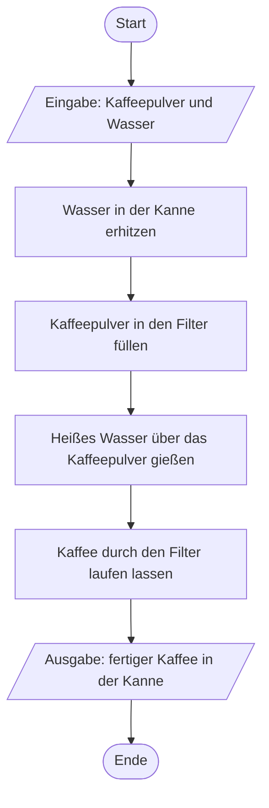

# Woche 3: Algorithmisches Denken I — Algorithmusbegriff und PAP-Grundelemente

> Zeitbedarf: ca. 1,5 Stunden.

## Worum geht es?

In den letzten beiden Wochen ging es darum, wie ein Rechner aufgebaut ist und wie
er Zahlen darstellt. Ab jetzt wechselt der Blickwinkel: Bevor du in Woche 7 dein
erstes eigenes Programm schreibst, lernst du, wie man eine Lösung für ein Problem
überhaupt erst einmal *beschreibt* — unabhängig von jeder Programmiersprache.
Diese Fähigkeit heißt **algorithmisches Denken**, und sie zieht sich als roter
Faden durch den gesamten restlichen Kurs.

Diese Woche startest du ganz am Anfang: Was ist überhaupt ein **Algorithmus**,
und woran erkennst du, ob eine Anleitung diesen Namen verdient? Und mit welchen
Werkzeugen beschreibt man einen Algorithmus, bevor man ihn in Code gießt? Zwei
davon lernst du kennen: den **Programmablaufplan (PAP)** und den **Pseudocode**.
Diese Woche bleibt es bei linearen, also geradlinigen Abläufen. In den nächsten Wochen kommen dann Verzweigungen
und Wiederholungen dazu.

!!! info "Das brauchst du dafür"
    Für den Algorithmusbegriff greifst du noch einmal auf **Müller/Weichert:
    *Vorkurs Informatik*, 6. Auflage, Springer Vieweg 2023** zurück — dasselbe
    PDF wie in Woche 1, zu finden in ILIAS im Kursbereich zu diesem Modul.
    Diesmal brauchst du nur **Abschnitt 2.2 „Algorithmen" (S. 16–18)**.

    Programmablaufplan und Pseudocode sind dagegen eigenes Material dieses
    Kurses — die lernst du direkt auf dieser Seite kennen.

## Das solltest du danach können

- Du kannst erklären, was einen Algorithmus ausmacht, und seine drei
  Eigenschaften Eindeutigkeit, Endlichkeit und Determiniertheit an einem
  Beispiel erläutern.
- Du kannst einen linearen Ablauf als Programmablaufplan (PAP) mit den
  Symbolen Start/Ende, Verarbeitung und Ein-/Ausgabe zeichnen.
- Du kannst denselben linearen Ablauf als Pseudocode formulieren.
- Du kannst einen einfachen Alltagsablauf selbstständig in einen linearen
  Algorithmus überführen.

## Erarbeitung

**Schritt 1:** Lies **Abschnitt 2.2 „Algorithmen" (S. 16–18)**.

Ein Algorithmus ist eine eindeutige Handlungsvorschrift, die aus gegebenen
Ausgangswerten in einer endlichen Anzahl von Schritten ein Ergebnis erzeugt.
Das Buch führt das am Beispiel eines Backrezepts vor — im Grunde ist jede
Kochanleitung, die du befolgst, ein kleiner Algorithmus.

Damit eine Anleitung wirklich ein Algorithmus ist, muss sie drei Eigenschaften
erfüllen:

- **Eindeutigkeit**: Jeder einzelne Schritt ist so klar formuliert, dass es
  keinen Interpretationsspielraum gibt. Zwei Personen, die dieselbe Anleitung
  lesen, kommen beim nächsten Schritt immer zum selben Ergebnis.
- **Endlichkeit**: Die Anleitung besteht aus einer endlichen Anzahl von
  Schritten — und ihre Ausführung kommt nach endlich vielen Schritten
  tatsächlich zu einem Ende, statt sich in einer Endlosschleife zu verlieren.
- **Determiniertheit**: Bei denselben Eingaben liefert der Algorithmus
  immer dasselbe Ergebnis.

!!! example "Beispiel: Kaffee aufbrühen"
    „Koche dir einen Kaffee" ist noch kein Algorithmus — das ist zu ungenau.
    Erst wenn du die einzelnen Schritte genau festlegst, wird daraus einer.
    Genau diesen Kaffee-Algorithmus baust du in den nächsten Schritten Stück
    für Stück auf.

    Ein Gegenbeispiel dazu: „Rühre den Kaffee um, bis er gut genug schmeckt."
    Das verletzt gleich zwei Eigenschaften — „gut genug" ist nicht eindeutig
    festgelegt, und ohne klares Abbruchkriterium ist auch die Endlichkeit
    nicht gesichert.

!!! info "Vertiefung: weitere Eigenschaften (optional)"
    Wer genauer hinschaut, unterscheidet manchmal zwei Aspekte der
    Endlichkeit: die **Endlichkeit der Beschreibung** (die Anleitung selbst
    ist irgendwann zu Ende aufgeschrieben) und die **Terminierung** (die
    *Ausführung* kommt tatsächlich zum Halt). Für den jetzigen Stand fassen wir
    beides unter dem Begriff Endlichkeit zusammen.

    Auch die Determiniertheit ist nicht die einzig mögliche Eigenschaft: Es
    gibt in der Informatik auch **nicht-deterministische** Algorithmen
    (mehrere gültige nächste Schritte sind erlaubt) und **stochastische**
    Algorithmen (der Ablauf hängt bewusst von einem Zufallswert ab, z. B.
    beim Würfeln). In diesem Kurs beschränken wir uns durchgehend auf
    deterministische Algorithmen.

**Schritt 2:** Lerne den **Programmablaufplan (PAP)** kennen.

Ein PAP beschreibt einen Algorithmus grafisch, als eine Folge von Symbolen,
die durch Pfeile verbunden sind. Für lineare Abläufe reichen dir drei Symbole:

| Symbol | Bedeutung |
|---|---|
| Oval | **Start** oder **Ende** des Algorithmus |
| Rechteck | Ein **Verarbeitungsschritt** — irgendetwas wird getan oder berechnet |
| Parallelogramm | **Eingabe** oder **Ausgabe** eines Werts |

Ein PAP beginnt beim Start-Symbol
und endend beim Ende-Symbol. Hier ist der Kaffee-Algorithmus aus dem Beispiel
oben, jetzt vollständig als PAP:



Jeder Schritt ist eindeutig formuliert, es sind endlich viele, und bei
denselben Zutaten kommt immer derselbe Kaffee heraus — die drei Eigenschaften
aus Schritt 1 sind erfüllt.

**Schritt 3:** Lerne den **Pseudocode** kennen.

Ein PAP ist anschaulich, aber bei längeren Abläufen wird das Zeichnen schnell
unhandlich. Der **Pseudocode** beschreibt denselben Algorithmus stattdessen
als nummerierten Text, mit ein paar festen Schlüsselwörtern in Großbuchstaben.
In diesem Kurs verwendest du dafür durchgehend englische Schlüsselwörter — das
hat den Vorteil, dass sie dich später an die Schlüsselwörter deiner
C-Programme erinnern. Diese Woche brauchst du erst zwei davon:

- `INPUT` kennzeichnet eine Eingabe.
- `OUTPUT` kennzeichnet eine Ausgabe.

Alles andere schreibst du als normalen, kurzen Verarbeitungssatz. Der
Kaffee-Algorithmus als Pseudocode:

```
1. INPUT: Kaffeepulver und Wasser
2. Wasser in der Kanne erhitzen
3. Kaffeepulver in den Filter füllen
4. Heißes Wasser über das Kaffeepulver gießen
5. Kaffee durch den Filter laufen lassen
6. OUTPUT: fertiger Kaffee in der Kanne
```

PAP und Pseudocode beschreiben also exakt denselben Algorithmus — nur einmal
grafisch und einmal als Text. Zwei weitere Schlüsselwörter, `IF`/`ELSE` für
Verzweigungen und `REPEAT` für Wiederholungen, kommen in Woche 4 und 5 dazu,
wenn Algorithmen nicht mehr rein linear ablaufen.

!!! tip "Warum eigentlich zwei Notationen?"
    Der PAP zeigt den Ablauf auf einen Blick, ist bei größeren Algorithmen
    aber unhandlich zu zeichnen. Pseudocode lässt sich schnell tippen und
    ähnelt schon einem echten Programm — dafür siehst du die Struktur nicht
    sofort. In der Praxis wählst du je nach Situation die passendere
    Notation; in diesem Kurs übst du beide.

    Welche Notation sich eignet, hängt vor allem davon ab, wer sie lesen
    soll. Ein Kunde, der seinen eigenen Arbeitsablauf zwar genau kennt, aber
    keinen tieferen IT-Hintergrund hat, erschließt sich eine grafische
    Darstellung wie den PAP meist leichter. Eine Entwicklerin oder ein
    Entwickler mit IT-Hintergrund liest dagegen auch Pseudocode gut und
    problemlos, weil ihr oder ihm auch echte Programmiersprachen vertraut
    sind.

## Zum Ausprobieren

Beschreibe den Ablauf **Zähneputzen** als eigenen linearen Algorithmus —
einmal als PAP und einmal als Pseudocode. Verwende dabei mindestens eine
Eingabe und eine Ausgabe. Achte darauf, dass jeder Schritt eindeutig
formuliert ist.

??? note "Musterlösung anzeigen"
    Es gibt hier keine einzig richtige Zerlegung — entscheidend ist, dass
    deine Schritte eindeutig, endlich sind und immer zum selben Ablauf
    führen. Ein möglicher Vorschlag:

    Als PAP:

    ```mermaid
    %%{init: {'flowchart': {'htmlLabels': false}}}%%
    flowchart TD
        A(["Start"])
        B[/"Eingabe: Zahnbürste und Zahnpasta"/]
        C["Zahnpasta auf die Bürste geben"]
        D["Zähne zwei Minuten lang putzen"]
        E["Mund mit Wasser ausspülen"]
        F["Zahnbürste abspülen"]
        G[/"Ausgabe: geputzte Zähne"/]
        H(["Ende"])
        A --> B
        B --> C
        C --> D
        D --> E
        E --> F
        F --> G
        G --> H
    ```

    Als Pseudocode:

    ```
    1. INPUT: Zahnbürste und Zahnpasta
    2. Zahnpasta auf die Bürste geben
    3. Zähne zwei Minuten lang putzen
    4. Mund mit Wasser ausspülen
    5. Zahnbürste abspülen
    6. OUTPUT: geputzte Zähne
    ```

    Achte besonders auf Schritt 3: „Zähne putzen" allein wäre nicht eindeutig
    genug — „zwei Minuten lang" legt fest, wann der Schritt beendet ist.
    Genau solche unscheinbaren Lücken sind es, die eine Alltagsbeschreibung
    von einem Algorithmus unterscheiden.

## Selbstkontrolle

### Frage 1

<quiz>
Ordne jeden Begriff seiner Erklärung zu:

| Nr. | Begriff |
|---|---|
| 1 | Algorithmus |
| 2 | Eindeutigkeit |
| 3 | Endlichkeit |
| 4 | Determiniertheit |

- [[3]] Die Anleitung besteht aus endlich vielen Schritten und kommt nach endlich vielen Schritten zum Ende.
- [[1]] Eine eindeutige Handlungsvorschrift, die aus Ausgangswerten in endlich vielen Schritten ein Ergebnis erzeugt.
- [[4]] Bei denselben Ausgangswerten liefert der Ablauf immer dasselbe Ergebnis.
- [[2]] Jeder Schritt ist so klar formuliert, dass kein Interpretationsspielraum bleibt.

</quiz>

### Frage 2

<quiz>
Welche Aussagen zu den PAP-Symbolen aus dieser Woche treffen zu? (Mehrere Antworten können richtig sein.)

- [x] Das Oval steht für Start oder Ende des Algorithmus.
- [ ] Das Parallelogramm steht für einen Verarbeitungsschritt.
> Nein — das Parallelogramm steht für Eingabe oder Ausgabe. Ein Verarbeitungsschritt wird als Rechteck gezeichnet.
- [x] Ein PAP wird entlang der Pfeilrichtungen gelesen.
- [ ] Für Eingabe und Ausgabe gibt es zwei unterschiedliche Symbole.
> Nein — Eingabe und Ausgabe verwenden beide das Parallelogramm, unterschieden nur durch den Text im Symbol.

</quiz>

### Frage 3

Warum ist „Rühre den Kaffee um, bis er gut genug schmeckt" kein zulässiger
Algorithmus-Schritt? Welche der drei Eigenschaften aus Schritt 1 verletzt
diese Anweisung?

??? note "Musterlösung anzeigen"
    Die Anweisung verletzt gleich zwei Eigenschaften. Sie ist nicht
    **eindeutig**, weil „gut genug" von Person zu Person unterschiedlich
    verstanden wird — es gibt keine klare Regel, wann der Schritt erfüllt
    ist. Und sie verletzt die **Endlichkeit**, weil ohne ein klares,
    prüfbares Abbruchkriterium nicht sichergestellt ist, dass das Rühren
    jemals endet.

### Frage 4

<quiz>
Ergänze: In unserem Pseudocode kennzeichnet das Schlüsselwort [[INPUT]] eine Eingabe, und das Schlüsselwort [[OUTPUT]] kennzeichnet eine Ausgabe.

---
Beide Schlüsselwörter schreibst du in Großbuchstaben.
</quiz>

### Frage 5

Ein Mitstudierender hat für den Ablauf „Wasser kochen" folgenden Pseudocode
geschrieben:

```
1. Wasser in den Wasserkocher füllen
2. Wasserkocher einschalten
3. Wasser kochen
```

Findest du eine Stelle, an der eine Eigenschaft aus Schritt 1 verletzt ist?
Wie würdest du den Pseudocode korrigieren?

??? note "Musterlösung anzeigen"
    Schritt 3 „Wasser kochen" ist nicht eindeutig genug: Es fehlt, wann
    dieser Schritt als beendet gilt (etwa: sobald das Wasser sichtbar
    sprudelt, oder sobald der Wasserkocher automatisch abschaltet). Außerdem
    fehlt eine Eingabe- und eine Ausgabeanweisung. Eine mögliche Korrektur:

    ```
    1. INPUT: Wasser
    2. Wasser in den Wasserkocher füllen
    3. Wasserkocher einschalten
    4. Warten, bis der Wasserkocher automatisch abschaltet
    5. OUTPUT: gekochtes Wasser
    ```
