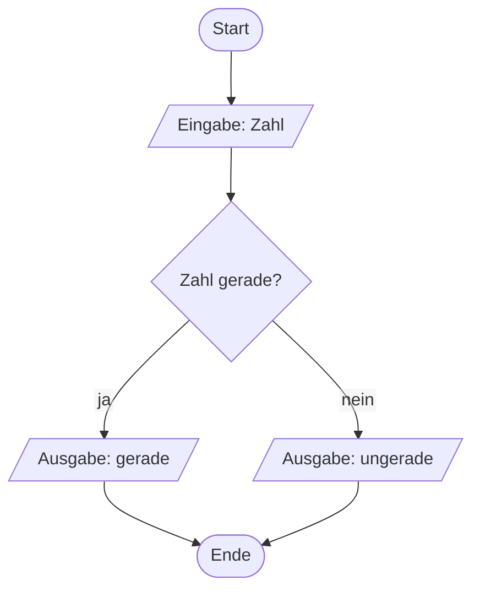
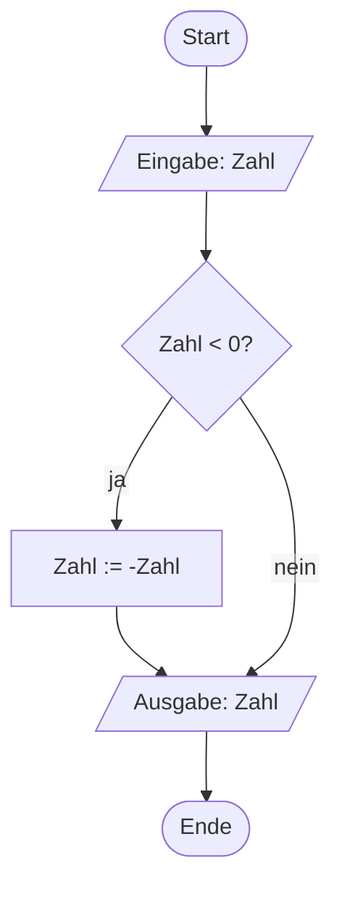
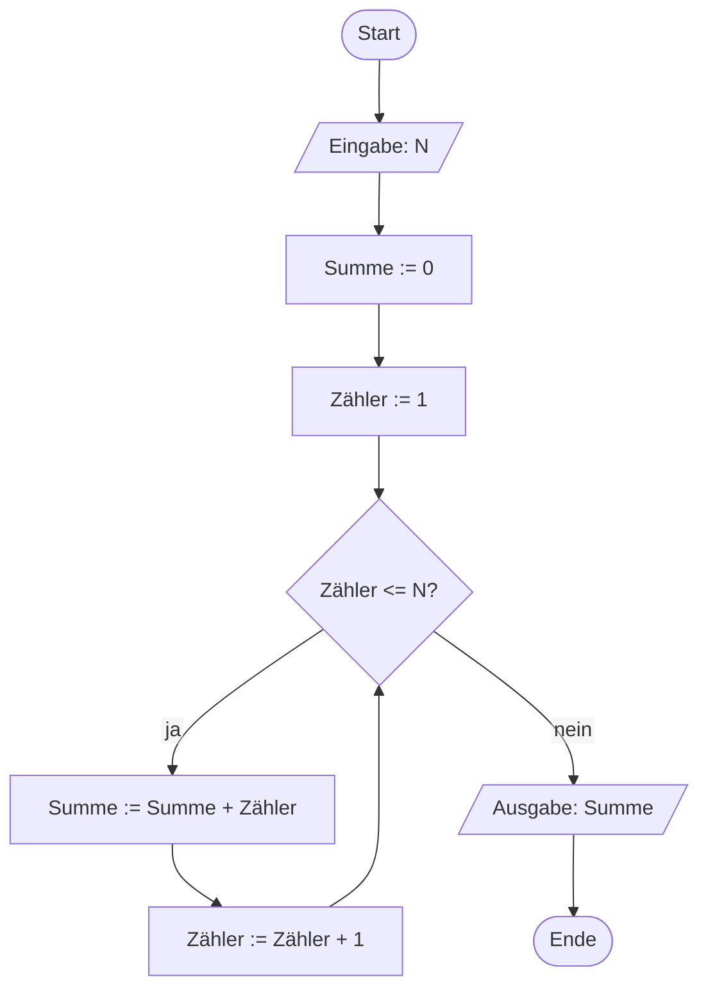
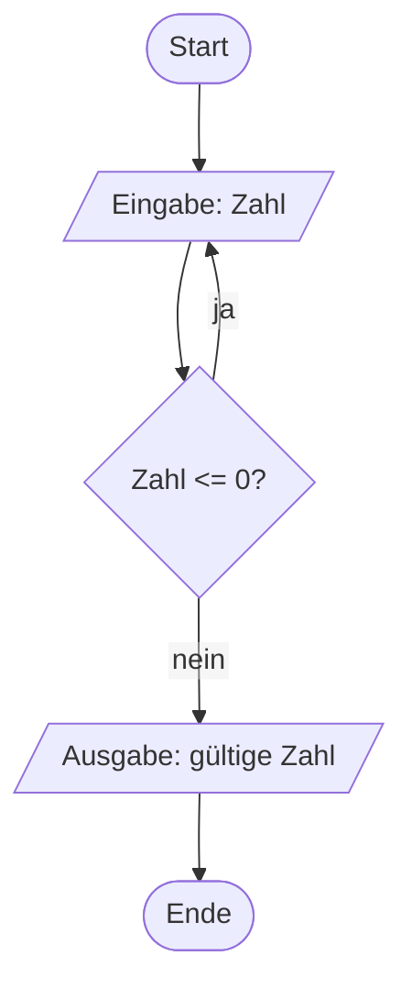
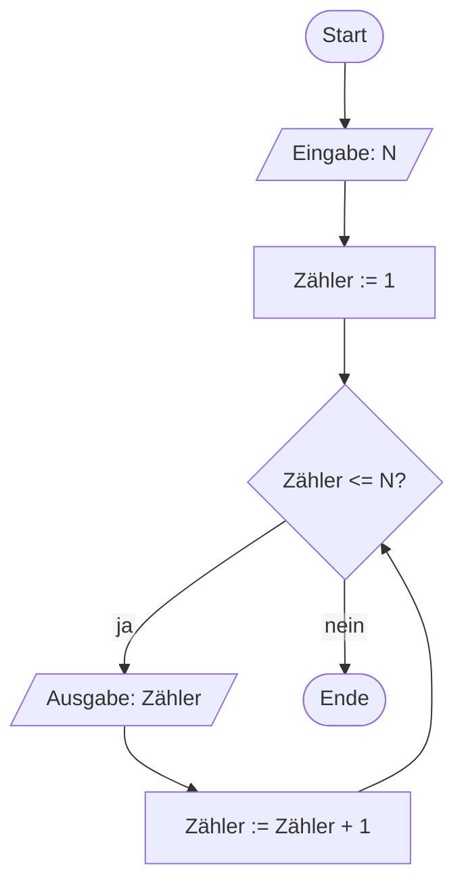
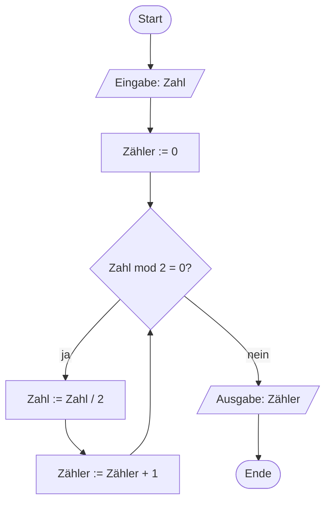
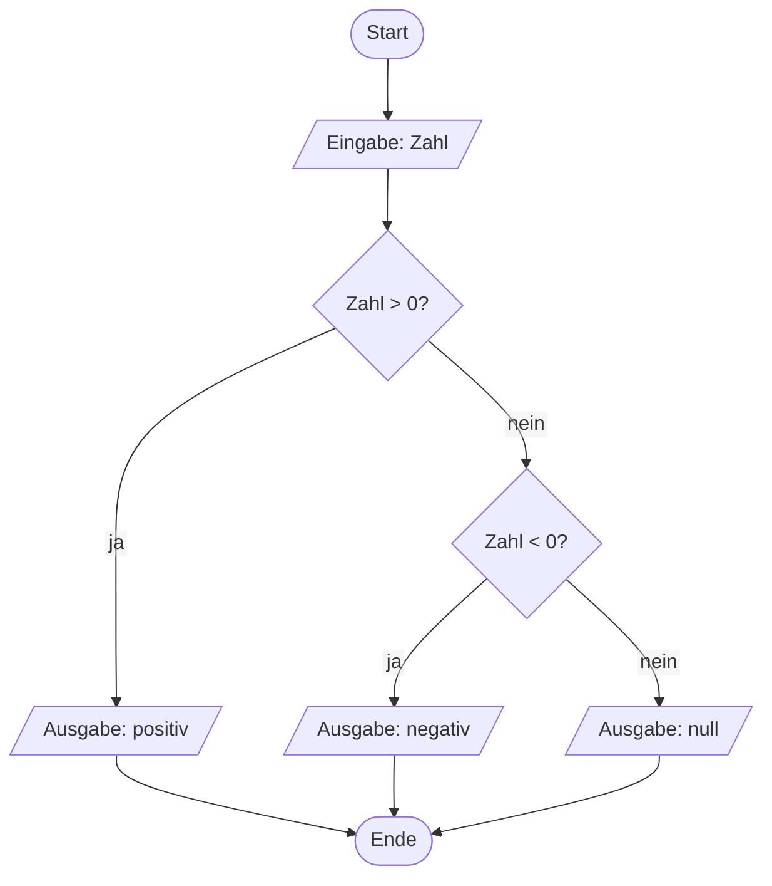

# Woche 4: Algorithmisches Denken II — Verzweigungen und Schleifen im PAP

> Zeitbedarf: ca. 2 Stunden.

## Worum geht es?

Letzte Woche hast du lineare Algorithmen kennengelernt — Abläufe, die
Schritt für Schritt von oben nach unten laufen, ohne Abzweigungen. Damit
kommst du erstaunlich weit, aber die meisten echten Probleme brauchen mehr:
Ein Algorithmus muss abhängig von einer Bedingung unterschiedlich reagieren
(**Verzweigung**), oder er muss dieselben Schritte mehrfach ausführen
(**Wiederholung**). Genau diese beiden Bausteine kommen diese Woche zu
deinem Werkzeugkoffer dazu — sowohl als PAP als auch als Pseudocode. Dazu
lernst du mit der **Zählschleife** eine besonders häufige Sonderform der
Wiederholung kennen.

Weil es diese Woche um Entscheidungen und Wiederholungen statt um
Alltagsabläufe geht, dürfen die Beispiele jetzt auch technischer und
mathematischer werden. Rechenoperationen sind für den Einstieg oft sogar
leichter nachzuvollziehen als vage Alltagsformulierungen, weil bei ihnen von
Anfang an klar ist, was mit welchem Wert passiert.

**Nachschlagewerk für alle PAP-Symbole:** Alle Symbole, die du im Kurs für
Programmablaufpläne verwendest — auch die aus Woche 3 — findest du
gesammelt auf der Seite
[PAP: Elemente im Überblick](../../pap-elemente.md). Dort kannst du
jederzeit nachschlagen, welches Symbol wofür steht.
{: .hinweis-klein }

## Das solltest du danach können

- Du kannst eine ein- und eine zweiseitige Auswahl als PAP mit einer Raute
  zeichnen und im Pseudocode mit `IF`/`THEN`/`ELSE`/`END IF` formulieren.
- Du kannst eine kopfgesteuerte Wiederholung als PAP zeichnen und im
  Pseudocode mit `WHILE`/`DO`/`END WHILE` formulieren, eine fußgesteuerte
  mit `DO`/`WHILE`.
- Du kannst erklären, worin sich kopf- und fußgesteuerte Wiederholung
  unterscheiden.
- Du kannst eine Zählschleife als Sonderfall der kopfgesteuerten
  Wiederholung erkennen und im Pseudocode mit `FOR`/`TO`/`STEP`/`END FOR`
  formulieren.
- Du kannst mit `BREAK` eine Wiederholung vorzeitig abbrechen und
  begründen, warum das sparsam eingesetzt werden sollte.
- Du kannst einen gegebenen PAP mit Verzweigung und Wiederholung für eine
  konkrete Eingabe per Schreibtischtest durchrechnen und in Pseudocode
  übersetzen.

## Erarbeitung { .abschnitt-erarbeitung }

**Schritt 1:** Lerne die **Verzweigung** kennen.

Eine Verzweigung prüft eine Bedingung und lässt den Ablauf abhängig vom
Ergebnis einen von zwei Wegen nehmen. Im PAP wird dafür eine **Raute**
verwendet, die beiden ausgehenden Pfeile werden mit **ja** und **nein**
beschriftet. Im Pseudocode entspricht das den Schlüsselwörtern `IF`,
`THEN` und `ELSE`, abgeschlossen mit `END IF`.

Bei einer **zweiseitigen Auswahl** passiert auf beiden Wegen etwas.
Beispiel: eine eingegebene Zahl als gerade oder ungerade einordnen.



Als Pseudocode kann man diese Unterscheidung so beschreiben:

```text linenums="1"
INPUT: Zahl
IF Zahl gerade THEN
    OUTPUT: gerade
ELSE
    OUTPUT: ungerade
END IF
```

Bei einer **einseitigen Auswahl** passiert nur auf einem Weg etwas — der
andere Weg führt direkt zum gemeinsamen Folgeschritt, es gibt also kein
`ELSE`. Beispiel: den Betrag einer Zahl bilden, indem eine negative Zahl
umgekehrt wird.



Im Pseudocode entfällt entsprechend der `ELSE`-Block:

```text linenums="1"
INPUT: Zahl
IF Zahl < 0 THEN
    Zahl := -Zahl
END IF
OUTPUT: Zahl
```

**Beachte:** Bei einer Auswahl muss es immer den `IF`-Zweig geben, und
`END IF` schließt sie immer ab — auch ohne `ELSE`. Der `ELSE`-Zweig ist
dagegen optional und kann entfallen.

---

**Schritt 2:** Lerne die **Wiederholung** kennen.

Eine Wiederholung lässt einen Teil eines Algorithmus so lange erneut
laufen, wie eine Bedingung erfüllt ist. Im PAP verwendest du dafür dieselbe
Raute wie bei der Verzweigung: Der ja-Zweig führt als **Rücksprung**-Pfeil
zurück zum Anfang der Schleifenanweisungen, der nein-Zweig verlässt die
Schleife.

Je nachdem, **wo** die Raute steht, unterscheidest du zwei Varianten:

- **Kopfgesteuerte Wiederholung**: Die Bedingung steht *vor* den
  Schleifenanweisungen. Ist sie von Anfang an nicht erfüllt, laufen die
  Anweisungen kein einziges Mal.
- **Fußgesteuerte Wiederholung**: Die Bedingung steht *nach* den
  Schleifenanweisungen. Dadurch laufen die Anweisungen immer mindestens
  einmal.

Im Pseudocode gibt es dafür die Schlüsselwörter `WHILE` und `DO` — bewusst
dieselben Wörter, die du später auch in C für Schleifen verwendest. Je
nachdem, in welcher Reihenfolge sie stehen, ergibt sich die kopf- oder die
fußgesteuerte Variante:

- **Kopfgesteuert:** `WHILE <Bedingung> DO` steht vor den
  Schleifenanweisungen, `END WHILE` schließt sie ab. Die Bedingung wird
  also zuerst geprüft.
- **Fußgesteuert:** `DO` steht vor den Schleifenanweisungen, `WHILE
  <Bedingung>` danach — ein eigenes `END` brauchst du hier nicht, das
  `WHILE` beendet die Schleife bereits.

Beispiel für eine **kopfgesteuerte** Wiederholung: die Summe der Zahlen von
1 bis N berechnen.



```text linenums="1"
INPUT: N
Summe := 0
Zähler := 1
WHILE Zähler <= N DO
    Summe := Summe + Zähler
    Zähler := Zähler + 1
END WHILE
OUTPUT: Summe
```

Prüfe an diesem Beispiel gedanklich einmal den Fall `N = 0`: Die Bedingung
in Zeile 4 ist dann direkt falsch, die eingerückten Schleifenanweisungen
laufen kein einziges Mal, und ausgegeben wird korrekt `Summe = 0`.

Beispiel für eine **fußgesteuerte** Wiederholung: so lange nach einer Zahl
fragen, bis eine gültige (positive) Zahl eingegeben wurde.



```text linenums="1"
DO
    INPUT: Zahl
WHILE Zahl <= 0
OUTPUT: gültige Zahl
```

Anders als bei der kopfgesteuerten Variante läuft hier die Eingabe immer
mindestens einmal, bevor überhaupt geprüft wird — bei einer fußgesteuerten
Wiederholung ist das immer so.

**Warum zwei Varianten?** Die Wahl zwischen kopf- und fußgesteuerter
Wiederholung ist keine Geschmacksfrage. Entscheidend ist: Muss der
Schleifenkörper unter Umständen null Mal laufen (dann kopfgesteuert), oder
ist mindestens ein Durchlauf immer sinnvoll oder sogar nötig, weil erst
danach etwas zu prüfen ist — wie bei der Eingabe oben, die es ja erst geben
muss, bevor man sie bewerten kann (dann fußgesteuert)?
{: .hinweis-klein }

Für Wiederholungen gibt es in diesem Kurs **kein eigenes PAP-Symbol**.
Genormt wäre das nach DIN 66001 ein eigener Schleifenblock — in der Praxis
wird diese Notation aber selten verwendet. Deshalb wird hier stattdessen,
wie oben gezeigt, dieselbe Raute wie bei der Verzweigung wiederverwendet,
kombiniert mit einem Rücksprung-Pfeil.

---

**Schritt 3:** Lerne die **Zählschleife** als besonderen Fall kennen.

Schau dir das Summen-Beispiel aus Schritt 2 noch einmal genauer an: Vor der
Schleife wird eine Variable auf einen Startwert gesetzt (`Zähler := 1`),
die Bedingung vergleicht diese Variable mit einer Grenze (`Zähler <= N`),
und am Ende jedes Durchlaufs wird sie um einen festen Wert verändert
(`Zähler := Zähler + 1`). Diese Kombination aus **Startwert**,
**Bedingung** und **Schrittweite** kommt so häufig vor, dass sie einen
eigenen Namen hat: **Zählschleife**.

Im PAP ist eine Zählschleife kein neues Element — sie ist und bleibt eine
kopfgesteuerte Wiederholung mit derselben Raute, nur mit dieser speziellen,
sehr regelmäßigen Struktur. Im Pseudocode lohnt es sich aber, dafür ein
eigenes, kompakteres Schlüsselwort zu verwenden: `FOR`. Es fasst Startwert,
Bedingung und Schrittweite in einer einzigen Kopfzeile zusammen, mit `TO`
für die Obergrenze und `STEP` für die Schrittweite — genau nach diesem
Muster gibt es später auch in C eine eigene Schleifenart, die
`for`-Schleife.

Noch ein Beispiel, das die Zählschleife klar zeigt: die Zahlen von 1 bis N
der Reihe nach ausgeben.



```text linenums="1"
INPUT: N
FOR Zähler := 1 TO N STEP 1 DO
    OUTPUT: Zähler
END FOR
```

Du erkennst die drei Bestandteile jetzt direkt im Kopf der Schleife:
Startwert (`Zähler := 1`), Obergrenze (`TO N`) und Schrittweite
(`STEP 1`). Eine eigene Anweisung, die `Zähler` von Hand hochzählt,
brauchst du hier nicht mehr — das übernimmt `STEP` automatisch bei jedem
Durchlauf.

---

**Schritt 4:** Lerne `BREAK` kennen — ein Werkzeug für den vorzeitigen
Abbruch einer Wiederholung.

Manchmal soll eine Wiederholung nicht erst über ihre reguläre Bedingung
enden, sondern sofort, sobald im Inneren etwas Bestimmtes eintritt. Dafür
gibt es das Schlüsselwort `BREAK`: Es verlässt die umgebende Wiederholung
sofort, unabhängig davon, ob deren eigentliche Bedingung gerade erfüllt
ist. Beispiel: In einer Reihe von N eingegebenen Zahlen soll die erste
negative Zahl gefunden und sofort ausgegeben werden — ist sie gefunden,
lohnt sich kein Weitersuchen mehr.

```text linenums="1"
INPUT: N
FOR Zähler := 1 TO N STEP 1 DO
    INPUT: Zahl
    IF Zahl < 0 THEN
        OUTPUT: Zahl
        BREAK
    END IF
END FOR
```

Wie sich `BREAK` im PAP als einfacher Pfeil zum Schleifenende darstellen
lässt, zeigt [PAP: Elemente im Überblick](../../pap-elemente.md), Abschnitt
„Vorzeitiger Abbruch (BREAK)". Setze `BREAK` sparsam ein — nur dort, wo
sich ein Abbruch nicht sauberer über die Schleifenbedingung selbst
ausdrücken lässt — und kommentiere im Pseudocode immer, warum an dieser
Stelle abgebrochen wird.

## Zum Ausprobieren { .abschnitt-ausprobieren }

**Aufgabe A:** Entwirf einen eigenen Algorithmus, der von zwei eingegebenen
Zahlen die größere ermittelt und ausgibt. Zeichne ihn als PAP und formuliere
ihn als Pseudocode.

??? note "Musterlösung anzeigen"
    ```mermaid
    %%{init: {'flowchart': {'htmlLabels': false}}}%%
    flowchart TD
        A(["Start"])
        B[/"Eingabe: erste Zahl"/]
        C[/"Eingabe: zweite Zahl"/]
        D{"erste Zahl > zweite Zahl?"}
        E[/"Ausgabe: erste Zahl ist größer"/]
        F[/"Ausgabe: zweite Zahl ist größer oder gleich"/]
        G(["Ende"])
        A --> B
        B --> C
        C --> D
        D -->|ja| E
        D -->|nein| F
        E --> G
        F --> G
    ```

    ```text linenums="1"
    INPUT: erste Zahl
    INPUT: zweite Zahl
    IF erste Zahl > zweite Zahl THEN
        OUTPUT: erste Zahl ist größer
    ELSE
        OUTPUT: zweite Zahl ist größer oder gleich
    END IF
    ```

    Beachte, dass „gleich" bewusst in den ELSE-Zweig gehört — sonst müsstest
    du eine dritte Möglichkeit prüfen, die es hier aber gar nicht braucht.

**Aufgabe B:** Der folgende PAP beschreibt einen Algorithmus, der zählt, wie oft eine
eingegebene Zahl hintereinander restfrei durch 2 teilbar ist. Darin taucht in der Prüfung der Bedingung für die Wiederholung die `mod`-Operation auf. Diese liefert einfach den Rest einer Division zurück. Beispiel: 15 mod 2 = 1, denn 15 / 2 = 7 (Rest 1). Wenn also die `mod`-Operation mit 2 den Wert 0 ergibt, ist die jeweilige Zahl **restfrei** durch 2 teilbar. Die `mod`-Operation werden wir beim Programmieren in C noch sehr häufig verwenden.



Übersetze diesen PAP in Pseudocode.

??? note "Musterlösung anzeigen"
    ```text linenums="1"
    INPUT: Zahl
    Zähler := 0
    WHILE Zahl mod 2 = 0 DO
        Zahl := Zahl / 2
        Zähler := Zähler + 1
    END WHILE
    OUTPUT: Zähler
    ```

    Die Raute prüft die Fortsetzungsbedingung, bevor überhaupt etwas
    passiert — das entspricht im Pseudocode `WHILE Zahl mod 2 = 0 DO` vor
    den Schleifenanweisungen, `END WHILE` danach: eine kopfgesteuerte
    Wiederholung. Das ist hier auch die einzig sinnvolle Wahl: Ist die
    eingegebene Zahl schon ungerade (z. B. 7), soll der Zähler bei 0
    bleiben, ohne dass die Schleife auch nur einmal läuft — genau das
    leistet die kopfgesteuerte Variante. Probiere das Beispiel gedanklich
    für die Zahl 24 durch: 24 → 12 → 6 → 3, macht dreimal restfrei
    teilbar, `Zähler = 3`.

## Selbstkontrolle { .abschnitt-selbstkontrolle }

### Frage 1

<quiz>
Ordne jeden Begriff seiner Erklärung zu:

| Nr. | Begriff |
|---|---|
| 1 | Verzweigung |
| 2 | Kopfgesteuerte Wiederholung |
| 3 | Fußgesteuerte Wiederholung |
| 4 | Rücksprung |

- [[3]] Eine Wiederholung, bei der die Bedingung nach den Schleifenanweisungen geprüft wird — die Anweisungen laufen dadurch immer mindestens einmal.
- [[1]] Eine Raute im PAP, bei der der Ablauf abhängig von einer Bedingung einen von zwei Wegen nimmt.
- [[4]] Ein Pfeil im PAP, der zu einem bereits durchlaufenen Schritt zurückführt, statt weiter nach unten.
- [[2]] Eine Wiederholung, bei der die Bedingung vor den Schleifenanweisungen geprüft wird — die Anweisungen können dadurch auch null Mal ausgeführt werden.

</quiz>

### Frage 2

<quiz>
Welche Aussagen zu Verzweigung und Wiederholung im PAP treffen zu? (Mehrere Antworten können richtig sein.)

- [x] Eine Verzweigung wird als Raute dargestellt.
- [ ] Die Raute hat bei einer Verzweigung immer drei ausgehende Pfeile.
> Nein — eine Raute hat in diesem Kurs immer genau zwei ausgehende Pfeile, beschriftet mit „ja" und „nein".
- [x] Bei einer einseitigen Auswahl passiert nur auf einem der beiden Wege etwas.
- [ ] Eine kopfgesteuerte Wiederholung führt die Schleifenanweisungen immer mindestens einmal aus.
> Nein — das ist die fußgesteuerte Wiederholung. Bei der kopfgesteuerten Wiederholung können die Schleifenanweisungen auch null Mal laufen, wenn die Bedingung von Anfang an nicht erfüllt ist.

</quiz>

### Frage 3

Hier ist ein PAP, der eine eingegebene Zahl als positiv, negativ oder null
einordnet:



Führe für die Eingaben **-3** und **0** jeweils einen **Schreibtischtest**
durch — du rechnest den Algorithmus dabei Schritt für Schritt im Kopf
durch, ohne ihn tatsächlich auszuführen: Welchen Weg nimmt der Ablauf, und
was wird ausgegeben?

??? note "Musterlösung anzeigen"
    **Eingabe -3:** Die erste Bedingung „Zahl > 0?" ist falsch (nein-Zweig).
    Die zweite Bedingung „Zahl < 0?" ist wahr (ja-Zweig) → Ausgabe:
    **negativ**.

    **Eingabe 0:** Die erste Bedingung „Zahl > 0?" ist falsch (nein-Zweig).
    Die zweite Bedingung „Zahl < 0?" ist ebenfalls falsch (nein-Zweig) →
    Ausgabe: **null**.

    Diese Verschachtelung — eine Verzweigung im nein-Zweig einer anderen —
    ist ein gängiges Muster, um zwischen mehr als zwei Möglichkeiten zu
    unterscheiden.

### Frage 4

<quiz>
Fülle die Lücken im folgenden Text aus: 

Im Pseudocode wird eine Verzweigung durch das Schlüsselwort [[IF]] eingeleitet und die zu prüfende Bedingung wird durch [[THEN]] abgeschlossen. Optionale Anweisungen werden durch [[ELSE]] eingeleitet. Steht bei einer Wiederholung [[WHILE]] vor den Schleifenanweisungen, ist sie kopfgesteuert, steht stattdessen [[DO]] davor, ist sie fußgesteuert.

---
Kopfgesteuert und fußgesteuert kannst du auch auf der Seite PAP: Elemente im Überblick nachschlagen.
</quiz>

### Frage 5

Angenommen, beim Berechnen der Summe der Zahlen von 1 bis N (kopfgesteuerte
Wiederholung, siehe Beispiel oben) wird N = 0 eingegeben. Wie oft laufen die
Schleifenanweisungen, und welchen Wert gibt das Programm aus? Wäre das
Ergebnis bei einer fußgesteuerten Variante desselben Algorithmus anders?
Begründe.

??? note "Musterlösung anzeigen"
    Bei N = 0 ist die Bedingung „Zähler <= N" mit Zähler = 1 von Anfang an
    falsch. Die Schleifenanweisungen laufen deshalb kein einziges Mal, und
    das Programm gibt korrekt Summe = 0 aus.

    Bei einer fußgesteuerten Variante würden die Anweisungen dagegen immer
    mindestens einmal laufen, bevor überhaupt geprüft wird — es würde also
    fälschlicherweise Zähler = 1 zur Summe addiert und am Ende Summe = 1
    ausgegeben, obwohl bei N = 0 gar nichts addiert werden sollte. Für diese
    Aufgabe ist deshalb die kopfgesteuerte Variante die richtige Wahl.
