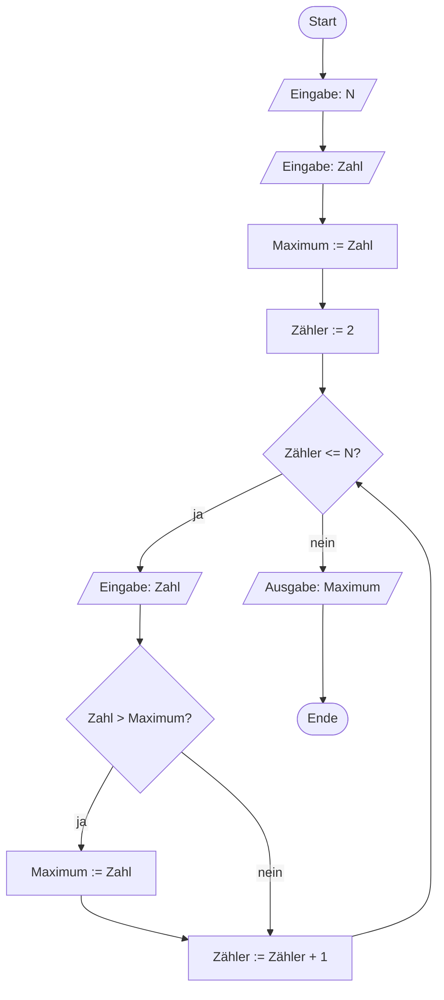

# Woche 5: Algorithmisches Denken III — eigene Algorithmen entwerfen

> Zeitbedarf: ca. 2 Stunden.

## Worum geht es?

In den letzten beiden Wochen hast du gelernt, PAPs mit Verzweigungen und
Wiederholungen zu *lesen* und zu einem gegebenen Ablauf zu *ergänzen*. Diese
Woche gehst du einen Schritt weiter: Du entwirfst einen Algorithmus komplett
selbst, von der Problembeschreibung bis zum fertigen PAP und Pseudocode.

Dabei stellt sich eine neue Frage: Für dasselbe Problem gibt es oft mehrere
mögliche Algorithmen — manche brauchen deutlich weniger Schritte als andere.
Wie man das systematisch vergleicht, zeigt dir ein Video dieser Woche. Am
Ende entwirfst du wieder selbst einen kompletten Algorithmus — diesmal, um
eine mathematische Eigenschaft einer Zahl zu prüfen.

!!! abstract "Diese Woche bitte ohne KI"
    Der Lerneffekt dieser Woche liegt gerade darin, selbst einen Lösungsweg
    zu finden — nicht darin, einen fertigen zu lesen. Wenn dir beim Lesen
    ein Begriff unklar bleibt, darfst du ihn dir davon unberührt gerne von
    einem KI-Werkzeug erklären lassen. Mehr dazu unter
    [KI im Kurs](../../ki-nutzung.md).

## Das solltest du danach können

- Du kannst ein Problem eigenständig in Eingabe, Zwischenschritte und
  Ausgabe zerlegen und daraus einen PAP und Pseudocode entwerfen.
- Du kannst einen eigenen Algorithmus mit Wiederholung, Verzweigung und
  vorzeitigem Abbruch (`BREAK`) entwerfen, der eine mathematische
  Eigenschaft einer Zahl prüft.
- Du kannst erklären, was Brute-Force- und Divide-and-Conquer-Lösungen
  grundsätzlich unterscheidet.
- Du kannst grob einordnen, was die O-Notation aussagt.
- Du kannst einen Algorithmus mit Wiederholung und vorzeitigem Abbruch
  (`BREAK`) per Schreibtischtest durchrechnen.

## Erarbeitung { .abschnitt-erarbeitung }

**Schritt 1:** Lerne eine Methode kennen, mit der du **jeden** Algorithmus
von Grund auf entwerfen kannst.

Bisher hast du PAPs meist schon fertig vorgesetzt bekommen oder Bausteine
ergänzt. Damit du jetzt selbst loslegen kannst, hilft eine feste
Vorgehensweise in fünf Schritten:

1. **Problem verstehen:** Was genau ist gegeben, was wird gesucht?
2. **Ein- und Ausgabe festlegen:** Welche Werte muss der Algorithmus
   einlesen, welchen Wert soll er am Ende ausgeben?
3. **In Teilschritte zerlegen:** Welche Zwischenwerte oder Hilfsvariablen
   brauchst du auf dem Weg von der Eingabe zur Ausgabe?
4. **Entscheidungen und Wiederholungen erkennen:** Muss irgendwo geprüft
   oder wiederholt werden — und wenn ja, welche Art von Verzweigung oder
   Wiederholung passt?
5. **PAP zeichnen, Pseudocode formulieren, mit einem Schreibtischtest
   prüfen.**

Diese fünf Schritte wendest du jetzt direkt an einem Beispiel an: *Finde
die größte von N eingegebenen Zahlen.*

**1. Problem verstehen:** Gegeben sind N Zahlen (nacheinander eingegeben),
gesucht ist die größte davon.

**2. Ein-/Ausgabe:** Eingabe ist N und danach N einzelne Zahlen. Ausgabe ist
eine einzige Zahl — das Maximum.

**3. Teilschritte:** Du brauchst eine Variable, die sich die *bisher größte
gesehene Zahl* merkt — nenn sie `Maximum`. Ein kleiner, aber wichtiger
Kniff: Die erste eingegebene Zahl kannst du direkt als Startwert für
`Maximum` verwenden, dann musst du nur noch die restlichen N−1 Zahlen mit
ihr vergleichen.

**4. Entscheidung und Wiederholung:** Für „die restlichen N−1 Zahlen
einlesen und vergleichen" passt eine Zählschleife (`FOR`), weil N von
Anfang an bekannt ist. Bei jeder Zahl brauchst du eine Verzweigung (`IF`):
Ist die neue Zahl größer als `Maximum`, wird sie das neue Maximum.

**5. PAP und Pseudocode:**



```text linenums="1"
INPUT: N
INPUT: Zahl
Maximum := Zahl
FOR Zähler := 2 TO N STEP 1 DO
    INPUT: Zahl
    IF Zahl > Maximum THEN
        Maximum := Zahl
    END IF
END FOR
OUTPUT: Maximum
```

Prüfe das Ergebnis gedanklich für die Zahlen 3, 7, 2, 9, 5 (N = 5):
`Maximum` startet bei 3, bleibt bei 7 (7 > 3), bleibt bei 7 (2 > 7 ist
falsch), wird 9 (9 > 7), bleibt bei 9 (5 > 9 ist falsch). Ausgabe: **9** —
korrekt.

Dieser Algorithmus prüft **jede einzelne Zahl** — bei N Zahlen sind das
immer genau N−1 Vergleiche. Man nennt das eine **Brute-Force**-Lösung: Sie
probiert konsequent alles durch, ohne einen Umweg zu suchen. Für dieses
Problem gibt es auch keinen schnelleren Weg — du kannst das Maximum
unmöglich finden, ohne mindestens einmal jede Zahl gesehen zu haben. Bei
manchen anderen Problemen geht es aber tatsächlich deutlich sparsamer.
Genau darum geht es im nächsten Schritt.

---

**Schritt 2:** Schau dir das Video **„Vergleich und Bewertung von
Algorithmen"** an (18:47 Min.).

<div class="video-wrapper">
  <iframe src="https://www.youtube-nocookie.com/embed/BIjFaWoge3g" title="Video: Vergleich und Bewertung von Algorithmen" loading="lazy" allowfullscreen referrerpolicy="strict-origin-when-cross-origin"></iframe>
</div>

Das Video zeigt am sogenannten Wiegeproblem zwei grundverschiedene Lösungen
für dasselbe Problem: eine **Brute-Force**-Lösung (wie dein
Maximum-Beispiel eben — sie probiert alles durch) und eine
**Divide-and-Conquer**-Lösung (zu Deutsch etwa „Teile und herrsche" — sie
zerlegt das Problem bei jedem Schritt in kleinere Teile und wirft dabei
gezielt Teile davon weg, die sowieso nicht mehr infrage kommen). Anhand
dieses Vergleichs führt das Video die **Zeitkomplexität** und die
**O-Notation** ein — die Sprache, mit der man ausdrückt, wie stark der
Aufwand eines Algorithmus mit wachsender Eingabemenge zunimmt.

Du musst die O-Notation nach dieser Woche nicht selbst anwenden können —
wichtig ist nur die Grundidee: Manche Algorithmen brauchen bei großen
Eingabemengen drastisch weniger Schritte als andere, die dasselbe Ergebnis
liefern. Divide-and-Conquer ist dabei nur eine von mehreren Strategien, um
Aufwand zu sparen — eine andere, einfachere, lernst du gleich in der
nächsten Aufgabe kennen: Manchmal reicht es schon, eine Wiederholung genau
im richtigen Moment abzubrechen.

## Zum Ausprobieren { .abschnitt-ausprobieren }

**Aufgabe — Primzahltest:**

Eine eingegebene Zahl N (nimm an, N ist mindestens 2) soll darauf geprüft
werden, ob sie eine **Primzahl** ist — also nur durch 1 und sich selbst
teilbar. Entwirf einen eigenen Algorithmus dafür. Nutze dafür die
Entwurfsmethode aus Schritt 1.

Ein paar Leitfragen als Starthilfe:

- Welche Eingabe braucht dein Algorithmus, welche Ausgabe soll er liefern?
- Wie prüfst du, ob eine Zahl `Teiler` die Zahl N ohne Rest teilt? (Denk an
  den `mod`-Operator aus Woche 4.)
- Welche Zahlen musst du der Reihe nach als `Teiler` durchprobieren?
- Warum lohnt es sich, sofort abzubrechen, sobald ein Teiler gefunden
  wurde — weiterzusuchen würde am Ergebnis nichts mehr ändern?
- Wie hält dein Algorithmus fest, ob N eine Primzahl ist, wenn die
  Wiederholung zu Ende ist?

Zeichne deinen Algorithmus als PAP und formuliere ihn als Pseudocode. Du
darfst dafür das `BREAK` aus Woche 4 verwenden, um die Wiederholung zu
verlassen, sobald ein Teiler gefunden wurde — kommentiere direkt daneben,
warum an dieser Stelle abgebrochen wird (Notation siehe
[PAP: Elemente im Überblick](../../pap-elemente.md)).

Prüfe deinen Algorithmus anschließend mit einem **Schreibtischtest**,
einmal für N = 7 und einmal für N = 15. Trage jeden Durchlauf in eine
Tabelle wie diese ein:

| Durchlauf | Teiler | N mod Teiler | Ergebnis |
|---|---|---|---|
| 1 | | | |

??? note "Musterlösung anzeigen"
    ```mermaid
    %%{init: {'flowchart': {'htmlLabels': false}}}%%
    flowchart TD
        A(["Start"])
        B[/"Eingabe: N"/]
        C["Ist_Primzahl := wahr"]
        D["Teiler := 2"]
        E{"Teiler <= N - 1?"}
        F{"N mod Teiler = 0?"}
        G["Ist_Primzahl := falsch"]
        H["Teiler := Teiler + 1"]
        I{"Ist_Primzahl = wahr?"}
        J[/"Ausgabe: N ist eine Primzahl"/]
        K[/"Ausgabe: N ist keine Primzahl"/]
        L(["Ende"])
        A --> B --> C --> D --> E
        E -->|ja| F
        F -->|ja| G
        G -->|BREAK: Teiler gefunden| I
        F -->|nein| H --> E
        E -->|nein| I
        I -->|ja| J --> L
        I -->|nein| K --> L
    ```

    ```text linenums="1"
    INPUT: N
    Ist_Primzahl := wahr
    FOR Teiler := 2 TO N - 1 STEP 1 DO
        IF N mod Teiler = 0 THEN
            Ist_Primzahl := falsch
            BREAK
        END IF
    END FOR
    IF Ist_Primzahl = wahr THEN
        OUTPUT: N ist eine Primzahl
    ELSE
        OUTPUT: N ist keine Primzahl
    END IF
    ```

    Wie schon beim `Maximum`-Beispiel in Schritt 1 passt eine Zählschleife
    (`FOR`), weil der Wertebereich für `Teiler` (2 bis N−1) von Anfang an
    feststeht.

    Neu ist die Variable `Ist_Primzahl`: Bisher haben Variablen in diesem
    Kurs immer Zahlen gespeichert (`Summe`, `Zähler`, `Maximum`). Eine
    Variable kann aber genauso gut einen **Wahrheitswert** speichern — nur
    `wahr` oder `falsch`, wie das Ergebnis einer Ja/Nein-Frage.
    `Ist_Primzahl` merkt sich auf diese Weise, ob schon ein Teiler gefunden
    wurde, und macht dieses Ergebnis auch nach dem Ende der Wiederholung
    noch verfügbar.

    **Schreibtischtest für N = 7** (Primzahl — die Wiederholung läuft
    komplett durch, kein `BREAK`):

    | Durchlauf | Teiler | N mod Teiler | Ergebnis |
    |---|---|---|---|
    | 1 | 2 | 7 mod 2 = 1 | kein Teiler, weiter |
    | 2 | 3 | 7 mod 3 = 1 | kein Teiler, weiter |
    | 3 | 4 | 7 mod 4 = 3 | kein Teiler, weiter |
    | 4 | 5 | 7 mod 5 = 2 | kein Teiler, weiter |
    | 5 | 6 | 7 mod 6 = 1 | kein Teiler, weiter |

    Danach ist `Teiler = 7`, die Zählschleife hat ihre Obergrenze (N − 1 = 6)
    überschritten und endet regulär, `Ist_Primzahl` ist immer noch `wahr`.
    Ausgabe: **7 ist eine Primzahl.**

    **Schreibtischtest für N = 15** (keine Primzahl — bricht früh per
    `BREAK` ab):

    | Durchlauf | Teiler | N mod Teiler | Ergebnis |
    |---|---|---|---|
    | 1 | 2 | 15 mod 2 = 1 | kein Teiler, weiter |
    | 2 | 3 | 15 mod 3 = 0 | Teiler gefunden, `Ist_Primzahl := falsch`, `BREAK` |

    Ausgabe: **15 ist keine Primzahl.** Bemerkenswert: Für N = 15 hätte die
    Brute-Force-Prüfung ohne `BREAK` noch bis `Teiler = 14` weiterlaufen
    müssen, obwohl das Ergebnis nach Durchlauf 2 schon feststeht — der
    frühzeitige Abbruch spart hier den Großteil der Arbeit, ganz ohne dass
    dafür ein Divide-and-Conquer-Verfahren nötig wäre.

## Selbstkontrolle { .abschnitt-selbstkontrolle }

### Frage 1

<quiz>
Ordne jeden Begriff seiner Erklärung zu:

| Nr. | Begriff |
|---|---|
| 1 | Brute-Force |
| 2 | Divide-and-Conquer |
| 3 | Zeitkomplexität |
| 4 | O-Notation |

- [[4]] Die Schreibweise, mit der man ausdrückt, wie stark der Aufwand eines Algorithmus mit wachsender Eingabemenge zunimmt.
- [[1]] Eine Lösungsstrategie, die konsequent alle Möglichkeiten durchprobiert, ohne einen Umweg zu suchen.
- [[3]] Ein Maß dafür, wie die Anzahl der nötigen Rechenschritte eines Algorithmus mit der Größe der Eingabe wächst.
- [[2]] Eine Lösungsstrategie, die ein Problem bei jedem Schritt in kleinere Teile zerlegt und dabei gezielt Teile verwirft.

</quiz>

### Frage 2

Erkläre in eigenen Worten, warum es sich beim Primzahltest aus „Zum
Ausprobieren" lohnt, die Wiederholung per `BREAK` zu verlassen, sobald ein
Teiler gefunden wurde — statt trotzdem alle Teiler bis N−1 durchzuprobieren.
Wird der Algorithmus dadurch zu einem Divide-and-Conquer-Verfahren?

??? note "Musterlösung anzeigen"
    Sobald ein einziger Teiler gefunden ist, steht fest, dass N keine
    Primzahl ist — an diesem Ergebnis ändert sich nichts mehr, egal wie
    viele weitere Teiler noch durchprobiert würden. Ohne `BREAK` würde der
    Algorithmus trotzdem stur bis `Teiler = N − 1` weiterlaufen und dabei
    nur Zeit verschwenden.

    Ein Divide-and-Conquer-Verfahren ist das trotzdem nicht: Der Algorithmus
    zerlegt das Problem nicht in kleinere Teilprobleme, sondern probiert
    weiterhin **Teiler für Teiler** durch — das ist nach wie vor
    Brute-Force. `BREAK` macht diese Brute-Force-Lösung nur *effizienter*,
    indem unnötige weitere Schritte vermieden werden, sobald das Ergebnis
    feststeht. Das zeigt: Nicht jede Beschleunigung eines Algorithmus
    braucht gleich Divide-and-Conquer.

    Wichtig dabei: `BREAK` hilft nur, wenn N **keine** Primzahl ist — dort
    reicht oft schon ein kleiner Teiler. Ist N dagegen eine Primzahl (wie
    im Schreibtischtest für N = 7), läuft die Wiederholung trotzdem
    komplett durch, ganz ohne `BREAK`. Am grundsätzlichen Aufwand im
    schlechtesten Fall ändert `BREAK` also nichts — nur am tatsächlichen
    Aufwand in den Fällen, in denen früh ein Teiler auftaucht.

### Frage 3

Führe einen Schreibtischtest für den Primzahltest-Algorithmus aus „Zum
Ausprobieren" durch, diesmal für **N = 11**. Anders als beim Beispiel
N = 15 im Lösungsvorschlag oben ist 11 eine Primzahl — die Wiederholung
läuft hier also komplett durch, ohne `BREAK`. 
Überlege an diesem Beispiel, wie man den Algorithmus noch effizienter machen kann. Die Effizient bezieht sich hier auf die Anzahl der Schleifendurchläufe bis zum Abbruch.

??? note "Musterlösung anzeigen"
    | Durchlauf | Teiler | N mod Teiler | Ergebnis |
    |---|---|---|---|
    | 1 | 2 | 11 mod 2 = 1 | kein Teiler, weiter |
    | 2 | 3 | 11 mod 3 = 2 | kein Teiler, weiter |
    | 3 | 4 | 11 mod 4 = 3 | kein Teiler, weiter |
    | 4 | 5 | 11 mod 5 = 1 | kein Teiler, weiter |
    | 5 | 6 | 11 mod 6 = 5 | kein Teiler, weiter |
    | 6 | 7 | 11 mod 7 = 4 | kein Teiler, weiter |
    | 7 | 8 | 11 mod 8 = 3 | kein Teiler, weiter |
    | 8 | 9 | 11 mod 9 = 2 | kein Teiler, weiter |
    | 9 | 10 | 11 mod 10 = 1 | kein Teiler, weiter |

    Die Zählschleife hat ihre Obergrenze (N − 1 = 10) erreicht und endet
    regulär, `Ist_Primzahl` ist immer noch `wahr`. Ausgabe: **11 ist eine
    Primzahl.**

    Die Effizienzz des Algorithmus ließe sich steigern, indem der `Teiler` nur bis zum Wert `N/2` erhöht wird. Jede Division von `N` durch einen Wert `Teiler > N/2` muss zwangsläufig einen Rest haben, womit das Kriterium für eine Primzahl nicht erfüllt ist.

### Frage 4

<quiz>
Ergänze: Ein `BREAK` verlässt die umgebende [[Wiederholung]] sofort, unabhängig davon, ob deren eigentliche [[Abbruchbedingung]] schon erfüllt ist. Es sollte im Pseudocode immer mit einem kurzen [[Kommentar]] versehen werden, der erklärt, warum an dieser Stelle abgebrochen wird.

---
Nachzulesen auf der Seite "PAP: Elemente im Überblick", Abschnitt "Vorzeitiger Abbruch (BREAK)".
</quiz>

### Frage 5

<quiz>
Welche Aussagen zur O-Notation treffen zu? (Mehrere Antworten können richtig sein.)

- [x] Sie beschreibt, wie der Aufwand eines Algorithmus mit wachsender Eingabemenge zunimmt.
- [ ] Sie gibt an, wie viele Sekunden ein Algorithmus für eine bestimmte Eingabe braucht.
> Nein — die O-Notation macht keine Aussage über konkrete Zeiten, sondern über das grundsätzliche Wachstumsverhalten mit steigender Eingabemenge.
- [x] Mit ihrer Hilfe lassen sich zwei Algorithmen für dasselbe Problem miteinander vergleichen.
- [ ] Ein Algorithmus mit besserer O-Notation ist bei jeder einzelnen Eingabe garantiert schneller.
> Nein — die O-Notation beschreibt das Verhalten für wachsende Eingabemengen, nicht das Ergebnis für jeden einzelnen Einzelfall.

</quiz>
