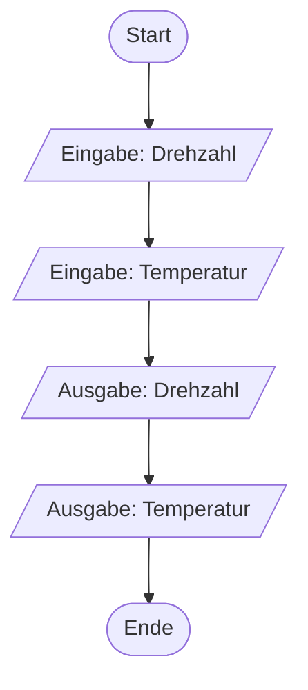

<!-- ZIELGRUPPE: Erstsemester im 1. Fachsemester, KEINE Vorkenntnisse in
     Programmierung oder Informatik. Die Studierenden sind im Betrieb und
     haben in dieser Phase KEINEN Kontakt zum Lehrenden — dieses Dokument
     muss vollständig aus sich heraus verständlich sein.

     BEWUSSTE SCOPE-ENTSCHEIDUNG: curriculum-map.yaml nennt fuer Woche 7
     auch "Einen PAP aus Woche 5 in C umsetzen". Woche 5 verwendet dafuer
     aber Beispiele mit Schleifen/Verzweigungen (Maximum finden,
     Primzahltest) - Schleifen und Verzweigungen in C werden erst in der
     Theoriephase (Termin 2) eingefuehrt, stehen hier also noch nicht zur
     Verfuegung. Stattdessen wird die in Woche 5 gelernte 5-Schritt-
     Entwurfsmethode auf ein NEUES, rein lineares Problem (nur Eingabe,
     Verarbeitung, Ausgabe, keine Wiederholung/Verzweigung) angewendet und
     in C umgesetzt. Siehe hinweis-Feld bei Woche 7 in curriculum-map.yaml.

     Reihenfolge auf Wunsch des Professors an die Video-Reihenfolge
     angepasst: erst Basisdatentypen (Video 6), dann Ein-/Ausgabe
     (Video 7) - curriculum-map.yaml wurde entsprechend mitgepflegt. -->

# Woche 7: Das erste eigene Programm

> Zeitbedarf: ca. 2 Stunden.

## Worum geht es?

Letzte Woche hast du Visual Studio installiert und dein erstes Programm
zum Laufen gebracht — ohne dass wir uns angeschaut haben, was der Code
darin eigentlich bedeutet. Das holst du diese Woche nach: Du lernst den
Aufbau eines C-Programms im Detail kennen, legst eigene Variablen an und
liest und schreibst Werte über die Konsole. Am Ende dieser Woche kannst du
ein kleines, eigenständiges Problem komplett selbst in ein lauffähiges
C-Programm verwandeln.

!!! abstract "Diese Woche ohne KI"
    Diese Woche schreibst du deinen ersten eigenen Code — Variablen
    anlegen, Werte einlesen und ausgeben. Das baut algorithmisches Denken
    und ein Gefühl für die Sprache C auf, das dir eine KI nicht abnehmen
    kann. Nachschlagen in der Kursseite oder deiner Dokumentation bleibt
    natürlich erlaubt. Mehr dazu unter [KI im Kurs](../../ki-nutzung.md).

## Das solltest du danach können

- Du kannst den korrekten Aufbau eines C-Programms (`#include`,
  `int main(void)`, `return 0;`) erklären und Kommentare sinnvoll
  einsetzen.
- Du kannst Variablen der vier Basisdatentypen (`int`, `float`, `double`,
  `char`) deklarieren, initialisieren und ihnen Werte zuweisen.
- Du kannst erklären, warum Datentyp und zugewiesener Wert zueinander
  passen müssen, und vorhersagen, was bei einer unpassenden Zuweisung
  passiert.
- Du kannst mit `printf` formatiert Werte ausgeben und mit `scanf_s` Werte
  unterschiedlichen Typs von der Tastatur einlesen.
- Du kannst ein einfaches, lineares Problem mit Ein- und Ausgabe
  eigenständig als PAP entwerfen und in C umsetzen.

## Erarbeitung { .abschnitt-erarbeitung }

**Schritt 1:** Verstehe den Aufbau eines C-Programms im Detail.

In Woche 6 hast du der Einfachheit halber `void main()` ohne `return`
geschrieben, genau wie im Video. Das war bewusst so vereinfacht, damit du
dich in Woche 6 ganz auf die Bedienung von Visual Studio konzentrieren
konntest, ohne dich gleichzeitig mit dem Programmaufbau zu beschäftigen.
Das ist aber nicht ganz die korrekte Form — ab jetzt schreibst du immer
die vollständige, standardkonforme Variante. Tippe dieses Programm ab und
klicke auf die Kreise im Code für die Erklärung:

```c title="programmstruktur.c" linenums="1"
--8<-- "01-praxisphase/woche-07/code/programmstruktur.c"
```

1. `main` ist die Einstiegsfunktion, mit der jedes C-Programm startet.
   Das `(void)` bedeutet, dass `main` ohne Parameter aufgerufen wird —
   das steht bei uns immer so da. Der Rückgabetyp `int` (statt `void`)
   sagt, dass dieses Programm nach dem Beenden einen Zahlenwert
   zurückmeldet.
2. `return 0;` ist genau dieser Rückgabewert — die 0 bedeutet "das
   Programm wurde erfolgreich beendet". Andere Programme oder das
   Betriebssystem können diesen Wert auswerten, um zu prüfen, ob dein
   Programm erfolgreich durchgelaufen ist. Ein anderer Wert (z. B.
   `return 1;`) würde einen Fehler signalisieren; für dieses Modul reicht
   `return 0;` am Ende von `main` immer aus.

Im Code stehen außerdem zwei Kommentare (insgesamt drei Zeilen), die vom
Compiler komplett ignoriert werden — sie sind nur für Menschen gedacht.
Ein einzeiliger Kommentar beginnt mit `//`, ein mehrzeiliger steht
zwischen `/*` und `*/` und darf sich über mehrere Zeilen erstrecken.
Kommentare helfen dir (und anderen), Code später wieder zu verstehen, und
werden manchmal auch benutzt, um Codezeilen vorübergehend zu deaktivieren
("auszukommentieren"), zum Beispiel bei der Fehlersuche.

---

**Schritt 2:** Schau dir das Video **„C-Programmierung #02:
Basisdatentypen"** an (12:14 Min.).

<div class="video-wrapper">
  <iframe src="https://www.youtube-nocookie.com/embed/ru4R61C90Sw" title="Video: Basisdatentypen" loading="lazy" allowfullscreen referrerpolicy="strict-origin-when-cross-origin"></iframe>
</div>

Das Video zeigt, wie man eine **Variable** anlegt — also einen benannten
Speicherplatz für einen Wert — und welche vier grundlegenden Datentypen
(**Basisdatentypen**) es dafür in C gibt: `int` für ganze Zahlen, `float`
und `double` für Zahlen mit Nachkommaanteil (`double` mit höherer
Genauigkeit) und `char` für einzelne Zeichen. Du erinnerst dich vielleicht
an Woche 1: Der Speicher lässt sich wie eine Tabelle aus Adressen und
Werten vorstellen — genau dort legt eine Variable ihren Wert ab.

Wichtig ist außerdem: Der **Datentyp** einer Variable legt fest, welche
Werte sie aufnehmen darf. Weist du ihr einen nicht passenden Wert zu (zum
Beispiel eine Kommazahl an eine `int`-Variable), übersetzt der Compiler
das Programm trotzdem — aber der Nachkommaanteil geht dabei verloren.
Visual Studio warnt dich in diesem Fall mit einem Hinweis wie
*"conversion from 'double' to 'int', possible loss of data"* — genau
diese Warnung siehst du gleich selbst, wenn du das Programm unten baust.

Und noch eine Erinnerung an Woche 2: Intern wird auch ein `char` als Zahl
gespeichert — nämlich als sein ASCII-Code.

Tippe das folgende Programm ab, das alle vier Basisdatentypen zeigt —
inklusive der Zuweisung, die zu diesem Datenverlust führt:

```c title="basisdatentypen.c" linenums="1"
--8<-- "01-praxisphase/woche-07/code/basisdatentypen.c"
```

1. `int` speichert eine ganze Zahl.
2. `float` speichert eine Gleitkommazahl (Zahl mit Nachkommaanteil). Das
   `f` hinter der Zahl markiert sie ausdrücklich als `float`-Wert.
   Beachte bei der Ausgabe: `%f` zeigt standardmäßig sechs
   Nachkommastellen an (`3.140000`) — wie du die Anzahl selbst festlegst,
   siehst du weiter unten.
3. `double` speichert ebenfalls eine Gleitkommazahl, mit doppelt so hoher
   Genauigkeit wie `float`.
4. `char` speichert ein einzelnes Zeichen, hier in einfachen
   Anführungszeichen angegeben.
5. Hier passiert der Datenverlust aus dem Text oben: `3.99` passt nicht in
   eine `int`-Variable, deshalb wird nur der ganzzahlige Anteil (`3`)
   übernommen und der Rest verworfen.

---

**Schritt 3:** Schau dir das Video **„C-Programmierung #03: Ein- und
Ausgaben"** an (7:33 Min.).

<div class="video-wrapper">
  <iframe src="https://www.youtube-nocookie.com/embed/_AldPyHZnxM" title="Video: Ein- und Ausgaben" loading="lazy" allowfullscreen referrerpolicy="strict-origin-when-cross-origin"></iframe>
</div>

`printf` kennst du schon aus den letzten beiden Wochen. Neu ist
`scanf_s`: Damit liest du einen Wert von der Tastatur ein und speicherst
ihn in einer Variable.

!!! info "scanf_s ist eine Visual-Studio-Besonderheit"
    `scanf_s` ist eine von Microsoft ergänzte, sicherere Variante der
    Standardfunktion `scanf` und funktioniert nur mit dem Visual-Studio-
    Compiler. Andere Compiler (z. B. auf Linux oder Mac) kennen nur
    `scanf`. Da wir in diesem Modul mit Visual Studio arbeiten, verwenden
    wir durchgehend `scanf_s`.

Tippe das folgende Programm ab. Es liest eine Zahl ein und gibt sie
anschließend in drei verschiedenen Formen wieder aus:

```c title="ein-ausgabe.c" linenums="1"
--8<-- "01-praxisphase/woche-07/code/ein-ausgabe.c"
```

1. `scanf_s` braucht wie `printf` ein Formatierungszeichen (hier `%d` für
   eine ganze Zahl) und dahinter den Namen der Variable, in die
   eingelesen werden soll — allerdings mit einem vorangestellten `&`. Das
   `&` ist der **Adressoperator**: Er gibt nicht den Wert der Variable an,
   sondern ihre Adresse im Speicher, also den Ort, an den `scanf_s` den
   eingelesenen Wert schreiben soll. Erinnerst du dich an die
   Speicher-Tabelle aus Woche 1 (Adressen in der einen, Werte in der
   anderen Spalte)? Genau diese Adresse liefert `&`.
2. `%x` gibt denselben Wert im Hexadezimalsystem aus — eine Erinnerung an
   Woche 2.
3. `%c` interpretiert die Zahl als ASCII-Code und gibt das zugehörige
   Zeichen aus.

---

**Schritt 4:** Setze ein kleines, selbst entworfenes Problem in C um.

In Woche 5 hast du eine 5-Schritt-Methode kennengelernt, um Algorithmen
von Grund auf zu entwerfen: Problem verstehen, Ein-/Ausgabe festlegen, in
Teilschritte zerlegen, Entscheidungen und Wiederholungen erkennen, PAP und
Pseudocode formulieren. Verzweigungen und Wiederholungen kannst du in C
erst ab der Theoriephase umsetzen — deshalb wenden wir die Methode heute
auf ein Problem an, das **rein linear** ist: nur Eingabe, Verarbeitung,
Ausgabe, ohne Entscheidung oder Wiederholung.

**Problem:** Ein Motorprüfstand soll die aktuelle Motordrehzahl (eine
ganze Zahl in U/min) und die Temperatur (eine Kommazahl in Grad Celsius)
erfassen und beides übersichtlich ausgeben.



Die Umsetzung in C braucht dafür genau die Bausteine, die du diese Woche
gelernt hast: zwei Variablen unterschiedlichen Typs, `scanf_s` zum
Einlesen und `printf` zur formatierten Ausgabe.

!!! warning "Dezimalzahlen mit Punkt eingeben"
    Wenn du gleich eine Kommazahl über die Tastatur eingibst, verwende
    einen **Punkt** statt eines Kommas (also `23.5`, nicht `23,5`).
    `scanf_s` erwartet die Schreibweise, die C für Zahlen verwendet — mit
    einem Komma würde das Einlesen nicht wie erwartet funktionieren.

```c title="messwerte.c" linenums="1"
--8<-- "01-praxisphase/woche-07/code/messwerte.c"
```

1. Für die Temperatur brauchst du beim Einlesen mit `scanf_s` das
   Formatierungszeichen `%lf` ("long float") statt `%f` — bei `printf`
   reicht dagegen für beide Typen `%f`. Der Grund: Bei `printf` wandelt C
   `float`-Werte automatisch in `double` um, bevor sie ausgegeben werden.
   Beim Einlesen mit `scanf_s` passiert diese automatische Umwandlung
   nicht — deshalb muss dort der genaue Typ angegeben werden.
2. `%.1f` gibt die Zahl mit genau einer Nachkommastelle aus — die Zahl vor
   dem `f` legt die Anzahl der angezeigten Nachkommastellen fest.

## Zum Ausprobieren { .abschnitt-ausprobieren }

**Aufgabe — Gesamtwiderstand bei Reihenschaltung:**

Zwei Widerstände `R1` und `R2` (jeweils eine Kommazahl in Ohm) werden in
Reihe geschaltet. Der Gesamtwiderstand einer Reihenschaltung ist die
Summe der Einzelwiderstände: `R_gesamt = R1 + R2`. Denk beim Testen wieder
an den Punkt statt Komma bei der Eingabe (siehe Hinweis oben).

Wende die 5-Schritt-Methode aus Woche 5 an: Entwirf zuerst einen kurzen,
linearen PAP für dieses Problem (Eingabe zweier Werte, eine einfache
Verarbeitung, Ausgabe des Ergebnisses — keine Verzweigung oder
Wiederholung nötig) und setze ihn anschließend in ein C-Programm um.

??? note "Musterlösung anzeigen"
    ```mermaid
    %%{init: {'flowchart': {'htmlLabels': false}}}%%
    flowchart TD
        A(["Start"])
        B[/"Eingabe: R1"/]
        C[/"Eingabe: R2"/]
        D["R_gesamt := R1 + R2"]
        E[/"Ausgabe: R_gesamt"/]
        F(["Ende"])
        A --> B --> C --> D --> E --> F
    ```

    ```c title="widerstand.c" linenums="1"
    --8<-- "01-praxisphase/woche-07/code/widerstand.c"
    ```

    Beide Widerstände werden als `double` eingelesen, da Widerstandswerte
    in der Praxis selten ganzzahlig sind. Die Addition `r1 + r2`
    funktioniert bei `double`-Werten genauso, wie du es aus der Mathematik
    kennst. Die Ausgabe mit `%.2f` rundet auf zwei Nachkommastellen, was
    für einen Widerstandswert eine sinnvolle Genauigkeit ist.

## Selbstkontrolle { .abschnitt-selbstkontrolle }

### Frage 1

<quiz>
Ordne jeden Begriff seiner Erklärung zu:

| Nr. | Begriff |
|---|---|
| 1 | Deklaration |
| 2 | Initialisierung |
| 3 | Zuweisung |
| 4 | Adressoperator |

- [[4]] Das Zeichen `&` vor einem Variablennamen, das die Speicheradresse dieser Variable angibt statt ihres Werts.
- [[1]] Das Anlegen einer Variable mit einem festgelegten Datentyp im Speicher.
- [[3]] Das nachträgliche Verändern des Werts einer bereits bestehenden Variable mit `=`.
- [[2]] Das Vergeben eines ersten Werts direkt bei der Deklaration einer Variable.

</quiz>

### Frage 2

Was gibt dieses Programm aus?

```c
--8<-- "01-praxisphase/woche-07/code/frage-typkonflikt.c"
```

??? note "Musterlösung anzeigen"
    Die Ausgabe ist `2`. `wert` ist als `int` deklariert und kann daher
    nur ganze Zahlen speichern. Bei der Zuweisung `wert = 2.5;` wird nur
    der ganzzahlige Anteil (`2`) übernommen, der Nachkommaanteil (`0.5`)
    geht verloren. Das Programm kompiliert trotzdem — Visual Studio würde
    hier lediglich eine Warnung anzeigen, keinen Fehler.

### Frage 3

<quiz>
Welches Formatierungszeichen verwendest du bei printf, um eine char-Variable als einzelnes Zeichen (nicht als Zahl) auszugeben?
- [ ] `%d`
> Nein — damit würde der ASCII-Code als Zahl ausgegeben, nicht das Zeichen selbst.
- [ ] `%s`
> Nein — `%s` ist für Zeichenketten (mehrere Zeichen), nicht für ein einzelnes `char`.
- [x] `%c`
> Richtig.
- [ ] `%x`
> Nein — das würde den ASCII-Code hexadezimal ausgeben.

</quiz>

### Frage 4

<quiz>
Beim Einlesen einer `double`-Variable mit [[scanf_s]] verwendest du das Formatierungszeichen [[%lf]], bei einer `float`-Variable dagegen [[%f]] — bei der Ausgabe mit `printf` reicht dagegen für beide Typen einheitlich [[%f]].

---
Nachzulesen im Abschnitt zu Schritt 4 oben.
</quiz>

### Frage 5

In `scanf_s("%d", &zahl);` steht vor dem Variablennamen ein `&`. Was
würde passieren, wenn du dieses `&` vergisst, und warum ist es überhaupt
nötig? Du musst den genauen Fehlertext nicht kennen — erkläre das Prinzip
in eigenen Worten.

??? note "Musterlösung anzeigen"
    `scanf_s` muss wissen, **wohin** im Speicher der eingelesene Wert
    geschrieben werden soll — dafür braucht es die Adresse der Variable,
    nicht ihren (zu diesem Zeitpunkt ohnehin meist bedeutungslosen)
    aktuellen Wert. Das `&` liefert genau diese Adresse. Ohne `&` würde
    `scanf_s` stattdessen den aktuellen Wert der Variable übergeben
    bekommen — der Compiler meldet das in der Regel als Fehler oder
    zumindest als deutliche Warnung, weil `scanf_s` an dieser Stelle eine
    Adresse (einen Zeiger) erwartet, keinen gewöhnlichen Wert.

### Frage 6

Würde dein Programm noch kompilieren, wenn du `int main(void)` durch
`void main()` ersetzt und die Zeile `return 0;` weglässt — also wie in
Woche 6? Was wäre der Unterschied zur empfohlenen Form aus dieser Woche?

??? note "Musterlösung anzeigen"
    Ja, mit Visual Studio kompiliert das Programm in der Regel trotzdem —
    `void main()` wird von vielen Compilern akzeptiert, ist aber keine
    standardkonforme C-Form. Der Unterschied: Ohne `int` als Rückgabetyp
    und ohne `return 0;` kann das Programm keinen Rückgabewert an das
    Betriebssystem (oder ein aufrufendes Programm) melden — es lässt sich
    also nicht von außen feststellen, ob das Programm erfolgreich
    durchgelaufen ist. Für kleine Übungsprogramme fällt das kaum auf, ist
    aber schlechter Stil und in größeren Projekten problematisch.
