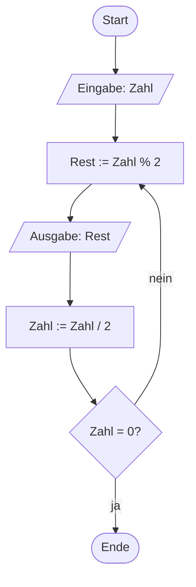
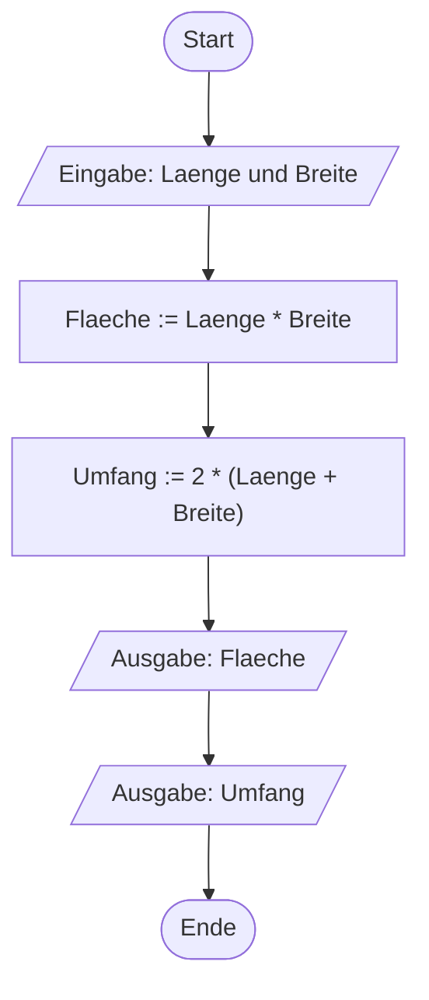
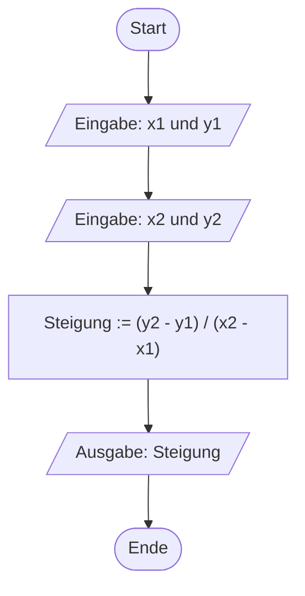
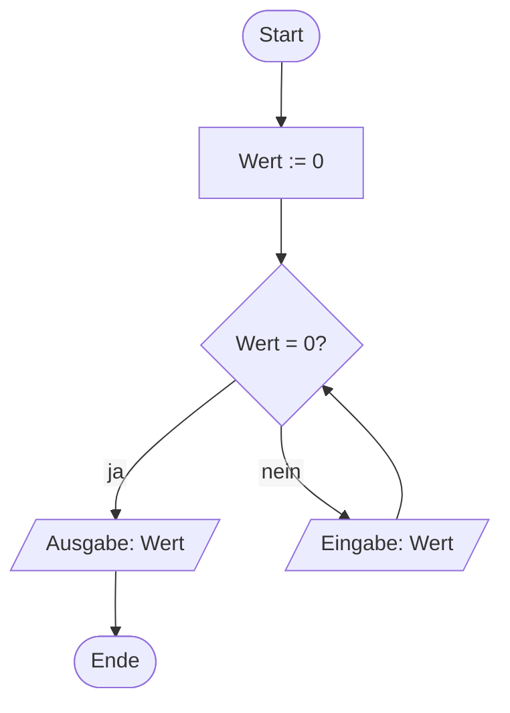

# Algorithmen und Programmablaufpläne (21.10.2026)

## Übung { .modus-uebung }

### Worum geht es?

In der ersten Einheit von heute habt ihr einen ganzen Werkzeugkasten für
Ein- und Ausgabe in C gebaut. Jetzt geht es einen Schritt weiter: Bevor ihr ein neues
Problem programmiert, entwerft ihr zuerst einen Programmablaufplan dafür —
so wie ihr es in der Praxisphase (Woche 3 bis 5) geübt habt. Diesen roten
Faden "erst PAP, dann Code" behalten wir vorerst bei.

!!! abstract "Lernziele"
    - Ihr könnt einen bekannten Algorithmus (Horner-Schema) als
      Programmablaufplan mit einer gültigen Abbruchbedingung formulieren.
    - Ihr könnt für ein neues, lineares Problem zuerst einen PAP entwerfen
      und ihn anschließend in ein C-Programm umsetzen.

### Horner-Schema: Vom Verfahren zum PAP <span class="zeitangabe">ca. 12 Min.</span> { data-toc-label="Horner-Schema: Vom Verfahren zum PAP" }

Ihr kennt das Horner-Schema schon aus Praxisphase Woche 2: Eine Dezimalzahl
wird fortgesetzt durch die Zielbasis geteilt, die Reste ergeben — von unten
nach oben gelesen — die gesuchte Zahl. Zur Auffrischung ein Beispiel: Die
Zahl `13₁₀` soll ins Dualsystem umgewandelt werden.

```text
13 : 2 = 6  Rest 1
 6 : 2 = 3  Rest 0
 3 : 2 = 1  Rest 1
 1 : 2 = 0  Rest 1
```

Von unten nach oben gelesen ergibt sich `1101₂`. Entscheidend dafür, dass
dieses Verfahren überhaupt endet, ist die **Abbruchbedingung**: Es wird so
lange weiter geteilt, bis das Ergebnis der Division `0` ist — bei jedem
anderen Zwischenergebnis geht es weiter. Genau das übersetzen wir jetzt in
einen Programmablaufplan mit einer Wiederholung.

**Neuer Operator — Modulo:** Der Operator `%`, den ihr gleich im PAP seht,
liefert den **Rest** einer Ganzzahldivision — zum Beispiel ist `17 % 5`
gleich `2`, weil `17` bei der Division durch `5` den Rest `2` lässt.
Zusammen mit der normalen Division `/` (die bei `int`-Werten immer
abrundet) lässt sich damit eine Zahl in Stellen mit unterschiedlicher
Größenordnung zerlegen — genau das nutzt das Horner-Schema hier aus.
{: .hinweis-klein }



Wie in Woche 4 ist das dieselbe Raute wie bei einer Verzweigung, kombiniert
mit einem Rücksprung. Sie prüft nach jeder Division neu, ob schon
abgebrochen werden kann — das ist eine **fußgesteuerte** Wiederholung: Die
Schleifenanweisungen laufen mindestens einmal, bevor überhaupt geprüft
wird. Diesen PAP setzen wir bewusst noch nicht in Code um — die dafür
nötige Wiederholung in C lernt ihr erst im nächsten Termin. Wir greifen
dieses Beispiel dann wieder auf.

---

### Das Beispiel: Fläche und Umfang eines Rechtecks <span class="zeitangabe">ca. 2 Min.</span> { data-toc-label="Das Beispiel: Fläche und Umfang eines Rechtecks" }

Jetzt entwerfen wir gemeinsam ein neues, rein lineares Problem — erst als
PAP, dann als Code: Länge und Breite eines Rechtecks werden eingelesen,
daraus werden Fläche und Umfang berechnet und ausgegeben.



---

### Umsetzung in C <span class="zeitangabe">ca. 8 Min.</span> { data-toc-label="Umsetzung in C" }

Den PAP von eben setzen wir jetzt in C um. Die drei Schritte aus dem PAP —
Eingabe, Berechnung, Ausgabe — kennzeichnen wir im Code mit Kommentaren, so
dass sich Programm und PAP leicht einander zuordnen lassen.

**Trennzeichen beim Einlesen:** Vergesst ihr beim Eintippen das Komma
zwischen den beiden Zahlen, liest `scanf_s` die Eingabe anders ein als
erwartet — genau das Problem, das in der Musterlösung zu Aufgabe 01 vom
Anfang des heutigen Termins schon kurz angesprochen wurde. Wir gehen im
nächsten Termin genauer darauf ein.
{: .hinweis-klein }

??? quote livecoding "Beispiel-Code"
    ```c linenums="1"
    --8<-- "02-theoriephase/termin-01/code/live-02-1-rechteck.c"
    ```

---

### Noch ein Algorithmus: Steigung zwischen zwei Punkten <span class="zeitangabe">ca. 8 Min.</span> { data-toc-label="Noch ein Algorithmus: Steigung zwischen zwei Punkten" }

Ein zweites lineares Beispiel, damit ihr das Muster "erst PAP, dann Code"
noch einmal seht: Aus zwei Punkten `(x1, y1)` und `(x2, y2)` berechnen wir
die Steigung der Geraden durch beide Punkte.



??? quote livecoding "Beispiel-Code"
    ```c linenums="1"
    --8<-- "02-theoriephase/termin-01/code/live-02-2-steigung.c"
    ```

**Was, wenn `x1 = x2`?** Dann stünde eine Division durch `0` im Programm —
mathematisch eine senkrechte Gerade ohne definierte Steigung. Um diesen
Fall abzufangen, bräuchtet ihr eine Verzweigung. Die lernt ihr im nächsten
Termin kennen.
{: .hinweis-klein }

---

## Betreutes Selbststudium { .modus-selbststudium }

### Worum geht es?

Jetzt wendet ihr das Muster "erst PAP, dann Code" selbst an, prüft einen
gegebenen PAP auf einen Fehler und übt zusätzlich, aus gegebenem Code den
passenden PAP abzuleiten und die dahinterliegende Absicht eines Programms
zu erschließen.

!!! abstract "Lernziele"
    - Ihr könnt für ein neues, lineares Problem zuerst einen PAP entwerfen
      und ihn anschließend in ein C-Programm umsetzen.
    - Ihr könnt einen gegebenen PAP auf einen Logikfehler hin prüfen und
      die Korrektur begründen.
    - Ihr könnt einem gegebenen, kommentierten C-Programm mit Verzweigung
      und Wiederholung den passenden Programmablaufplan zuordnen.
    - Ihr könnt aus einem PAP bzw. Code die dahinterliegende Absicht eines
      Programms erschließen und in eigenen Worten beschreiben.

### Aufgabe 04: Sekunden in Stunden, Minuten, Sekunden

Entwerft zuerst einen PAP für folgendes Problem: Eine Anzahl Sekunden wird
eingelesen und in Stunden, Minuten und Restsekunden zerlegt (zum Beispiel:
`3725` Sekunden sind `1:02:05`). Setzt den PAP anschließend in ein
C-Programm um — nutzt dafür wie beim Horner-Schema in der Übung die
Operatoren `%` und `/`.

<!-- MUSTERLOESUNG-START -->
??? note "Musterlösung anzeigen"
    ```mermaid
    %%{init: {'flowchart': {'htmlLabels': false}}}%%
    flowchart TD
        A(["Start"])
        B[/"Eingabe: Sekunden"/]
        C["Stunden := Sekunden / 3600"]
        D["Rest := Sekunden % 3600"]
        E["Minuten := Rest / 60"]
        F["Restsekunden := Rest % 60"]
        G[/"Ausgabe: Stunden, Minuten, Restsekunden"/]
        H(["Ende"])
        A --> B --> C --> D --> E --> F --> G --> H
    ```

    ```c linenums="1"
    --8<-- "02-theoriephase/termin-01/code/aufg-04-sekunden-umrechnen.c"
    ```

    Der Kern ist die zweistufige Zerlegung: Zuerst werden die vollen
    Stunden abgetrennt (`/ 3600`, `% 3600` liefert den Rest ohne die vollen
    Stunden), danach wird derselbe Trick auf den Rest angewendet, um daraus
    Minuten und Restsekunden zu gewinnen. `%02d` sorgt dafür, dass Minuten
    und Sekunden immer zweistellig mit führender Null erscheinen (`02:05`
    statt `2:5`).

<!-- MUSTERLOESUNG-ENDE -->

---

### Aufgabe 05: Fehlersuche im PAP

Der folgende PAP soll die Nutzerin oder den Nutzer so lange nach einer Zahl
fragen, bis eine Zahl ungleich `0` eingegeben wurde, und diese dann
ausgeben — enthält dabei aber einen Fehler bei der Wiederholung. Findet den
Fehler **ohne Rechner**, allein durch Lesen des PAP: Was würde das
Programm tatsächlich tun, wenn ihr es so ausführen würdet?



<!-- MUSTERLOESUNG-START -->
??? note "Musterlösung anzeigen"
    Die Raute prüft `Wert = 0?`, **bevor** überhaupt einmal eine Zahl
    eingelesen wurde — das ist eine kopfgesteuerte Wiederholung. Da `Wert`
    mit `0` initialisiert wird, ist die Bedingung beim allerersten Check
    schon erfüllt (`ja`), und das Programm läuft direkt zur Ausgabe und
    zum Ende, ohne den Knoten "Eingabe: Wert" auch nur ein einziges Mal zu
    erreichen. Es würde also einfach `0` ausgeben, ohne euch je nach einer
    Zahl zu fragen.

    Richtig wäre hier eine **fußgesteuerte** Wiederholung: Erst einlesen,
    dann prüfen, ob der Wert noch `0` ist — so läuft die Eingabe garantiert
    mindestens einmal, bevor überhaupt geprüft wird. Klassischer Fall: Wenn
    ihr eine Eingabe überprüfen wollt, müsst ihr sie erst einmal gehabt
    haben, bevor ihr sie prüfen könnt — das spricht grundsätzlich für eine
    fußgesteuerte Schleife, genau wie beim Horner-Schema in der Übung.

<!-- MUSTERLOESUNG-ENDE -->

---

### Aufgabe 06: PAP zu gegebenem Code

Das folgende Programm ist bereits vollständig — lest es, **ohne es
auszuführen**. Es verwendet drei Konstrukte, die ihr in C noch nicht selbst
geschrieben habt: eine Wiederholung (`while`), eine Verzweigung (`if`) und
einen vorzeitigen Abbruch (`break`) — das Gegenstück zum `BREAK` aus der
PAP-Notation, das ihr aus Praxisphase Woche 4/5 kennt. Die Anmerkungen
darunter erklären nur, **was** die markierten Zeilen bewirken, nicht die
genaue Schreibweise — die lernt ihr im nächsten Termin.

```c title="messreihen-auswertung.c" linenums="1"
--8<-- "02-theoriephase/termin-01/code/vorgabe-06-messreihen-auswertung.c"
```

1. Diese Zeile bedeutet: "Wiederhole die folgenden Schritte, solange der
   zuletzt eingegebene Wert nicht negativ ist." Zu diesen "folgenden
   Schritten" gehört alles zwischen der öffnenden geschweiften Klammer
   `{` in der nächsten Zeile und der zugehörigen schließenden Klammer `}`
   in Zeile 28 — erkennbar an der gemeinsamen Einrückung.
2. Diese Zeile aktualisiert einen laufenden Gesamtwert: Der neue Wert von
   `summe` ergibt sich aus dem bisherigen `summe`-Wert plus dem gerade
   eingegebenen `wert`. Beispiel: Steht `summe` bei `30` und wird `20`
   eingegeben, ist `summe` danach `50`.
3. Diese Zeile bedeutet: "Wenn das bisherige Ergebnis größer als die
   Grenze ist, führe die folgenden Schritte aus." Auch hier gehört alles
   zwischen der öffnenden Klammer `{` in der nächsten Zeile und der
   schließenden Klammer `}` in Zeile 24 dazu.
4. Diese Zeile bedeutet: "Verlasse die Wiederholung sofort" — unabhängig
   davon, ob die Bedingung von Anmerkung 1 noch erfüllt wäre. Alle
   restlichen Schritte innerhalb der Wiederholung (auch der erneute
   Eingabe-Aufruf danach) werden dadurch übersprungen.

#### Teil A — PAP zeichnen

Zeichnet den vollständigen Programmablaufplan zu diesem Programm — mit der
Verzweigungs- und der Wiederholungs-Raute aus Woche 4 sowie dem
`BREAK`-Pfeil aus Woche 4/5 für den vorzeitigen Abbruch.

<!-- MUSTERLOESUNG-START -->
??? note "Musterlösung Teil A anzeigen"
    ```mermaid
    %%{init: {'flowchart': {'htmlLabels': false}}}%%
    flowchart TD
        A(["Start"])
        B[/"Eingabe: Wert"/]
        C{"Wert >= 0?"}
        D["Summe := Summe + Wert"]
        E["Anzahl := Anzahl + 1"]
        F["Ergebnis := Summe / Anzahl"]
        G{"Ergebnis > Grenze?"}
        H[/"Eingabe: Wert"/]
        I[/"Ausgabe: Ergebnis"/]
        J(["Ende"])
        A --> B --> C
        C -->|ja| D --> E --> F --> G
        G -->|BREAK| I
        G -->|nein| H --> C
        C -->|nein| I --> J
    ```

    Die Raute `Wert >= 0?` ist **kopfgesteuert**: Sie wird geprüft, bevor
    die Schleifenanweisungen überhaupt laufen — genau wie beim `while` im
    Code. Die Raute `Ergebnis > Grenze?` gehört zur Verzweigung (`if`):
    Trifft sie zu, verlässt ein mit `BREAK` beschrifteter Pfeil die
    Wiederholung direkt und führt zum selben Knoten, an dem die
    Wiederholung auch regulär verlassen wird (`Ausgabe: Ergebnis`) — genau
    die Notation für vorzeitigen Abbruch aus Woche 4/5.

<!-- MUSTERLOESUNG-ENDE -->

---

#### Teil B — Was berechnet das Programm?

Beschreibt in eigenen Worten, was dieses Programm insgesamt berechnet.
Prüft eure Vermutung anschließend gedanklich (ohne Rechner) an den
Eingaben `70` und dann `100`. Führt dafür am besten Buch, wie sich
`summe`, `anzahl` und `ergebnis` bei jedem eingegebenen Wert verändern:

| Eingegebener Wert | Summe | Anzahl | Ergebnis | Abbruch? |
|---|---|---|---|---|
| 70 | | | | |
| 100 | | | | |

<!-- MUSTERLOESUNG-START -->
??? note "Musterlösung Teil B anzeigen"
    Das Programm berechnet fortlaufend den **Mittelwert** (das
    arithmetische Mittel) aller bisher eingegebenen Werte — nach jedem
    neuen Wert wird er neu berechnet. Die Eingabe endet entweder normal
    (eine negative Zahl wird eingegeben) oder vorzeitig per `break`,
    sobald dieser laufende Mittelwert die Grenze (hier `80`) übersteigt.

    So füllt sich die Tabelle von oben:

    | Eingegebener Wert | Summe | Anzahl | Ergebnis | Abbruch? |
    |---|---|---|---|---|
    | 70 | 70 | 1 | 70.00 | nein |
    | 100 | 170 | 2 | 85.00 | **ja — break** |

    Nach der zweiten Eingabe liegt der laufende Mittelwert (`85.00`) über
    der Grenze `80` — die Wiederholung wird sofort per `break` verlassen.
    Ihr würdet also gar nicht mehr nach einem dritten Wert gefragt werden,
    obwohl ihr keine negative Zahl eingegeben habt. Ausgegeben wird
    `Ergebnis: 85.00`.

<!-- MUSTERLOESUNG-ENDE -->
