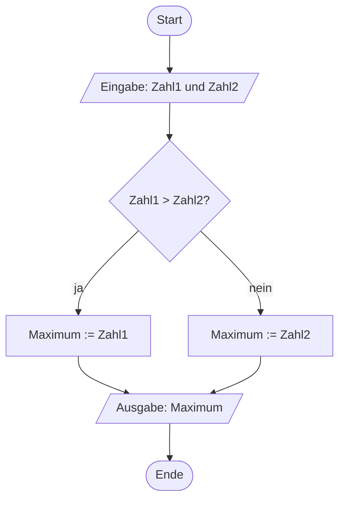

# Vom PAP zum C-Programm (28.10.2026)

## Übung { .modus-uebung }

### Worum geht es?

In Termin 1 habt ihr gelernt, zuerst einen Programmablaufplan zu entwerfen
und ihn dann in C umzusetzen — allerdings nur für rein lineare Probleme.
Heute kommt das erste neue Sprachelement dazu: die Verzweigung. Ihr kennt
sie als Raute aus der Praxisphase (Woche 4) — jetzt übersetzt ihr sie zum
ersten Mal in echten C-Code.

!!! abstract "Lernziele"
    - Ihr könnt eine zweiseitige Verzweigung aus dem PAP mit `if`/`else` in
      C umsetzen.
    - Ihr könnt eine Mehrfachauswahl mit `switch`/`case` in C umsetzen und
      erklären, warum jeder Fall ein `break` braucht.

### Kurzer Rückblick <span class="zeitangabe">ca. 5 Min.</span> { data-toc-label="Kurzer Rückblick" }

1\. Wieso entwerft ihr eigentlich zuerst einen Programmablaufplan, bevor
ihr ein Problem programmiert?

<!-- MUSTERLOESUNG-START -->
??? note "Musterlösung anzeigen"
    Ein PAP zwingt euch, die Lösung erst zu Ende zu durchdenken, bevor ihr
    euch mit der Syntax einer Programmiersprache beschäftigen müsst. Fehler
    im Ablauf selbst (z. B. ein vergessener Schritt oder eine falsche
    Reihenfolge) fallen so auf, bevor sie sich im Code verstecken — und ein
    PAP lässt sich unabhängig von der Programmiersprache lesen und
    diskutieren.
<!-- MUSTERLOESUNG-ENDE -->

2\. Wie unterscheidet sich im PAP eine zweiseitige von einer einseitigen
Auswahl?

<!-- MUSTERLOESUNG-START -->
??? note "Musterlösung anzeigen"
    Bei einer zweiseitigen Auswahl haben sowohl der ja- als auch der
    nein-Zweig einen eigenen Schritt, bevor beide wieder im selben
    Folgeknoten zusammenlaufen. Bei einer einseitigen Auswahl hat nur der
    ja-Zweig einen zusätzlichen Schritt — der nein-Zweig läuft direkt zum
    Folgeknoten weiter.
<!-- MUSTERLOESUNG-ENDE -->

---

### Das Beispiel: Maximum zweier Zahlen <span class="zeitangabe">ca. 3 Min.</span> { data-toc-label="Das Beispiel: Maximum zweier Zahlen" }

In Praxisphase Woche 5 habt ihr als PAP gesehen, wie man das Maximum aus
einer ganzen Reihe von Zahlen bestimmt — mit einer Zählschleife, die noch
nicht zur Verfügung steht. Heute fangen wir kleiner an: Nur zwei Zahlen
werden eingelesen, verglichen, und die größere wird ausgegeben. Anders als
in Woche 5 (Startwert übernehmen, dann bei Bedarf aktualisieren) vergleichen
wir hier direkt beide Werte in einer einzigen zweiseitigen Auswahl — das
passt bei genau zwei Zahlen besser. Die Variante mit beliebig vielen Zahlen
(inklusive des Startwert-Tricks aus Woche 5) holt ihr später am heutigen
Termin nach, sobald ihr Schleifen in C schreiben könnt.



---

### Umsetzung in C <span class="zeitangabe">ca. 10 Min.</span> { data-toc-label="Umsetzung in C" }

Den PAP von eben setzen wir jetzt in C um. `if`/`else` funktioniert genau
wie die zweiseitige Auswahl im PAP:

```c
if (Bedingung)
{
    // Anweisungen, wenn die Bedingung erfüllt ist
}
else
{
    // Anweisungen, wenn die Bedingung nicht erfüllt ist
}
```

Ist die Bedingung in den runden Klammern erfüllt, laufen die Anweisungen
im ersten Zweig; sonst die im `else`-Zweig. Die geschweiften Klammern
fassen dabei jeweils zusammen, was zu einem Zweig gehört — auch wenn es,
wie gleich bei uns, nur eine einzige Zeile ist. Eingabe, Vergleich und
Ausgabe kennzeichnen wir im Code außerdem mit Kommentaren.

**Vergleich statt Zuweisung — `==` statt `=`:** Im PAP habt ihr Bedingungen
wie `"Zahl = 0?"` mit einem einfachen Gleichheitszeichen geschrieben. In C
ist `=` aber die Zuweisung (`ergebnis = 5;`) — für einen **Vergleich**
braucht ihr stattdessen `==` (zwei Gleichheitszeichen), zum Beispiel
`zahl1 == zahl2`. Verwechselt ihr die beiden, meldet der Compiler oft nicht
einmal einen Fehler, nur ein unerwartetes Ergebnis — also gleich richtig
merken.
{: .hinweis-klein }

??? quote livecoding "Beispiel-Code"
    ```c linenums="1"
    --8<-- "02-theoriephase/termin-02/code/live-03-1-maximum.c"
    ```

    1. Steht im `if`-Zweig nur eine einzige Anweisung, sind die geschweiften
       Klammern eigentlich überflüssig und könnten auch weggelassen werden.
    2. Dasselbe gilt für den `else`-Zweig: Bei nur einer Anweisung sind die
       geschweiften Klammern nicht zwingend nötig.

!!! tip "Clean Code: Sprechende Namen"
    `zahl1`, `zahl2` und `maximum` sagen auf den ersten Blick, wofür die
    Variable steht — anders als z. B. `a`, `b` und `m`. Das kostet beim
    Tippen ein paar Zeichen mehr, spart euch aber beim Lesen (und erst
    recht beim Wiederlesen nach ein paar Wochen) deutlich mehr Zeit, weil
    ihr den Code nicht erst entschlüsseln müsst. Ab jetzt erwarten wir
    sprechende Namen in allen Aufgaben.

---

### Alternative: Der ternäre Operator <span class="zeitangabe">ca. 5 Min.</span> { data-toc-label="Alternative: Der ternäre Operator" }

Für genau solche einfachen Fälle — eine Bedingung, zwei mögliche Werte,
direkt einer Variable zugewiesen — bietet C eine kompakte Alternative zu
`if`/`else`: den **ternären Operator**.

```c
Variable = (Bedingung) ? WertWennWahr : WertWennFalsch;
```

Angewendet auf unser Maximum-Beispiel ersetzt eine einzige Zeile das
komplette `if`/`else` von eben:

??? quote livecoding "Beispiel-Code"
    ```c linenums="1"
    --8<-- "02-theoriephase/termin-02/code/live-03-2-ternaer.c"
    ```

**Nur für einfache Fälle:** Der ternäre Operator ist eine Ergänzung, kein
Ersatz für `if`/`else`. Sobald mehr als eine Anweisung pro Zweig nötig ist
oder die Bedingung selbst unübersichtlich wird, bleibt `if`/`else` die
klarere Wahl — Lesbarkeit geht vor Kompaktheit.
{: .hinweis-klein }

---

### Noch ein Konstrukt: switch/case <span class="zeitangabe">ca. 12 Min.</span> { data-toc-label="Noch ein Konstrukt: switch/case" }

`if`/`else` eignet sich gut für zwei Möglichkeiten. Müsst ihr dagegen
zwischen vielen festen Werten unterscheiden, wird eine Kette aus
`if`/`else if`/`else` schnell unübersichtlich — dafür gibt es `switch`/
`case`. Beispiel: Der Betriebszustand einer Maschine (als Zahl 0 bis 3)
soll in Klartext ausgegeben werden.

```c
switch (Ausdruck)
{
    case Wert1:
        // Anweisungen für Wert1
        break;
    case Wert2:
        // Anweisungen für Wert2
        break;
    default:
        // Anweisungen, wenn kein Fall passt
        break;
}
```

**Wichtig — `break` nicht vergessen:** Ohne `break` am Ende eines Falls
"fällt" die Ausführung einfach in den nächsten Fall durch (*Fallthrough*)
— anders als bei einer Wiederholung, wo `break` nur in Ausnahmefällen
gebraucht wird, ist es bei `switch`/`case` praktisch immer nötig. Ihr seht
gleich in Aufgabe 09, was passiert, wenn man es vergisst.
{: .hinweis-klein }

??? quote livecoding "Beispiel-Code"
    ```c linenums="1"
    --8<-- "02-theoriephase/termin-02/code/live-03-3-maschinenzustand.c"
    ```

!!! tip "Clean Code: Kommentare erklären das Warum, nicht das Was"
    Ein Kommentar wie `// gibt "Unbekannter Zustand" aus` würde nur
    wiederholen, was ohnehin schon im Code steht — überflüssig. Der
    Kommentar am `default`-Fall oben erklärt stattdessen, **warum** dieser
    Fall überhaupt da ist: damit eine ungültige Eingabe nicht einfach
    stillschweigend nichts ausgibt. Das ist die Art von Kommentar, die
    wirklich weiterhilft — Code, der nur wiederholt, was die nächste Zeile
    ohnehin zeigt, ist kein guter Kommentar. Ab jetzt erwarten wir diese Art
    von Kommentaren in allen Aufgaben.

---

## Betreutes Selbststudium { .modus-selbststudium }

### Worum geht es?

Jetzt übt ihr `if`/`else` und `switch`/`case` selbst an neuen Beispielen —
und sucht einen klassischen Fehler in vorgegebenem Code.

!!! abstract "Lernziele"
    - Ihr könnt sprechende Namen in eigenem Code verwenden.
    - Ihr könnt Kommentare schreiben, die das Warum statt das Was
      erklären.
    - Ihr könnt einen Fallthrough-Fehler durch ein fehlendes `break` in
      gegebenem Code finden und erklären.

### Aufgabe 07: Gerade oder ungerade

Entwerft zuerst einen PAP: Eine ganze Zahl wird eingelesen, und es wird
ausgegeben, ob sie gerade oder ungerade ist. Setzt den PAP anschließend
mit `if`/`else` um — nutzt dafür den `%`-Operator aus Termin 1 (eine Zahl
ist gerade, wenn der Rest bei Division durch 2 gleich `0` ist). Achtet auf
sprechende Namen und Kommentare, die das Warum erklären.

<!-- MUSTERLOESUNG-START -->
??? note "Musterlösung anzeigen"
    ```mermaid
    %%{init: {'flowchart': {'htmlLabels': false}}}%%
    flowchart TD
        A(["Start"])
        B[/"Eingabe: Zahl"/]
        C{"Zahl % 2 = 0?"}
        D[/"Ausgabe: gerade"/]
        E[/"Ausgabe: ungerade"/]
        F(["Ende"])
        A --> B --> C
        C -->|ja| D --> F
        C -->|nein| E --> F
    ```

    ```c linenums="1"
    --8<-- "02-theoriephase/termin-02/code/aufg-07-gerade-ungerade.c"
    ```

    `zahl % 2` liefert entweder `0` (gerade) oder `1` (ungerade) — mehr
    steckt nicht dahinter. Der Vergleich `== 0` prüft dabei ausdrücklich
    auf Gleichheit; ein einzelnes `=` wäre eine Zuweisung und ein klassischer
    Anfängerfehler an dieser Stelle.

<!-- MUSTERLOESUNG-ENDE -->

---

### Aufgabe 08: Fehlercode eines Sensors

Ein Fehlercode (Zahl 0 bis 3) wird eingelesen und in Klartext übersetzt
(0 = Kein Fehler, 1 = Überhitzung, 2 = Kabelbruch, 3 = Kurzschluss). Setzt
das mit `switch`/`case` um — wie im Übungsbeispiel gezeigt, braucht eine
solche Mehrfachauswahl keinen eigenen PAP, unsere PAP-Notation kennt dafür
keine eigene Form. Denkt an einen `default`-Fall mit einem Kommentar, der
erklärt, warum ihr ihn braucht.

<!-- MUSTERLOESUNG-START -->
??? note "Musterlösung anzeigen"
    ```c linenums="1"
    --8<-- "02-theoriephase/termin-02/code/aufg-08-fehlercode-sensor.c"
    ```

    Strukturell identisch zum Maschinenzustand-Beispiel aus der Übung —
    nur die Werte und Texte sind andere. Genau das macht `switch`/`case`
    so gut lesbar: Jeder Fall steht für sich und ist leicht zu ergänzen
    oder zu ändern, ohne die anderen Fälle anfassen zu müssen.

<!-- MUSTERLOESUNG-ENDE -->

---

### Aufgabe 09: Fehlersuche im Getränkeautomat

Das folgende Programm für einen kleinen Getränkeautomaten hat einen
Fehler. Beantwortet **ohne Rechner**, allein durch Lesen des Codes: Was
gibt das Programm für die Eingabe `1` aus? Passt das zu dem, was ihr
erwarten würdet? Falls nicht: Welche Zeile fehlt, und warum führt genau das
zu dieser falschen Ausgabe?

```c title="getraenkeautomat.c" linenums="1"
--8<-- "02-theoriephase/termin-02/code/vorgabe-09-getraenkeautomat.c"
```

<!-- MUSTERLOESUNG-START -->
??? note "Musterlösung anzeigen"
    Für die Eingabe `1` gibt das Programm **beide** Zeilen aus:

    ```text
    Wasser: 1,00 Euro
    Kaffee: 1,50 Euro
    ```

    Erwartet wäre nur die erste Zeile. Der Grund: Nach `case 1:` fehlt das
    `break;` — die Ausführung "fällt" deshalb einfach in `case 2:` weiter
    (*Fallthrough*). Anders als bei einer Wiederholung, wo `break` nur für
    einen bewussten vorzeitigen Abbruch genutzt wird, braucht `switch`/
    `case` praktisch bei jedem Fall ein `break`, um genau das zu
    verhindern. Korrigiert:

    ```c linenums="1"
    --8<-- "02-theoriephase/termin-02/code/aufg-09-getraenkeautomat-korrigiert.c"
    ```

<!-- MUSTERLOESUNG-ENDE -->

---

### Aufgabe 10: Kommentare ergänzen (optional)

Das folgende Programm warnt je nach Akkustand mit unterschiedlicher
Dringlichkeit — funktioniert korrekt, hat aber gar keine Kommentare.
Ergänzt an den beiden markierten Stellen je einen Kommentar, der das
**Warum** erklärt (nicht das Was, das steht schon im Code):

- vor Zeile 10 (`if (akkustand <= 10)`)
- vor Zeile 14 (`else if (akkustand <= 30)`)

```c title="akkustand.c" linenums="1"
--8<-- "02-theoriephase/termin-02/code/vorgabe-10-akkustand.c"
```

<!-- MUSTERLOESUNG-START -->
??? note "Musterlösung anzeigen"
    ```c linenums="1"
    --8<-- "02-theoriephase/termin-02/code/aufg-10-akkustand-kommentiert.c"
    ```

    Beide Kommentare begründen die gewählte Schwelle, statt nur zu
    wiederholen, was die `if`-Zeile ohnehin zeigt — ein Kommentar wie
    `// prueft, ob akkustand kleiner gleich 10 ist` wäre dagegen ein
    typisches "Was"-Beispiel und würde hier nichts beitragen. Eure eigenen
    Formulierungen können anders klingen; entscheidend ist, dass sie
    erklären, *warum* gerade diese Schwellenwerte und diese Reaktion
    gewählt wurden.

<!-- MUSTERLOESUNG-ENDE -->
