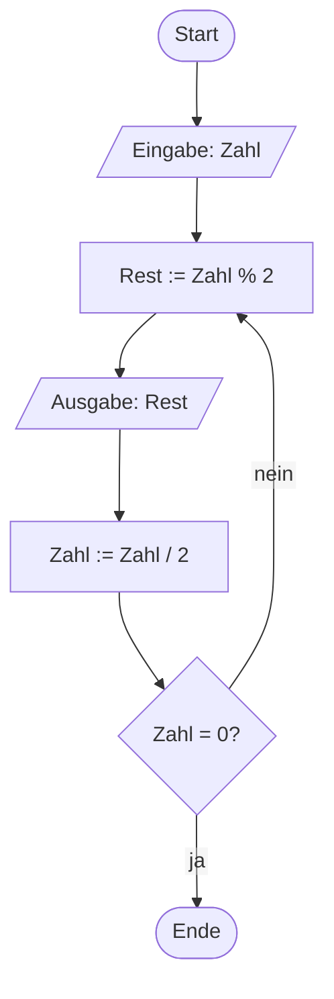

# Schleifen (28.10.2026)

## Übung { .modus-uebung }

### Worum geht es?

Nach der Verzweigung eben kommt jetzt die dritte und letzte große
Kontrollstruktur dazu: die Wiederholung. Als PAP kennt ihr sie schon aus der
Praxisphase (Woche 4) und aus dem Horner-Schema-Beispiel vom letzten
Termin — heute übersetzt ihr sie zum ersten Mal in echten C-Code, und zwar
gleich in drei Varianten.

!!! abstract "Lernziele"
    - Ihr könnt eine fußgesteuerte Wiederholung (`do-while`) in C schreiben
      und sie von einer kopfgesteuerten Wiederholung (`while`)
      unterscheiden.
    - Ihr könnt eine Zählschleife (`for`) in C schreiben und begründen,
      wann sie sich besser eignet als `while` oder `do-while`.
    - Ihr könnt zwei Schleifen so verschachteln, dass ein
      zweidimensionales Muster entsteht.

### Das Beispiel: Horner-Schema in C <span class="zeitangabe">ca. 5 Min.</span> { data-toc-label="Das Beispiel: Horner-Schema in C" }

Erinnert ihr euch an den Horner-Schema-PAP vom letzten Termin? Eine
Dezimalzahl wird fortgesetzt durch 2 geteilt, die Reste ergeben — von unten
nach oben gelesen — die Dualzahl:



Damals habt ihr diesen PAP bewusst noch nicht in Code umgesetzt — die dafür
nötige Wiederholung in C fehlte euch noch. Genau die lernt ihr jetzt: die
**fußgesteuerte** Wiederholung heißt in C `do-while` und passt exakt zur
Reihenfolge im PAP (erst Rest berechnen und ausgeben, dann teilen, erst
danach prüfen):

```c
do
{
    // Anweisungen
} while (Bedingung);
```

Die Schleifenanweisungen zwischen `do` und `while` laufen dabei **immer
mindestens einmal**, bevor die Bedingung überhaupt das erste Mal geprüft
wird — genau wie im PAP oben, wo die Prüfraute erst nach den davor
liegenden Schritten kommt. Beachtet das Semikolon nach der Bedingung:
Anders als bei `if` oder `while` gehört es hier zwingend dazu.

---

### Umsetzung in C: Horner-Schema <span class="zeitangabe">ca. 8 Min.</span> { data-toc-label="Umsetzung in C: Horner-Schema" }

Jetzt setzen wir den PAP von eben direkt in C um.

**Reihenfolge der Ausgabe:** Das Programm gibt die Dualziffern in derselben
Reihenfolge aus, in der sie im PAP berechnet werden — also von der
niederwertigsten zur höchstwertigen Stelle, praktisch rückwärts gelesen.
Um die Ziffern richtig herum auszugeben, bräuchtet ihr ein Array oder eine
Zeichenkette, um sie zwischenzuspeichern — beides kennt ihr noch nicht.
Für heute genügt es, die Ziffern von hinten nach vorne zu lesen, wie es der
PAP schon vorgesehen hat.
{: .hinweis-klein }

??? quote livecoding "Beispiel-Code"
    ```c linenums="1"
    --8<-- "02-theoriephase/termin-02/code/live-04-1-horner-dual.c"
    ```

---

### Die kopfgesteuerte Variante: while <span class="zeitangabe">ca. 8 Min.</span> { data-toc-label="Die kopfgesteuerte Variante: while" }

Bei `do-while` wird immer mindestens einmal durchlaufen. Manchmal soll eine
Wiederholung aber möglicherweise **gar nicht** laufen — zum Beispiel, wenn
schon die erste Prüfung zeigt, dass nichts zu tun ist. Dafür gibt es die
**kopfgesteuerte** Variante `while`:

```c
while (Bedingung)
{
    // Anweisungen
}
```

Hier wird die Bedingung **vor** den Anweisungen geprüft — ist sie von
Anfang an nicht erfüllt, laufen die Anweisungen kein einziges Mal. Genau
dieser Unterschied war letzten Termin der Fehler in Aufgabe 05: Eine
kopfgesteuerte Wiederholung wurde dort versehentlich verwendet, wo eine
fußgesteuerte nötig gewesen wäre.

Ein Beispiel, bei dem `while` gut passt: Ist eine Zahl eine **Potenz**
eines gegebenen Teilers — lässt sie sich also durch wiederholtes Teilen
durch den Teiler vollständig bis auf `1` herunterbrechen? Das lässt sich
durch sukzessive Division herausfinden: Vor jeder Division wird per
Modulo geprüft, ob sich noch ohne Rest teilen lässt. Geht das immer
wieder auf und landet man irgendwann genau bei `1`, ist die Zahl eine
Potenz des Teilers. Lässt sie sich von Anfang an nicht ohne Rest teilen,
soll gar nicht erst dividiert werden — deshalb `while`, nicht `do-while`.

**Teiler mindestens 2:** Für `Teiler = 1` würde die Schleife nie enden —
jede Zahl lässt sich ohne Rest durch `1` teilen, das Ergebnis wird aber
nie `1` (außer die Eingabe war schon `1`). Das Beispiel geht deshalb von
einem Teiler ab `2` aus.
{: .hinweis-klein }

??? quote livecoding "Beispiel-Code"
    ```c linenums="1"
    --8<-- "02-theoriephase/termin-02/code/live-04-2-potenz-while.c"
    ```

---

### Die Zählschleife: for <span class="zeitangabe">ca. 8 Min.</span> { data-toc-label="Die Zählschleife: for" }

Sowohl `while` als auch `do-while` müsst ihr die Zählvariable selbst
anlegen, prüfen und verändern. Läuft eine Wiederholung eine feste Anzahl
Mal durch — wie beim `FOR`/`TO`/`STEP` aus der PAP-Notation —, fasst `for`
alle drei Teile in einer einzigen Kopfzeile zusammen:

```c
for (Startanweisung; Bedingung; Schrittanweisung)
{
    // Anweisungen
}
```

`for` ist ebenfalls kopfgesteuert — die Bedingung wird vor jedem Durchlauf
geprüft, genau wie bei `while`. Der Unterschied ist reine Bequemlichkeit:
Start, Bedingung und Schrittweite stehen alle an einer Stelle, statt über
den Code verteilt zu sein.

??? quote livecoding "Beispiel-Code"
    ```c linenums="1"
    --8<-- "02-theoriephase/termin-02/code/live-04-3-zahlen-for.c"
    ```

---

### Verschachtelte Schleifen: Rechteck aus Sternchen <span class="zeitangabe">ca. 8 Min.</span> { data-toc-label="Verschachtelte Schleifen: Rechteck aus Sternchen" }

Schleifen lassen sich auch ineinander verschachteln: Bei jedem Durchlauf
der äußeren Schleife läuft die innere komplett durch. Das eignet sich gut
für zweidimensionale Muster — zum Beispiel ein Rechteck aus Sternchen, bei
dem die äußere Schleife die Zeilen zählt und die innere Schleife pro Zeile
die Sternchen ausgibt.

**Vorsicht vor der Endlosschleife:** Vergesst ihr bei `while` oder
`do-while`, die geprüfte Variable im Schleifenrumpf zu verändern, wird die
Bedingung nie unwahr — das Programm hängt sich scheinbar auf. Bei `for`
passiert das seltener, weil die Schrittanweisung fest in der Kopfzeile
steht, ist aber genauso möglich, wenn ihr die Zählvariable zusätzlich von
Hand verändert.
{: .hinweis-klein }

??? quote livecoding "Beispiel-Code"
    ```c linenums="1"
    --8<-- "02-theoriephase/termin-02/code/live-04-4-rechteck-sterne.c"
    ```

**Drei Schleifen, eine Wahl:** `while` prüft zuerst und kann null
Durchläufe haben. `do-while` läuft immer mindestens einmal und prüft erst
am Ende. `for` ist die kopfgesteuerte Sonderform für eine von vornherein
bekannte Anzahl Durchläufe mit einer Zählvariable.
{: .hinweis-klein }

---

## Betreutes Selbststudium { .modus-selbststudium }

### Worum geht es?

Jetzt wendet ihr alle drei Schleifenformen selbst an: eine fußgesteuerte
Wiederholung für eine Ziffernzerlegung, verschachtelte Zählschleifen für
ein Sternchenmuster und eine Wiederholung kombiniert mit `switch`/`case`
für eine wiederholte Zustandsabfrage. Wer schnell fertig ist, kann sich
zusätzlich an einer optionalen Aufgabe mit KI-Unterstützung versuchen.

!!! abstract "Lernziele"
    - Ihr könnt zwei Schleifen so verschachteln, dass ein
      zweidimensionales Muster entsteht.
    - Ihr könnt eine Zustandsabfrage mit `switch`/`case` innerhalb einer
      Wiederholung wiederholt stellen, bis ein Abbruchwert eingegeben
      wird.
    - Ihr könnt für ein gegebenes Problem begründen, ob eine
      kopfgesteuerte, fußgesteuerte oder Zählschleife am besten passt.

### Aufgabe 11: Quersumme und Stellenanzahl

#### Teil A — Quersumme

Schreibt ein Programm, das eine ganze Zahl einliest und ihre **Quersumme**
berechnet und ausgibt (die Summe aller einzelnen Ziffern — bei `1234` also
`1 + 2 + 3 + 4 = 10`). Nutzt dafür wie beim Horner-Schema in der Übung eine
`do-while`-Schleife mit den Operatoren `%` und `/`, diesmal mit `10` statt
`2`.

<!-- MUSTERLOESUNG-START -->
??? note "Musterlösung Teil A anzeigen"
    ```c linenums="1"
    --8<-- "02-theoriephase/termin-02/code/aufg-11-quersumme.c"
    ```

    `zahl % 10` liefert die letzte Ziffer, `zahl / 10` entfernt sie wieder
    — derselbe Trick wie beim Horner-Schema, nur mit Basis 10 statt 2.
    `do-while` passt hier besonders gut: Selbst bei der Eingabe `0` soll
    die Schleife mindestens einmal laufen (Quersumme von `0` ist `0`), eine
    kopfgesteuerte `while`-Schleife würde diesen Fall sonst überspringen.

<!-- MUSTERLOESUNG-ENDE -->

---

#### Teil B — Stellenanzahl ergänzen

Erweitert euer Programm aus Teil A um eine zweite Ausgabe: die Anzahl der
Stellen der eingegebenen Zahl (bei `1234` also `4`). Ihr müsst dafür nur
eine zusätzliche Variable mitzählen lassen — die Schleife selbst bleibt
unverändert.

<!-- MUSTERLOESUNG-START -->
??? note "Musterlösung Teil B anzeigen"
    ```c linenums="1"
    --8<-- "02-theoriephase/termin-02/code/aufg-11-quersumme-stellenanzahl.c"
    ```

    1. Neue Variable für die Stellenanzahl, mit `0` initialisiert.
    2. Neue Zeile: bei jedem Schleifendurchlauf wird die Stellenanzahl um
       eins erhöht.
    3. Neue Ausgabe der Stellenanzahl, zusätzlich zur Quersumme aus Teil A.

    Das sind gegenüber Teil A die einzigen drei neuen Zeilen — die
    Schleife selbst (Bedingung, Ziffer- und Quersummenberechnung) bleibt
    unverändert. `stellen` wird bei jedem Schleifendurchlauf um eins
    erhöht — da die Schleife genau einmal pro Ziffer läuft, steht am Ende
    die Stellenzahl fest. Auch das funktioniert dank `do-while` korrekt
    für die Eingabe `0`: ein Durchlauf, also eine Stelle.

<!-- MUSTERLOESUNG-ENDE -->

---

### Aufgabe 12: Raute aus Sternchen

#### Teil A — ohne Rechner: Muster analysieren

Hier ist eine Raute aus Sternchen mit `groesse = 4`:

```text
   *
  ***
 *****
*******
 *****
  ***
   *
```

Füllt **ohne Rechner** die folgende Tabelle für die obere Hälfte aus (Zeile
1 ist die oberste Zeile):

| Zeile | Anzahl Leerzeichen davor | Anzahl Sternchen |
|---|---|---|
| 1 | | |
| 2 | | |
| 3 | | |
| 4 | | |

<!-- MUSTERLOESUNG-START -->
??? note "Musterlösung Teil A anzeigen"
    | Zeile | Anzahl Leerzeichen davor | Anzahl Sternchen |
    |---|---|---|
    | 1 | 3 | 1 |
    | 2 | 2 | 3 |
    | 3 | 1 | 5 |
    | 4 | 0 | 7 |

    Pro Zeile nimmt die Anzahl Sternchen immer um 2 zu (`1, 3, 5, 7, ...`),
    während die Anzahl Leerzeichen davor um genau 1 abnimmt — beide
    zusammen sorgen dafür, dass die Raute immer mittig ausgerichtet bleibt.
    Bei Zeile `z` (gezählt ab 1) sind das allgemein `groesse - z`
    Leerzeichen und `2 * z - 1` Sternchen.

<!-- MUSTERLOESUNG-ENDE -->

---

#### Teil B — Programmieren

Schreibt jetzt ein Programm, das eine Raute wie oben zeichnet. Die Größe
(Anzahl Zeilen der oberen Hälfte, also bis zur breitesten Stelle) soll
eingelesen werden. Nutzt die Formeln aus Teil A (`groesse - zeile`
Leerzeichen, `2 * zeile - 1` Sternchen) für die obere Hälfte und zählt für
die untere Hälfte einfach wieder rückwärts.

<!-- MUSTERLOESUNG-START -->
??? note "Musterlösung Teil B anzeigen"
    ```c linenums="1"
    --8<-- "02-theoriephase/termin-02/code/aufg-12-raute.c"
    ```

    Zwei fast identische Blöcke aus je zwei verschachtelten `for`-Schleifen
    (Leerzeichen, dann Sternchen): Der erste zählt die Zeile von `1` bis
    `groesse` hoch, der zweite von `groesse - 1` wieder bis `1` herunter.
    Beide nutzen dieselben Formeln aus Teil A — nur die Zählrichtung der
    äußeren Schleife ändert sich.

<!-- MUSTERLOESUNG-ENDE -->

---

### Aufgabe 13: Zustandsverwaltung

Greift das Maschinenzustand-Beispiel (`switch`/`case`) vom letzten Termin
wieder auf: Schreibt ein Programm, das wiederholt einen Betriebszustand
(Zahl `0` bis `3`, Bedeutung wie letzten Termin: Aus, Standby, Läuft,
Fehler) abfragt und in Klartext ausgibt — so lange, bis der Wert `-1`
eingegeben wird. Danach soll das Programm eine Abschlussmeldung ausgeben
und enden.

**Zwei mögliche Wege:** Ihr könnt die Wiederholung direkt über die
Bedingung `zustand != -1` beenden (dann braucht ihr `scanf_s` einmal vor
und einmal in der Schleife, wie bei Aufgabe 06 letzten Termin), oder eine
Wiederholung ohne eigene Abbruchbedingung schreiben und stattdessen mit
`break` aussteigen, sobald `-1` eingegeben wurde. Beides ist hier
gleichwertig — die Musterlösung zeigt den ersten Weg.
{: .hinweis-klein }

<!-- MUSTERLOESUNG-START -->
??? note "Musterlösung anzeigen"
    ```c linenums="1"
    --8<-- "02-theoriephase/termin-02/code/aufg-13-zustandsverwaltung.c"
    ```

    Die `while`-Schleife prüft `zustand != -1`, bevor sie überhaupt einmal
    läuft — deshalb wird einmal vor der Schleife und einmal am Ende jedes
    Durchlaufs eingelesen (derselbe "Priming Read", den ihr schon aus
    Aufgabe 06 vom letzten Termin kennt). Das `switch`/`case` selbst ist
    unverändert aus der Übung von letztem Termin übernommen; jeder Fall
    braucht weiterhin sein eigenes `break`, sonst droht ein Fallthrough.

<!-- MUSTERLOESUNG-ENDE -->

---

### Aufgabe 14: Primzahlen berechnen (optional)

Eine **Primzahl** ist eine ganze Zahl größer als `1`, die nur durch `1`
und sich selbst ohne Rest teilbar ist (`2`, `3`, `5`, `7`, `11`, ...).
Diese Aufgabe ist optional — für alle, die mit den vorigen Aufgaben schon
fertig sind.

Bei dieser Aufgabe dürft ihr eine KI auch zur **Erzeugung von Code**
einsetzen, nicht nur zum Nachschlagen — mehr dazu unter
[KI im Kurs](../../ki-nutzung.md). Ihr bleibt dabei trotzdem in der
steuernden Rolle: Rechnet damit, jede abgegebene Zeile erklären zu müssen,
insbesondere in Teil C.

#### Teil A — PAP entwerfen

Entwerft einen Programmablaufplan: Der Nutzer gibt eine Obergrenze ein
(Beispiel: `50`), berechnet werden sollen alle Primzahlen, die kleiner als
diese Obergrenze sind. Prüft für jede Kandidatenzahl einzeln, ob sie durch
irgendeine kleinere Zahl (außer `1`) ohne Rest teilbar ist — wenn ja, ist
sie keine Primzahl.

<!-- MUSTERLOESUNG-START -->
??? note "Musterlösung Teil A anzeigen"
    ```mermaid
    %%{init: {'flowchart': {'htmlLabels': false}}}%%
    flowchart TD
        A(["Start"])
        B[/"Eingabe: Obergrenze"/]
        C["Kandidat := 2"]
        D{"Kandidat < Obergrenze?"}
        E["IstPrimzahl := 1"]
        F["Teiler := 2"]
        G{"Teiler < Kandidat?"}
        H{"Kandidat % Teiler = 0?"}
        I["IstPrimzahl := 0"]
        J["Teiler := Teiler + 1"]
        K{"IstPrimzahl = 1?"}
        L[/"Ausgabe: Kandidat"/]
        M["Kandidat := Kandidat + 1"]
        N(["Ende"])
        A --> B --> C --> D
        D -->|ja| E --> F --> G
        G -->|ja| H
        H -->|ja| I --> J
        H -->|nein| J
        J --> G
        G -->|nein| K
        K -->|ja| L --> M
        K -->|nein| M
        M --> D
        D -->|nein| N
    ```

    Zwei ineinander verschachtelte Rauten: Die äußere (`D`/`M`) zählt die
    Kandidaten hoch, die innere (`G`/`J`) prüft für den aktuellen
    Kandidaten alle möglichen Teiler durch. `IstPrimzahl` wird für jeden
    neuen Kandidaten auf `1` zurückgesetzt und nur auf `0` gesetzt, sobald
    ein passender Teiler gefunden wurde — erst nach der kompletten inneren
    Prüfung entscheidet `K`, ob ausgegeben wird.

<!-- MUSTERLOESUNG-ENDE -->

---

#### Teil B — Implementierung

Setzt den PAP aus Teil A in ein C-Programm um: zwei verschachtelte
Zählschleifen, wie ihr sie in der Übung beim Rechteck aus Sternchen schon
gesehen habt.

<!-- MUSTERLOESUNG-START -->
??? note "Musterlösung Teil B anzeigen"
    ```c linenums="1"
    --8<-- "02-theoriephase/termin-02/code/aufg-14-primzahlen-obergrenze.c"
    ```

    Die äußere `for`-Schleife zählt die Kandidaten hoch, die innere prüft
    alle Teiler von `2` bis `kandidat - 1`. `ist_primzahl` startet bei
    jedem Kandidaten neu bei `1` und wird auf `0` gesetzt, sobald ein
    Teiler ohne Rest passt — die innere Schleife läuft dabei bewusst immer
    komplett durch, auch wenn längst klar ist, dass die Zahl keine
    Primzahl mehr sein kann. Genau das greift Teil C wieder auf.

<!-- MUSTERLOESUNG-ENDE -->

---

#### Teil C — Analyse

War es zwingend nötig, für beide Schleifen `for` zu verwenden? Die innere
Schleife bricht die Prüfung eigentlich nicht ab, sobald feststeht, dass die
Zahl keine Primzahl mehr sein kann — sie läuft trotzdem bis zum Ende durch.
Überlegt: Hätte sich die innere Schleife auch als `while` schreiben lassen,
die aufhört, sobald ein Teiler gefunden wurde? Was wäre der Vorteil?

<!-- MUSTERLOESUNG-START -->
??? note "Musterlösung Teil C anzeigen"
    ```c linenums="1"
    --8<-- "02-theoriephase/termin-02/code/aufg-14-primzahlen-obergrenze-mit-while.c"
    ```

    Ja — die innere Schleife lässt sich als `while` mit einer
    zusammengesetzten Bedingung schreiben: `teiler < kandidat &&
    ist_primzahl == 1`. Sobald ein Teiler gefunden wurde (`ist_primzahl`
    wird `0`), wird die zweite Teilbedingung unwahr, und die Schleife
    endet sofort, statt die restlichen Teiler noch unnötig zu prüfen. Die
    äußere Schleife bleibt dabei ein `for`, weil sie weiterhin eine von
    vornherein feste Anzahl Kandidaten durchzählt — nur die innere hat
    einen echten frühen Abbruchgrund, den `for` nicht von sich aus anbietet.

<!-- MUSTERLOESUNG-ENDE -->

---

#### Teil D — Erweiterung: Anzahl statt Obergrenze

Verändert den Algorithmus so, dass der Nutzer nicht mehr eine Obergrenze,
sondern die **Anzahl** der gewünschten Primzahlen eingibt. Bei der Eingabe
`5` sollen genau die ersten 5 Primzahlen berechnet werden (`2, 3, 5, 7,
11`).

**Tipp:** Die äußere Schleife weiß jetzt vorher nicht mehr, wie viele
Kandidaten sie durchgehen muss — das hängt davon ab, wie viele davon sich
als Primzahl herausstellen. Welche der drei Schleifenformen aus der Übung
passt zu "wiederhole, bis eine bestimmte Anzahl erreicht ist, ohne zu
wissen, wie viele Versuche das braucht"?
{: .hinweis-klein }

<!-- MUSTERLOESUNG-START -->
??? note "Musterlösung Teil D anzeigen"
    ```c linenums="1"
    --8<-- "02-theoriephase/termin-02/code/aufg-14-primzahlen-anzahl.c"
    ```

    Die äußere Schleife ist jetzt ein `while` (`gefunden < anzahl_gewuenscht`)
    statt eines `for`: Sie kennt vorher keine feste Obergrenze für
    `kandidat` mehr, sondern läuft weiter, bis genug Primzahlen gefunden
    wurden. Die innere Schleife (Teilbarkeitsprüfung) bleibt unverändert
    ein `for`, da sie für jeden einzelnen Kandidaten weiterhin eine feste
    Anzahl möglicher Teiler durchgeht. Schön zu sehen: Dieselbe
    Entscheidung wie in Teil C — `for` für eine von vornherein bekannte
    Anzahl Durchläufe, `while` wenn das nicht gilt — taucht hier noch
    einmal auf, diesmal bei der äußeren statt der inneren Schleife.

<!-- MUSTERLOESUNG-ENDE -->
