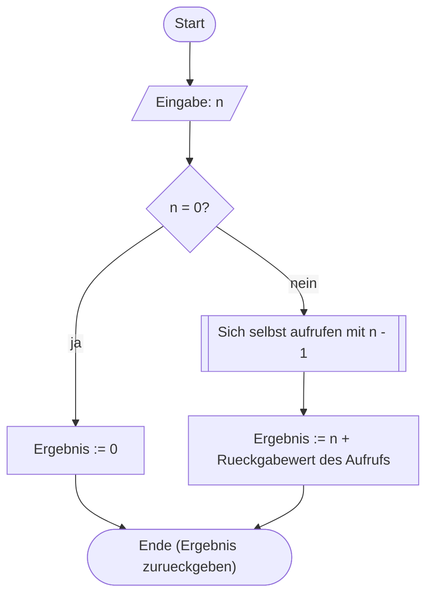

# Rekursive Funktionen (04.11.2026)

## Übung { .modus-uebung }

### Worum geht es?

Eben habt ihr gelernt, dass Funktionen andere Funktionen aufrufen können.
Heute geht ihr einen Schritt weiter: Eine Funktion darf auch **sich
selbst** aufrufen — das nennt sich **Rekursion**.

!!! abstract "Lernziele"
    - Ihr könnt eine rekursive Funktion mit Abbruchbedingung und
      rekursivem Aufruf in C schreiben.
    - Ihr könnt nachvollziehen, wie ein rekursiver Funktionsaufruf im
      Aufrufstapel abgearbeitet wird.
    - Ihr könnt begründen, ob eine rekursive oder eine iterative Lösung
      für ein gegebenes Problem einfacher ist.

### Was ist Rekursion? <span class="zeitangabe">ca. 4 Min.</span> { data-toc-label="Was ist Rekursion?" }

Jede rekursive Funktion braucht zwei Teile: eine **Abbruchbedingung**, bei
der die Funktion ohne weiteren Aufruf ein Ergebnis liefert, und einen
**rekursiven Aufruf**, bei dem sie sich selbst mit einem *kleineren*
Argument erneut aufruft — kleiner in dem Sinne, dass es der
Abbruchbedingung jedes Mal ein Stück näher kommt:

```c
typ funktion(Parameter)
{
    if (Abbruchbedingung)
        return Basisfall;

    return ... funktion(kleineres Argument) ...;
}
```

**Vorsicht vor dem Stapelüberlauf:** Wird die Abbruchbedingung nie
erreicht, ruft sich die Funktion unendlich oft selbst auf — das Programm
stürzt mit einem *Stapelüberlauf* ab. Dieselbe Gefahr wie bei der
Endlosschleife aus Termin 2, nur dass hier nicht die Schleifenvariable,
sondern das Argument des rekursiven Aufrufs sich der Abbruchbedingung
nähern muss.
{: .hinweis-klein }

---

### Erstes Beispiel: Summe von Zahlen <span class="zeitangabe">ca. 2 Min.</span> { data-toc-label="Erstes Beispiel: Summe von Zahlen" }

Die Summe aller Zahlen von `1` bis `n` lässt sich rekursiv formulieren:
Die Summe bis `n` ist `n` plus die Summe bis `n - 1` — und die Summe bis
`0` ist einfach `0`. Genau das ist schon die Abbruchbedingung.



**Neu: die Unterprogramm-Form.** Das Rechteck mit den doppelten
Seitenlinien steht für einen Aufruf, der vollständig abgewartet wird,
bevor es an dieser Stelle weitergeht — anders als der Rücksprung-Pfeil
einer Wiederholung, der ohne zu warten direkt zu einem früheren Knoten
zurückführt. Hier ruft sich der Algorithmus dabei selbst wieder auf —
genau das ist Rekursion im PAP. Alle PAP-Symbole findet ihr gesammelt auf
der Referenzseite [PAP-Elemente](../../pap-elemente.md).
{: .hinweis-klein }

---

### Umsetzung: Eine rekursive Summenfunktion <span class="zeitangabe">ca. 8 Min.</span> { data-toc-label="Umsetzung: Eine rekursive Summenfunktion" }

??? quote livecoding "Beispiel-Code"
    ```c linenums="1"
    --8<-- "02-theoriephase/termin-03/code/live-06-1-summe.c"
    ```

    1. Die Abbruchbedingung: Ist `n` bei `0` angekommen, endet die
       Rekursion hier, ohne dass ein weiterer Aufruf gestartet wird.

So läuft `summe(4)` ab — jeder Aufruf wartet auf die Rückkehr des
nächsten, bevor er selbst weiterrechnen kann:

```text
summe(4) ruft summe(3) auf und wartet
  summe(3) ruft summe(2) auf und wartet
    summe(2) ruft summe(1) auf und wartet
      summe(1) ruft summe(0) auf und wartet
        summe(0): Abbruchbedingung erreicht, gibt 0 zurueck
      summe(1) rechnet 1 + 0 = 1 und gibt 1 zurueck
    summe(2) rechnet 2 + 1 = 3 und gibt 3 zurueck
  summe(3) rechnet 3 + 3 = 6 und gibt 6 zurueck
summe(4) rechnet 4 + 6 = 10 und gibt 10 zurueck
```

Der Aufbau (jeder Aufruf ruft den nächsten) und der Abbau (jeder Aufruf
rechnet fertig, sobald der nächste zurückgekehrt ist) sind genau
symmetrisch — das ist der **Aufrufstapel** in Aktion.

Je mehr Rekursionsstufen nötig sind, desto größer wird dieser
Aufrufstapel: Für jeden noch wartenden Aufruf muss der Rechner sich
dessen Zwischenstand merken, bis dieser Aufruf fertig rechnen kann. Das
ist grundsätzlich ineffizient — anders als bei einer Schleife, die
denselben Speicherplatz einfach wiederverwendet, braucht jede zusätzliche
Rekursionsstufe zusätzlichen Speicher. Bei sehr vielen Rekursionsstufen
wird dieser Speicher irgendwann knapp: der Stapelüberlauf, vor dem oben
schon gewarnt wurde.

---

### Geht das nicht auch mit einer Schleife? <span class="zeitangabe">ca. 6 Min.</span> { data-toc-label="Geht das nicht auch mit einer Schleife?" }

Tatsächlich: Für die Summe reicht eine ganz normale `for`-Schleife, die
ihr schon aus Termin 2 kennt.

??? quote livecoding "Beispiel-Code"
    ```c linenums="1"
    --8<-- "02-theoriephase/termin-03/code/live-06-2-summe-schleife.c"
    ```

!!! tip "Clean Code: KISS"
    *KISS* steht für **K**eep **I**t **S**imple, **S**tupid — haltet
    Lösungen so einfach wie möglich. Für die Summe ist die
    Schleifen-Variante sogar einfacher als die rekursive: kein
    Aufrufstapel, kein Stapelüberlauf-Risiko, leichter nachzuvollziehen.
    Rekursion ist kein Selbstzweck — sie lohnt sich vor allem, wenn sich
    ein Problem **natürlich** in eine kleinere Version seiner selbst
    zerlegen lässt. Genau das seht ihr gleich bei der Collatz-Folge.

---

### Zweites Beispiel: Die Collatz-Folge <span class="zeitangabe">ca. 5 Min.</span> { data-toc-label="Zweites Beispiel: Die Collatz-Folge" }

Gegeben ist eine natürliche Zahl `n > 0`. Dann wird wie folgt verfahren:

* Ist `n` gerade, wird die Zahl halbiert (`n / 2`).
* Ist sie ungerade, wird die Zahl zu `3n + 1`. 

Das wiederholt sich, bis `n = 1` erreicht ist. Die **Collatz-Vermutung**
besagt: Egal welche Startzahl man wählt — die Folge landet
immer in der Wiederholung `4 → 2 → 1 → 4 → 2 → 1 → …`. Bewiesen ist das
bis heute nicht, aber wir können es für einzelne Zahlen ausprobieren.

Anders als bei der Summe zerlegt sich dieses Problem **von Natur aus**
rekursiv: Die Vorschrift selbst sagt euch schon, wie ihr von `n` zur
nächsten Zahl kommt — eine Schleife müsste dieselbe Fallunterscheidung
nachbauen, würde also nicht wirklich einfacher.

---

### Umsetzung: Collatz rekursiv <span class="zeitangabe">ca. 7 Min.</span> { data-toc-label="Umsetzung: Collatz rekursiv" }

??? quote livecoding "Beispiel-Code"
    ```c linenums="1"
    --8<-- "02-theoriephase/termin-03/code/live-06-3-collatz.c"
    ```

    1. Hier bricht die Berechnung ab. Die Collatz-Vorschrift selbst
       kennt kein Abbruchkriterium — sie beschreibt nur, wie es von einer
       Zahl zur nächsten geht. Diese Zeile ergänzen wir zusätzlich, damit
       die Rekursion bei `n == 1` endet, statt sich in der Folge
       `4 → 2 → 1 → 4 → 2 → 1 → …` unendlich weiter aufzurufen und einen
       Stapelüberlauf zu riskieren.

**Voraussetzung `n > 0`:** Für `n = 0` wäre `0` gerade, `0 / 2` bliebe
`0` — die Abbruchbedingung `n == 1` würde nie erreicht, ein
Stapelüberlauf wäre die Folge. Probiert das Programm mit mehreren
Startwerten aus, um die Vermutung selbst zu testen.
{: .hinweis-klein }

---

### Drittes Beispiel: Schokolade, Bonus-Schokolade und Sammelpunkte <span class="zeitangabe">ca. 8 Min.</span> { data-toc-label="Drittes Beispiel: Schokolade, Bonus-Schokolade und Sammelpunkte" }

Eine Packung Schokolade kostet einen festen Preis, auf jeder Packung ist
ein Sammelpunkt. Für eine bestimmte Anzahl Sammelpunkte gibt es eine
Bonus-Packung geschenkt — auf der wieder ein Sammelpunkt klebt. Frage:
Wie viele Packungen bekommt ihr insgesamt für ein bestimmtes Budget, wenn
ihr jeden Sammelpunkt sofort wieder einlöst?

Auch das ist ein natürlich rekursives Problem: Die Bonus-Packungen aus den
aktuellen Punkten zu bestimmen ist **dieselbe Aufgabe** wie die
Bonus-Packungen aus den Punkten danach — nur mit weniger Punkten.

---

### Umsetzung: Bonus-Schokolade <span class="zeitangabe">ca. 10 Min.</span> { data-toc-label="Umsetzung: Bonus-Schokolade" }

??? quote livecoding "Beispiel-Code"
    ```c linenums="1"
    --8<-- "02-theoriephase/termin-03/code/live-06-4-schokolade.c"
    ```

**Die Abbruchbedingung:** `bonusSchokolade` bricht ab, sobald die
vorhandenen Punkte nicht mehr für eine weitere Bonus-Packung reichen
(`punkte < sammelpunkte`) — dann gibt es keine weiteren Bonus-Packungen
mehr, die Funktion gibt `0` zurück. Bei jedem rekursiven Aufruf werden
außerdem weniger Punkte übrig bleiben oder verbraucht als vorher
eingesetzt wurden, die Abbruchbedingung wird also garantiert irgendwann
erreicht.

---

## Betreutes Selbststudium { .modus-selbststudium }

### Worum geht es?

Jetzt wandelt ihr eine rekursive Funktion selbst in eine Schleife um.
Danach sollt ihr euch noch an zwei deutlich
anspruchsvolleren Rekursionsaufgaben versuchen.

!!! abstract "Lernziele"
    - Ihr könnt eine gegebene rekursive Funktion in eine iterative Lösung
      umwandeln.

### Aufgabe 19: Rekursion durch Schleife ersetzen

Gegeben ist die folgende rekursive Funktion, die die Fakultät einer Zahl
berechnet (`fakultaet(4) = 4 * 3 * 2 * 1 = 24`):

```c linenums="1"
--8<-- "02-theoriephase/termin-03/code/vorgabe-19-fakultaet-rekursiv.c"
```

Entwerft **zunächst ohne Rechner** eine gleichwertige Schleifen-Variante
von `fakultaet` (Stift und Papier reichen). Tippt sie danach ab und
testet sie. Mit welchem der beiden **Clean-Code-Prinzipien** aus der
Übung lässt sich begründen, welche Variante hier vorzuziehen ist?

<!-- MUSTERLOESUNG-START -->
??? note "Musterlösung anzeigen"
    ```c linenums="1"
    --8<-- "02-theoriephase/termin-03/code/aufg-19-fakultaet-schleife.c"
    ```

    Die Schleife zählt `i` von `2` bis `n` hoch und multipliziert dabei
    fortlaufend in `ergebnis` — kein Aufrufstapel, keine
    Stapelüberlauf-Gefahr. Genau wie bei der Summe in der Übung ist das
    ein Fall für **KISS**: Die iterative Lösung ist hier einfacher als
    die rekursive, obwohl beide zum selben Ergebnis kommen.

<!-- MUSTERLOESUNG-ENDE -->

---

### Aufgabe 20: Erreichbarkeit in einem Pfad prüfen

Gegeben sind zwei Koordinatenpunkte: Start `(x1|y1)` und Ziel `(x2|y2)`.
Von einem Punkt `(x|y)` aus sind nur zwei Bewegungen erlaubt:

- zum Punkt `(x | y + x)`, oder
- zum Punkt `(x + y | y)`.

Beide Koordinaten dürfen sich dabei nur **vergrößern**, nie verkleinern.
Prüft mit einer rekursiven Funktion, ob es einen Pfad vom Start- zum
Zielpunkt gibt.

**Tipp:** Vorwärts vom Start aus zu suchen führt zu zwei möglichen
Wegen bei jedem Schritt — unübersichtlich. Denkt stattdessen
**rückwärts vom Ziel aus**: Bei diesen Bewegungsregeln ist die
Vorgänger-Position immer eindeutig bestimmt. Ist `x2 > y2`, kann der
letzte Schritt nur die zweite Bewegung gewesen sein, der Vorgänger war
also `(x2 - y2 | y2)`. Ist `y2 > x2`, war es entsprechend die erste
Bewegung, Vorgänger `(x2 | y2 - x2)`. So wird aus der Suche eine einzige,
lineare Rekursion statt einer verzweigten.
{: .hinweis-klein }

<!-- MUSTERLOESUNG-START -->
??? note "Musterlösung anzeigen"
    ```c linenums="1"
    --8<-- "02-theoriephase/termin-03/code/aufg-20-pfad-erreichbarkeit.c"
    ```

    Die Funktion arbeitet sich rückwärts vom Ziel zum Start vor: Ist die
    aktuelle Position gleich dem Start, ist sie erreichbar (Abbruch mit
    `1`). Ist die Koordinatensumme schon unter die Summe des Startpunkts
    gefallen, kann der Start nicht mehr erreicht werden (Abbruch mit
    `0`) — ohne diese Prüfung würde die Rekursion bei einem
    unerreichbaren Ziel nie enden. Ansonsten wird je nach dem, welche
    Koordinate größer ist, eindeutig die vorherige Position bestimmt und
    die Funktion ruft sich mit dieser selbst wieder auf.

<!-- MUSTERLOESUNG-ENDE -->

---

### Aufgabe 21: Horner-Schema rekursiv — Dezimal in Binär (optional)

Mit dem Horner-Schema lässt sich eine Dezimalzahl durch sukzessive
Division durch `2` und Erfassen des Rests in eine Binärzahl umwandeln:

```c
while (n)
{
    int b = n % 2;
    n = n / 2;
    printf("%d", b);
}
```

Diese Schleife gibt die Binärzahl allerdings **verkehrt herum** aus (die
niederwertigste Ziffer zuerst). Schreibt denselben Algorithmus stattdessen
**rekursiv**, so dass die Binärzahl richtig herum ausgegeben wird.

**Der entscheidende Gedanke:** Bei der Schleife oben wird jede Ziffer
sofort ausgegeben, sobald sie berechnet ist — deshalb erscheint zuerst
die niederwertigste. Damit stattdessen die höchstwertige Ziffer zuerst
erscheint, darf eine Ziffer erst ausgegeben werden, **nachdem** alle
höherwertigeren Ziffern schon ausgegeben wurden. Überlegt: In welcher
Reihenfolge müssten der rekursive Aufruf und die Ausgabe der aktuellen
Ziffer in eurer Funktion stehen, damit genau das passiert?
{: .hinweis-klein }

Entwickelt den Algorithmus zunächst als Programmablaufplan (nutzt dafür
die Unterprogramm-Form für den rekursiven Aufruf), implementiert ihn
danach als Funktion `void printBinary(int zahl)` (kein Rückgabewert) und
testet ihn mit geeigneten Eingaben.

**Voraussetzung:** `zahl > 0` — für `zahl = 0` gibt die Funktion nichts
aus.
{: .hinweis-klein }

<!-- MUSTERLOESUNG-START -->
??? note "Musterlösung anzeigen"
    ```mermaid
    %%{init: {'flowchart': {'htmlLabels': false}}}%%
    flowchart TD
        A(["Start"])
        B[/"Eingabe: Zahl"/]
        C{"Zahl = 0?"}
        D[["Sich selbst aufrufen mit Zahl / 2"]]
        E["Rest := Zahl % 2"]
        F[/"Ausgabe: Rest"/]
        G(["Ende"])
        A --> B --> C
        C -->|ja| G
        C -->|nein| D --> E --> F --> G
    ```

    ```c linenums="1"
    --8<-- "02-theoriephase/termin-03/code/aufg-21-printbinary.c"
    ```

    Der Clou: Der rekursive Aufruf (`printBinary(zahl / 2)`) steht **vor**
    der Ausgabe. Dadurch wird zuerst die gesamte restliche Zahl bis zur
    Abbruchbedingung heruntergebrochen, und erst **danach**, beim
    Zurückkehren aus der Rekursion, werden die Ziffern ausgegeben — von
    der höchstwertigen zur niederwertigsten. Bei der Schleife oben passiert
    die Ausgabe dagegen direkt bei jedem Divisionsschritt, also in
    umgekehrter Reihenfolge.

<!-- MUSTERLOESUNG-ENDE -->
