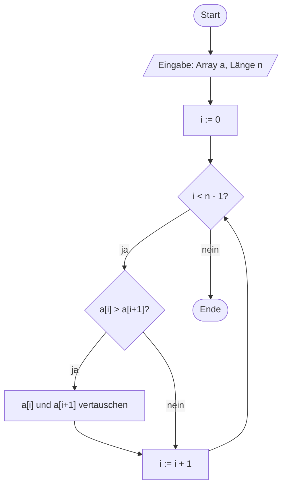
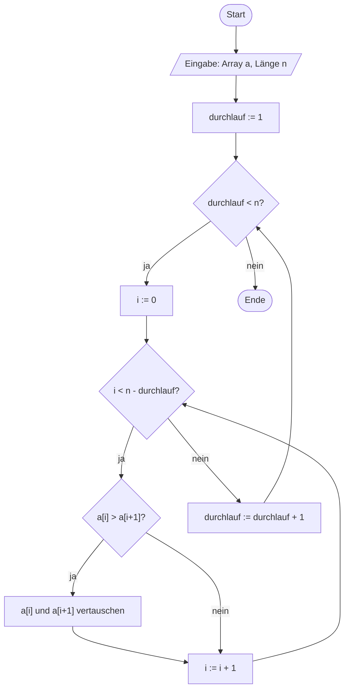

# Arrays (11.11.2026)

## Übung { .modus-uebung }

### Worum geht es?

Bisher hat jede Variable genau einen Wert gespeichert. Für eine ganze
Messreihe wäre es umständlich, für jeden Messwert eine eigene Variable
anzulegen. Mit **Arrays** verwaltet ihr viele Werte desselben Typs unter
einem Namen. Arrays kennt ihr schon aus dem Vorbereitungsvideo, und
Bubblesort habt ihr per Schreibtischtest durchgespielt — heute setzt ihr
beides in C um.

!!! abstract "Lernziele"
    - Ihr könnt ein Array in C deklarieren, initialisieren und einzelne
      Elemente lesen und schreiben.
    - Ihr könnt mit einer `for`-Schleife alle Elemente eines Arrays
      verarbeiten.
    - Ihr versteht, dass eine Funktion ein übergebenes Array
      verändert (Call by Reference), einen einfachen Parameter dagegen
      nicht (Call by Value).
    - Ihr könnt einen Algorithmus auf einem Array (Rollieren) als Funktion
      umsetzen.
    - Ihr könnt Bubblesort zuerst als PAP entwerfen und danach als Funktion
      in C umsetzen.

### Kurzer Rückblick <span class="zeitangabe">ca. 4 Min.</span> { data-toc-label="Kurzer Rückblick" }

1\. Was legt der Datentyp einer Variablen grundsätzlich fest?

<!-- MUSTERLOESUNG-START -->
??? note "Musterlösung anzeigen"
    Der Datentyp bestimmt, welche Art von Werten die Variable speichern
    kann, wie viel Speicherplatz sie belegt (das zeigt `sizeof`) und damit
    auch, welchen Wertebereich sie hat. Wird dieser Bereich verlassen,
    kommt es zu einem **Überlauf**.
<!-- MUSTERLOESUNG-ENDE -->

2\. Was bewirkt das Schlüsselwort `static` bei einer lokalen Variable, und
wodurch unterscheidet sich das von einer normalen lokalen Variable?

<!-- MUSTERLOESUNG-START -->
??? note "Musterlösung anzeigen"
    Eine `static`-Variable wird nur beim allerersten Aufruf der Funktion
    angelegt und initialisiert und behält ihren Wert über alle weiteren
    Aufrufe hinweg. Eine normale lokale Variable wird dagegen bei jedem
    Aufruf neu angelegt. Sichtbar bleibt sie in beiden Fällen nur innerhalb
    der Funktion.
<!-- MUSTERLOESUNG-ENDE -->

---

### Arrays: Deklaration, Initialisierung und Zugriff <span class="zeitangabe">ca. 5 Min.</span> { data-toc-label="Arrays: Deklaration, Initialisierung und Zugriff" }

Ein **Array** ist eine feste Anzahl von Variablen desselben Datentyps, die
unter einem gemeinsamen Namen im Speicher direkt hintereinander liegen. Die
einzelnen Werte heißen **Elemente**; angesprochen werden sie über ihren
**Index** in eckigen Klammern. Wichtig: Der Index beginnt bei **0** — das
erste Element ist `messwerte[0]`, bei fünf Elementen ist `messwerte[4]` das
letzte.

??? quote livecoding "Beispiel-Code"
    ```c linenums="1"
    --8<-- "02-theoriephase/termin-04/code/live-08-1-deklaration-zugriff.c"
    ```

    1. Wird nur ein Teil der Werte angegeben, füllt der Compiler den Rest mit
       `0` auf: `teilweise` enthält `1, 2, 0, 0, 0`.
    2. Ohne Größenangabe zählt der Compiler die Werte selbst — hier ergeben
       sich sechs Elemente.
    3. Lesender Zugriff: Der Index steht in eckigen Klammern, das erste
       Element hat den Index `0`.
    4. Schreibender Zugriff: Ein einzelnes Element lässt sich wie eine
       normale Variable überschreiben.

**Gültige Indizes:** Bei `n` Elementen sind die Indizes `0` bis `n - 1`
gültig. C prüft nicht, ob ihr diese Grenzen einhaltet — ein Zugriff
außerhalb führt zu einem Fehler, der nicht immer sofort auffällt (mehr dazu
im betreuten Selbststudium).
{: .hinweis-klein }

---

### Alle Elemente mit einer Schleife verarbeiten <span class="zeitangabe">ca. 5 Min.</span> { data-toc-label="Alle Elemente mit einer Schleife verarbeiten" }

Arrays und Zählschleifen gehören zusammen: Die Zählvariable der `for`-Schleife
läuft genau über die gültigen Indizes. Die Anzahl der Elemente schreiben wir
dabei nicht als nackte Zahl in den Code, sondern als benannte Konstante —
**Magic Numbers vermeiden** aus Termin 3.

??? quote livecoding "Beispiel-Code"
    ```c linenums="1"
    --8<-- "02-theoriephase/termin-04/code/live-08-2-schleife.c"
    ```

    1. Die Schleife läuft von `0` bis **kleiner** `ANZAHL` — also über die
       Indizes `0` bis `4`. Mit `<=` würde sie einen Schritt zu weit gehen.
    2. `sizeof` des ganzen Arrays geteilt durch `sizeof` eines einzelnen
       Elements ergibt die Anzahl der Elemente. Das funktioniert nur dort,
       wo das Array angelegt wurde — innerhalb einer Funktion, an die ein
       Array übergeben wurde, nicht mehr (siehe nächster Schritt).

---

### Ein Array an eine Funktion übergeben <span class="zeitangabe">ca. 6 Min.</span> { data-toc-label="Ein Array an eine Funktion übergeben" }

Wird ein einfacher Parameter (`int`, `char`, ...) an eine Funktion
übergeben, arbeitet die Funktion mit einer **Kopie**. Das Original bleibt
unverändert — man nennt das **Call by Value**. Wollt ihr einen einzelnen
Wert von einer Funktion aus verändern, geht das nur über den Rückgabewert.
Bei Arrays passiert etwas Überraschendes, das wir uns direkt ansehen: Beide
Funktionen verdoppeln ihre Werte.

??? quote livecoding "Beispiel-Code"
    ```c linenums="1"
    --8<-- "02-theoriephase/termin-04/code/live-08-3-uebergabe.c"
    ```

    1. Call by Value: `wertVerdoppeln` verdoppelt nur ihre eigene Kopie.
       `einzelwert` in `main` bleibt bei `12`.
    2. Das Array dagegen ist nach dem Aufruf verändert: Die Funktion hat das
       **Original** bekommen, keine Kopie — man spricht von **Call by
       Reference**. Die Länge wird zusätzlich als eigener Parameter
       mitgegeben.
    3. Der Parameter `int werte[]` hat keine Größenangabe in den eckigen
       Klammern. Die Funktion kennt die Länge deshalb nicht selbst —
       `sizeof` würde hier nicht mehr die Anzahl der Elemente liefern.
       Darum muss `laenge` übergeben werden.

**Warum ist das bei Arrays so?** Die technische Erklärung folgt im
nächsten Termin bei den Pointern — für heute genügt die Beobachtung: Eine
Funktion kann ein übergebenes Array verändern. Das ist praktisch (kein
Kopieren großer Datenmengen), aber auch eine mögliche Fehlerquelle, wenn
eine Funktion Daten verändert, die sie nur lesen sollte.
{: .hinweis-klein }

---

### Mehrdimensionale Arrays <span class="zeitangabe">ca. 3 Min.</span> { data-toc-label="Mehrdimensionale Arrays" }

Ein Array kann auch mehrere Dimensionen haben — etwa eine Tabelle mit
Zeilen und Spalten. Angesprochen wird ein Element dann mit **einem Index pro
Dimension**: `matrix[1][2]` ist das Element in Zeile `1`, Spalte `2`. Zum
Durchlaufen dienen die geschachtelten Schleifen aus Termin 2. Ihr braucht
das gleich im betreuten Selbststudium.

??? quote livecoding "Beispiel-Code"
    ```c linenums="1"
    --8<-- "02-theoriephase/termin-04/code/live-08-4-mehrdimensional.c"
    ```

    1. Bei einem mehrdimensionalen Array als Parameter muss die **Spaltenzahl**
       in den eckigen Klammern stehen, die Zeilenzahl nicht. Die Zeilenzahl
       wird wie bei eindimensionalen Arrays als eigener Parameter
       mitgegeben.
    2. Bei der Initialisierung steht für jede Zeile ein eigenes Klammerpaar.

---

### Aufgabe 27: Ein Array rollieren <span class="zeitangabe">ca. 14 Min.</span> { data-toc-label="Aufgabe 27: Ein Array rollieren" }

Gegeben ist ein `int`-Array `a[]` der Länge `n > 0`. Schreibt eine
Funktion, an die das Array, seine Länge und eine Zahl `m` übergeben werden.
`m` gibt an, um wie viele Stellen die Elemente des Arrays verschoben werden
sollen:

- Ist `m > 0`, werden die Elemente nach **rechts** verschoben. Elemente,
  die rechts aus dem Array „herausfallen", werden vorne wieder angefügt.
- Ist `m < 0`, werden die Elemente entsprechend nach **links** verschoben.
  Elemente, die links „herausfallen", werden hinten wieder angefügt.

Beachtet: `m` darf auch größer (bzw. betragsmäßig größer) sein als die
Länge des Arrays. Beispiel: `{ 1, 2, 3, 4, 5 }` wird mit `m = 2` zu
`{ 4, 5, 1, 2, 3 }` und mit `m = -1` zu `{ 2, 3, 4, 5, 1 }`.

Die Funktion soll `void rollieren(int a[], int n, int m)` heißen. Überlegt
euch kurz selbst, wie ihr vorgehen würdet — danach entwickeln wir die
Lösung gemeinsam in drei Schritten: erst nur eine Stelle nach rechts, dann
beliebig viele Stellen, dann auch negative Werte.

#### Schritt 1: Einmal um eine Stelle nach rechts

??? quote livecoding "Beispiel-Code"
    ```c linenums="1"
    --8<-- "02-theoriephase/termin-04/code/live-08-5-rollieren-1.c"
    ```

    1. Das letzte Element würde beim Verschieben überschrieben — deshalb
       merken wir es uns zuerst in einer Hilfsvariablen.
    2. Die Schleife zählt **rückwärts**. Von vorne beginnend würde
       `a[1] = a[0]` das Element `a[1]` überschreiben, bevor es nach `a[2]`
       kopiert werden konnte.

---

#### Schritt 2: Um beliebig viele Stellen nach rechts

Jetzt wird `einmalNachRechts` einfach `m`-mal aufgerufen. Damit das auch
für sehr große `m` nicht unnötig lange dauert, kommt der Modulo-Operator
`%` ins Spiel: Er liefert den Rest der Division von `m` durch `n`.

??? quote livecoding "Beispiel-Code"
    ```c linenums="1"
    --8<-- "02-theoriephase/termin-04/code/live-08-6-rollieren-m.c"
    ```

    1. Nach genau `n` Verschiebungen steht das Array wieder wie am Anfang.
       Von `m` zählt deshalb nur der Rest der Division durch `n` — das
       erledigt der Modulo-Operator und deckt gleichzeitig den Fall ab,
       dass `m` größer ist als die Länge.

**Voraussetzung `n > 0`:** Für `n = 0` würde `m % n` durch null teilen.
Die Aufgabenstellung schließt das bereits aus.
{: .hinweis-klein }

---

#### Schritt 3: Negative Verschiebung

Eine Verschiebung um `k` Stellen nach links ergibt dasselbe wie eine
Verschiebung um `n - k` Stellen nach rechts. Damit lässt sich der negative
Fall auf den bekannten zurückführen.

??? quote livecoding "Beispiel-Code"
    ```c linenums="1"
    --8<-- "02-theoriephase/termin-04/code/live-08-7-rollieren-negativ.c"
    ```

    1. In C ist der Rest einer Division bei negativem Dividenden ebenfalls
       negativ: `-1 % 5` ergibt `-1`, nicht `4`. Durch Addieren von `n`
       wird daraus die entsprechende Rechtsverschiebung. Beispiel aus dem
       Code: `-7 % 5` ergibt `-2`, und `-2 + 5` ergibt `3` — eine
       Verschiebung um 7 Stellen nach links entspricht also einer um 3
       Stellen nach rechts.

---

### Anwendungsbeispiel: Bubblesort <span class="zeitangabe">ca. 12 Min.</span> { data-toc-label="Anwendungsbeispiel: Bubblesort" }

Bubblesort kennt ihr aus der Vorbereitung: Benachbarte Elemente werden von
links nach rechts verglichen und getauscht, wenn sie in der falschen
Reihenfolge stehen. Nach jedem Durchlauf steht ein weiteres Element
endgültig am rechten Ende. Wie bei den Algorithmen aus den ersten Terminen
entwerfen wir zuerst den Ablauf als PAP und setzen ihn dann in C um.

#### Schritt 1: Ein einzelner Durchlauf als PAP

Ein Durchlauf geht das Array einmal von links nach rechts durch und
vergleicht dabei jedes Element `a[i]` mit seinem rechten Nachbarn
`a[i+1]`:



---

#### Schritt 2: Der vollständige Algorithmus als PAP

Ein Durchlauf reicht nicht — er wird wiederholt, insgesamt `n - 1`-mal. Aus
eurem Schreibtischtest wisst ihr außerdem: Nach jedem Durchlauf steht ein
Element mehr am rechten Ende fest. Die innere Wiederholung muss deshalb mit
jedem Durchlauf ein Element weniger vergleichen (`n - durchlauf`):



---

#### Schritt 3: Umsetzung in C

Die beiden Wiederholungen aus dem PAP werden zu zwei geschachtelten
`for`-Schleifen. Sortiert wird dasselbe Array wie in eurem Schreibtischtest
— vergleicht das Ergebnis mit eurer Tabelle.

??? quote livecoding "Beispiel-Code"
    ```c linenums="1"
    --8<-- "02-theoriephase/termin-04/code/live-08-8-bubblesort.c"
    ```

    1. Die innere Schleife wird mit jedem Durchlauf kürzer. Größter Index
       ist `n - durchlauf - 1`, damit `a[i + 1]` nie über das Array-Ende
       hinausgreift.
    2. Das Vertauschen braucht eine Hilfsvariable — wie beim Rollieren, sonst
       ginge ein Wert verloren.

---

#### Schritt 4: Zwischenstände ansehen

Damit ihr sehen könnt, was in jedem Durchlauf passiert, geben wir das
Array nach jedem Durchlauf aus.

??? quote livecoding "Beispiel-Code"
    ```c linenums="1"
    --8<-- "02-theoriephase/termin-04/code/live-08-9-bubblesort-zwischenstaende.c"
    ```

    1. Diese Ausgabe dient nur zum Beobachten. Danach gehört sie wieder
       heraus: Eine Sortierfunktion soll sortieren und nicht ausgeben
       (*Eine Funktion, eine Aufgabe*).

**Die Einschränkung:** `bubbleSort` sortiert nur `int`-Arrays. Für `float`
oder `char` müsstet ihr die Funktion kopieren und anpassen — nicht schön,
und laut DRY genau das, was wir vermeiden wollen. Das wird sich im Laufe
der Veranstaltung noch ändern.
{: .hinweis-klein }

---

## Betreutes Selbststudium { .modus-selbststudium }

### Worum geht es?

Jetzt wendet ihr die Array-Regeln selbst an: Ihr sagt die Ausgabe eines
Programms vorher, findet einen Fehler bei den Array-Grenzen und verwaltet
zum Schluss die Sitzplätze eines Kinosaals mit einem zweidimensionalen
Array.

!!! abstract "Lernziele"
    - Ihr könnt vorhersagen, welche Auswirkungen eine Funktion auf ein
      übergebenes Array und auf einen einfachen Parameter hat.
    - Ihr könnt einen Zugriff außerhalb der Array-Grenzen als Fehlerursache
      erkennen.
    - Ihr könnt ein zweidimensionales Array anlegen und mit Funktionen
      verwalten.

### Aufgabe 28: Arrays lesen und Fehler finden

#### Teil A — Was gibt das Programm aus?

Gegeben ist das folgende Programm:

```c linenums="1"
--8<-- "02-theoriephase/termin-04/code/vorgabe-28-array-ausgabe.c"
```

Notiert **ohne Rechner** alle Zeilen, die das Programm ausgibt. Begründet
dabei, warum `zahl` in `main` unverändert bleibt, die Elemente von `daten`
sich aber ändern — und benutzt die Begriffe *Call by Value* und *Call by
Reference*.

<!-- MUSTERLOESUNG-START -->
??? note "Musterlösung Teil A anzeigen"
    ```text
    zahl: 10
    daten[0]: 18
    daten[1]: 21
    daten[2]: 24
    daten[3]: 27
    ```

    In `aendere` wird zuerst die **Kopie** von `zahl` um `5` auf `15`
    erhöht und dann zu jedem Element des Arrays addiert: `3 + 15 = 18`,
    `6 + 15 = 21`, `9 + 15 = 24`, `12 + 15 = 27`. Die Variable `zahl` wurde
    per **Call by Value** übergeben — die Erhöhung betrifft nur die Kopie,
    in `main` bleibt sie `10`. Das Array `daten` wurde dagegen per **Call
    by Reference** übergeben: `aendere` arbeitet mit dem Original, deshalb
    sind die Änderungen auch in `main` sichtbar.
<!-- MUSTERLOESUNG-ENDE -->

---

#### Teil B — Der unauffällige Fehler

Das folgende Programm soll ein Array mit den Werten `0, 10, 20, 30, 40`
füllen und den letzten Wert ausgeben:

```c linenums="1"
--8<-- "02-theoriephase/termin-04/code/vorgabe-28-array-fehlersuche.c"
```

Das Programm enthält einen Fehler, der beim Ausprobieren nicht unbedingt
auffällt. Findet ihn **ohne Rechner**, erklärt, was dabei schiefgeht, und
korrigiert den Code.

<!-- MUSTERLOESUNG-START -->
??? note "Musterlösung Teil B anzeigen"
    ```c linenums="1"
    --8<-- "02-theoriephase/termin-04/code/aufg-28-array-fehlersuche-korrigiert.c"
    ```

    Die Schleifenbedingung `i <= ANZAHL` lässt `i` auch den Wert `5`
    annehmen — `messwerte[5]` liegt aber außerhalb des Arrays, dessen
    gültige Indizes `0` bis `4` sind. C prüft diese Grenzen nicht: Das
    Programm schreibt einfach in den Speicher hinter dem Array. Was dabei
    passiert, ist **nicht vorhersagbar** — manchmal bleibt es unbemerkt (das
    Programm gibt sogar das erwartete `40` aus), manchmal wird eine andere
    Variable überschrieben oder das Programm stürzt ab. Visual Studio
    meldet im Debug-Modus manchmal erst beim Beenden des Programms, dass
    der Speicher um das Array herum beschädigt wurde. Die Korrektur:
    `<` statt `<=`, wie in der Übung.
<!-- MUSTERLOESUNG-ENDE -->

---

### Aufgabe 29: Kino-Buchungssystem

Ihr verwaltet die Sitzplätze eines Kinosaals. Der Saal hat `REIHEN`
Reihen mit je `SITZE` Sitzen und wird in `main` als zweidimensionales
`int`-Array angelegt: Jedes Feld beschreibt einen Sitz, seine Zahl
beschreibt den Zustand (frei oder belegt). Reihen und Sitze werden ab `0`
gezählt.

**Ohne KI:** Die vier Pflichtfunktionen unten schreibt ihr selbst, ohne KI.
Sie sind kurz, üben aber genau das Muster, auf dem alles Weitere aufbaut:
ein zweidimensionales Array an eine Funktion übergeben, ein Feld lesen oder
ändern und ein Ergebnis zurückgeben. Wer sich das von einer KI schreiben
lässt, überspringt genau diese Übung. Nachschlagen im Kursmaterial oder in
der Dokumentation bleibt erlaubt. Für die beiden optionalen Erweiterungen
weiter unten ist KI dagegen ausdrücklich erlaubt. Mehr dazu in
[KI im Kurs](../../ki-nutzung.md).

Die Vorgabe enthält die Größen des Saals, die Prototypen, ein `main` zum
Ausprobieren und die fertige Funktion `saalAnzeigen`. Die vier übrigen
Funktionen müsst ihr selbst schreiben. Solange `saalFreigeben` noch leer
ist, enthält der Saal keine definierten Werte — die Ausgabe zeigt dann
beliebige Zahlen:

```c linenums="1"
--8<-- "02-theoriephase/termin-04/code/vorgabe-29-kino.c"
```

- `int sitzBuchen(int saal[][SITZE], int reihe, int sitz)` markiert den
  Sitz als belegt. Sie gibt `1` zurück, wenn das geklappt hat, und `0`,
  wenn der Sitz schon belegt war — wie bei `istPerfekt` aus Termin 3 ein
  reines Ja/Nein-Ergebnis, kein Sitzzustand.
- `int sitzStatus(int saal[][SITZE], int reihe, int sitz)` gibt den
  Zustand des Sitzes zurück.
- `void sitzFreigeben(int saal[][SITZE], int reihe, int sitz)` gibt einen
  einzelnen Sitz wieder frei.
- `void saalFreigeben(int saal[][SITZE], int reihen)` gibt alle Sitze
  frei — für die nächste Veranstaltung. `main` nutzt sie auch, um den Saal
  zu Beginn zu initialisieren.

**Keine Magic Numbers:** Legt für die beiden Zustände selbst zwei
sprechend benannte Konstanten fest, zum Beispiel `FREI` und `BELEGT` (die
TODO-Zeile in der Vorgabe). Welche Zahl was bedeutet, entscheidet ihr —
verwendet die Konstanten dann überall im Code: Nirgends soll ein nacktes
`0` oder `1` einen Sitzzustand bedeuten. `saalAnzeigen` gibt nur die Zahlen
der Felder aus.

**Voraussetzung:** `reihe` und `sitz` liegen im gültigen Bereich. C prüft
das nicht für euch (siehe Aufgabe 28, Teil B).
{: .hinweis-klein }

**Optional, mit KI — mehrere Sitze auf einmal:** Ergänzt eine Funktion
`int sitzeBuchen(int saal[][SITZE], int reihe, int ersterSitz, int anzahl)`,
die `anzahl` **nebeneinanderliegende** Sitze einer Reihe auf einmal bucht —
ganz oder gar nicht: Ist auch nur ein Sitz davon belegt oder würde die
Buchung über das Reihenende hinausgehen, wird nichts gebucht und `0`
zurückgegeben (sonst `1`). Diese Funktion dürft ihr von einer KI erzeugen
lassen, und zwar so, dass sie auf eurer eigenen Funktion `sitzBuchen`
(und `sitzStatus`) aufbaut. Prüft das Ergebnis danach kritisch: Bucht sie
wirklich ganz oder gar nicht? Was passiert am Reihenende? Ergänzt dafür
Prototyp und passende Testaufrufe in `main`, schreibt als Kommentar über
die Funktion, dass sie von einer KI stammt und was ihr geändert habt, und
achtet darauf, dass der Code reines C bleibt. Ihr müsst jede Zeile
erklären können.

**Optional, mit KI — den Saal übersichtlich ausgeben:** `saalAnzeigen`
gibt nur Zahlen aus. Ergänzt eine Funktion, die den Kinosaal samt
Belegungen übersichtlich in der Konsole darstellt — zum Beispiel `[ ]` für
freie und `[X]` für belegte Sitze, mit Reihen- und Sitznummern. Auch diese
Funktion dürft ihr von einer KI schreiben lassen. Sie soll eure Konstanten
statt nackter Zahlen verwenden. Prüft, ob die Ausgabe zur tatsächlichen
Belegung passt, und dokumentiert die KI-Nutzung wie oben.

<!-- MUSTERLOESUNG-START -->
??? note "Musterlösung anzeigen"
    ```c linenums="1"
    --8<-- "02-theoriephase/termin-04/code/aufg-29-kino.c"
    ```

    `FREI` und `BELEGT` machen im ganzen Programm lesbar, was ein Feld
    bedeutet — und der Zustand ließe sich später an einer einzigen Stelle
    ändern oder erweitern. `saalFreigeben` setzt mit zwei geschachtelten
    Schleifen jedes Feld auf `FREI` und initialisiert damit auch den Saal in
    `main`, ohne dass der Anfangszustand von einer bestimmten Zahl abhängt.
    Bei den mehrdimensionalen Parametern muss jeweils die Spaltenzahl
    (`SITZE`) in den eckigen Klammern stehen.

    Die beiden optionalen Erweiterungen sind hier zusätzlich enthalten.
    `sitzeBuchen` arbeitet in zwei Schritten: Erst wird **geprüft**, ob alle
    gewünschten Sitze frei sind und in die Reihe passen, erst danach wird
    **gebucht**. Ein typischer Fehler wäre, schon beim Prüfen zu buchen —
    dann blieben bei einem belegten Sitz mitten in der Reihe einzelne Sitze
    gebucht, obwohl die Buchung insgesamt scheitert. Genau darauf solltet
    ihr eine KI-Lösung testen. `saalGrafischAnzeigen` nutzt `BELEGT` statt
    einer nackten Zahl und gibt die Kopfzeile mit den Sitznummern getrennt
    von den Reihen aus.
<!-- MUSTERLOESUNG-ENDE -->
