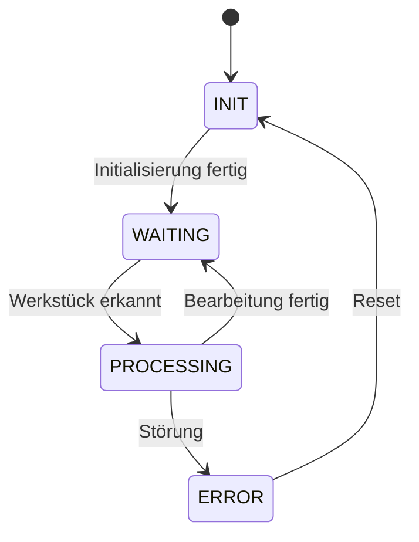
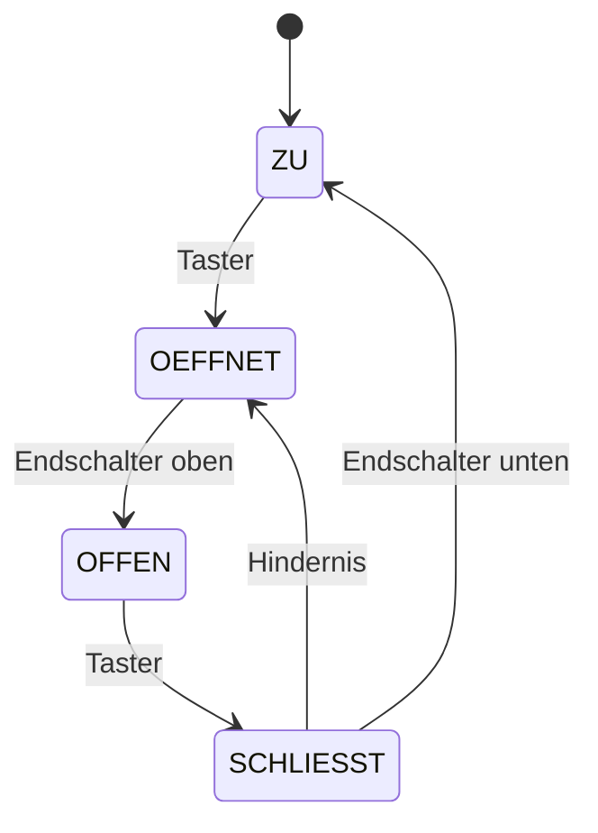

# Aufzählungsdatentypen (25.11.2026)

## Übung { .modus-uebung }

### Worum geht es?

In Termin 2 habt ihr den Betriebszustand einer Maschine als Zahl abgefragt:
`0` stand für „Aus", `1` für „Standby" und so weiter. Ihr kennt das Problem
solcher Zahlen als *Magic Number*. Heute lernt ihr mit dem
**Aufzählungsdatentyp** `enum` das passende Werkzeug in C, um solche Werte mit
Namen zu versehen, und ihr setzt es für einen kleinen Zustandsautomaten ein.

!!! abstract "Lernziele"
    - Ihr könnt erklären, wofür ein `enum` gedacht ist (eine abgeschlossene
      Liste möglicher Werte) und dass die Bezeichner nur Hilfsmittel für
      Programmierer sind, während intern jeder Wert als `int` gespeichert
      wird.
    - Ihr könnt einen Aufzählungsdatentyp mit `enum` definieren, ihm per
      `typedef` einen eigenen Typnamen geben und seine Werte in einem
      `switch`-Konstrukt verwenden.
    - Ihr könnt einen einfachen Zustandsautomaten lesen und umsetzen,
      dessen Zustände und Ereignisse als `enum` beschrieben sind.

### Kurzer Rückblick <span class="zeitangabe">ca. 2 Min.</span> { data-toc-label="Kurzer Rückblick" }

1\. Wozu dienen Funktionspointer grundsätzlich?

<!-- MUSTERLOESUNG-START -->
??? note "Musterlösung anzeigen"
    Mit einem Funktionspointer lässt sich eine Funktion selbst wie ein Wert
    weitergeben, zum Beispiel als Parameter an eine andere Funktion. Dadurch
    kann man eine Funktion verallgemeinern: `ableitung` rechnet für jede
    passende Funktion, `qsort` sortiert nach jedem passenden
    Vergleichskriterium, ohne dass man den Code dafür jedes Mal kopieren
    muss.
<!-- MUSTERLOESUNG-ENDE -->

2\. Was ist eine Magic Number, und warum ist sie problematisch?

<!-- MUSTERLOESUNG-START -->
??? note "Musterlösung anzeigen"
    Eine Magic Number ist eine Zahl, die direkt im Code steht, ohne dass ihre
    Bedeutung erkennbar ist. Sie ist schwer zu lesen (was bedeutet `2`?), und
    kommt dieselbe Zahl mehrfach vor, muss man bei einer Änderung jede Stelle
    einzeln finden und anpassen. Die Lösung ist eine sprechend benannte
    Konstante.
<!-- MUSTERLOESUNG-ENDE -->

---

### Einführung: Was ist ein enum? <span class="zeitangabe">ca. 5 Min.</span> { data-toc-label="Einführung: Was ist ein enum?" }

Ein `enum` ist ein Werkzeug, um eine **abgeschlossene Liste** möglicher Werte
zu definieren. „Abgeschlossen" heißt: Es gibt genau diese Werte und keine
weiteren. Typische Beispiele sind die Farben einer Ampel, die Kategorien eines
Produkts, die Studiengänge einer Hochschule, die Wochentage oder die
Betriebszustände einer Maschine.

Wichtig dabei: Die **Bezeichner** in der Liste sind nur Hilfsmittel für uns
Programmierer, damit der Code lesbar ist. Der Rechner kennt keine Namen,
**intern wird jeder Wert als `int` gespeichert**. Statt `einheit = 2` mit einer
Zahl, deren Bedeutung man nachschlagen muss, schreibt ihr `einheit =
EINHEIT_KELVIN`.

Als Beispiel dient die Einheit einer Temperaturangabe: Celsius, Fahrenheit
oder Kelvin.

??? quote livecoding "Beispiel-Code"
    ```c linenums="1"
    --8<-- "02-theoriephase/termin-06/code/live-13-1-einheit-syntax.c"
    ```

    1. `enum` ist das Schlüsselwort für den neuen Datentyp, danach folgt sein
       Name. Der Datentyp heißt jetzt `enum Einheit`.
    2. In den geschweiften Klammern stehen die möglichen Werte, durch Kommas
       getrennt. Mehr gibt es nicht, die Liste ist abgeschlossen. Der
       Compiler nummeriert sie von selbst ab `0` durch: `EINHEIT_CELSIUS` ist
       `0`, `EINHEIT_FAHRENHEIT` ist `1`, `EINHEIT_KELVIN` ist `2`.
    3. Eine Variable dieses Typs bekommt einen Wert aus der Liste
       zugewiesen.
    4. Die Ausgabe mit `%d` zeigt `2`. Der Name `EINHEIT_KELVIN` ist nur
       für uns da, gespeichert wird die Zahl.

**Warum das Präfix `EINHEIT_`?** Die Namen einer Aufzählung gelten im
gesamten Programm. Würden zwei Aufzählungen beide einen Wert `AUS` enthalten,
kollidierten die Namen. Das Präfix verhindert das und zeigt sofort, wozu ein
Wert gehört. Es ist eine Notlösung: C kennt für Aufzählungen keinen eigenen
Namensbereich (*scoped enum*), wie ihn manche andere Sprachen haben.
{: .hinweis-klein }

---

### Schritt 1: enum im switch <span class="zeitangabe">ca. 4 Min.</span> { data-toc-label="Schritt 1: enum im switch" }

Seine Stärke spielt ein `enum` zusammen mit `switch` aus: Für jeden Wert der
Liste gibt es einen `case`. Die Funktion rechnet eine Temperatur in Celsius
um, je nachdem, in welcher Einheit sie gegeben ist.

??? quote livecoding "Beispiel-Code"
    ```c linenums="1" hl_lines="11 15-17 24-37"
    --8<-- "02-theoriephase/termin-06/code/live-13-2-einheit-switch.c"
    ```

    1. Die Funktion bekommt den Wert und seine Einheit.
    2. Pro Einheit ein `case`, mit lesbaren Namen statt Zahlen.
    3. C prüft nicht, ob ein `int` zur Liste gehört. Die Variable könnte
       also auch den Wert `42` haben. Der `default`-Zweig fängt solche
       Werte ab, hier geben wir den Wert unverändert zurück.

---

### Schritt 2: Der Typname mit typedef <span class="zeitangabe">ca. 2 Min.</span> { data-toc-label="Schritt 2: Der Typname mit typedef" }

Das ständige `enum Einheit` ist umständlich, bei `int` oder `double` schreibt
ihr ja auch nur den Typnamen. Mit `typedef` bekommt ein Typ einen neuen,
kürzeren Namen.

??? quote livecoding "Beispiel-Code"
    ```c linenums="1" hl_lines="4 9 11 24"
    --8<-- "02-theoriephase/termin-06/code/live-13-3-einheit-typedef.c"
    ```

    1. `typedef` bedeutet: „Gib dem folgenden Typ einen zusätzlichen
       Namen." Die Aufzählung selbst bleibt namenlos, ihren Namen bekommt
       sie erst durch das `typedef`.
    2. Der neue Name steht hinter der schließenden Klammer: `Einheit`.
    3. Ab jetzt genügt `Einheit`, ganz ohne `enum` davor, genau wie bei
       `int`.

---

### Schritt 3: Ein Zustandsautomat <span class="zeitangabe">ca. 12 Min.</span> { data-toc-label="Schritt 3: Ein Zustandsautomat" }

Jetzt kommt die typische Anwendung. Ein **Zustandsautomat** befindet sich zu
jedem Zeitpunkt in genau einem von endlich vielen Zuständen und wechselt je
nach Ereignis in einen anderen. In der Automatisierung begegnet er euch
ständig, zum Beispiel bei einer Station in einer Fertigungslinie:



So liest man das Diagramm: Jedes Kästchen ist ein **Zustand**. Jeder Pfeil ist
ein **Übergang**, und die Beschriftung am Pfeil nennt das **Ereignis**, das
den Übergang auslöst. Der Punkt mit dem Pfeil markiert den Startzustand. Das
Diagramm ist der Plan, den wir danach in Code übersetzen, ähnlich wie ihr
früher erst den PAP gezeichnet habt. Im Code heißen die Zustände `ZUSTAND_INIT`,
`ZUSTAND_WAITING` und so weiter. Gibt es zu einem Ereignis keinen Pfeil, bleibt
die Station im aktuellen Zustand.

Die Zustände und die Ereignisse bilden jeweils eine abgeschlossene Liste, das
sind also zwei `enum`s.

#### 3a: Der Übergang

Die Funktion `naechsterZustand` bekommt den aktuellen Zustand und ein Ereignis
und liefert den nächsten Zustand. Zusätzlich meldet sie mit `printf`, in
welchem Zustand sich die Station gerade befindet.

??? quote livecoding "Beispiel-Code"
    ```c linenums="1"
    --8<-- "02-theoriephase/termin-06/code/live-13-4-station-uebergang.c"
    ```

    1. Das erste `enum` beschreibt die Zustände der Station.
    2. Das zweite `enum` beschreibt die Ereignisse, also das, was von außen
       passiert (ein Sensor meldet etwas, ein Bediener drückt Reset).
    3. Zwei Schritte von Hand: Aus `ZUSTAND_INIT` wird mit dem Ereignis
       „Initialisierung fertig" der Zustand `ZUSTAND_WAITING`, danach mit
       „Werkstück" der Zustand `ZUSTAND_PROCESSING`.
    4. Pro Zustand ein `case`. Er meldet den Zustand und prüft dann, ob das
       passende Ereignis eingetreten ist. Dann gibt es den Folgezustand
       zurück, sonst bleibt die Station im Zustand.
    5. Sicherheitshalber landet ein ungültiger Zustand im Fehlerzustand.

---

#### 3b: Die Simulation

Wir lassen die Station mehrere Takte laufen. In jedem Takt tritt ein Ereignis
ein, das in einem Array steht.

??? quote livecoding "Beispiel-Code"
    ```c linenums="1" hl_lines="4 28-32 35-39"
    --8<-- "02-theoriephase/termin-06/code/live-13-5-station-simulation.c"
    ```

    1. Die Anzahl der Takte steht als benannte Konstante da, keine Magic
       Number.
    2. Ein Array, dessen Elemente selbst `enum`-Werte sind. Es beschreibt den
       Ablauf: Initialisierung, zwei Werkstücke, dazu eine Störung und ein
       Reset.
    3. In jedem Takt wird der nächste Zustand aus dem aktuellen Zustand und
       dem Ereignis dieses Takts bestimmt.

Die Simulation wird nur zur Anschauung gezeigt, ihr müsst sie nicht selbst
nachbauen. Verfolgt beim Ablauf die Meldungen im Diagramm mit dem Finger
nach. Beachtet: Die Meldung nennt jeweils den Zustand, in dem die Station zu
Beginn des Takts steht. Der Wechsel in den Folgezustand passiert erst danach.
Im betreuten Selbststudium baut ihr gleich einen zweiten Zustandsautomaten,
und dort schreibt ihr auch selbst eine Funktion, die einen Zustand als Text
ausgibt.

---

## Betreutes Selbststudium { .modus-selbststudium }

### Worum geht es?

In der Übung habt ihr gesehen, dass ein `enum` eine abgeschlossene Liste von
Werten beschreibt, die intern als `int` gespeichert werden. In Aufgabe 38
prüft ihr das ohne Rechner, und in Aufgabe 39 baut ihr einen zweiten
Zustandsautomaten für ein Garagentor.

!!! abstract "Lernziele"
    - Ihr könnt die Zahlenwerte eines `enum` bestimmen, auch bei explizit
      festgelegten Werten.
    - Ihr könnt begründen, warum man mit `enum`-Werten nicht rechnet.
    - Ihr könnt für einen `enum` eine Ausgabefunktion schreiben, die einen
      Wert als Text ausgibt.
    - Ihr könnt einen unvollständigen Zustandsautomaten anhand eines
      Zustandsdiagramms vervollständigen.

### Aufgabe 38: Zahlenwerte bestimmen

Diese Aufgabe löst ihr **ohne Rechner**, nur durch genaues
Lesen. Das Vorhersagen von Ausgaben ist genau die
Fähigkeit, die ihr braucht, um fremden oder von einer KI erzeugten Code zu
beurteilen. Wer sich die Antwort erzeugen lässt, übt sie nicht.

Gegeben ist dieses Programm. Die Namen sind hier bewusst kurz gehalten:

```c linenums="1"
--8<-- "02-theoriephase/termin-06/code/vorgabe-38-enum-werte.c"
```

1. Welche Zahl gehört zu jedem der fünf Werte `ROT`, `GELB`, `GRUEN`, `BLAU`
   und `WEISS`?
2. Was gibt das Programm aus? Notiert jede Ausgabezeile.
3. Am Ende steht `f = f + 1;`. Welcher Wert steht jetzt in `f`? Gehört er zu
   einem der fünf Namen? Meldet C hier einen Fehler?

<!-- MUSTERLOESUNG-START -->
??? note "Musterlösung anzeigen"
    1. `ROT` ist `0`. `GELB` ist ausdrücklich auf `5` gesetzt, `GRUEN` zählt
       ab dort weiter und ist `6`. `BLAU` ist ausdrücklich `2`, `WEISS` zählt
       weiter und ist `3`. Eine explizite Zuweisung setzt die Zählung also
       neu an. Ein später aufgeführter Name darf einen kleineren Wert haben
       als ein früherer.
    2. Die Ausgabe ist:
       ```text
       0
       6
       3
       f ist groesser als GELB
       7
       ```
       `f` enthält `GRUEN`, also `6`, und `6 > 5`. Deshalb der erste
       Zweig.
    3. In `f` steht `7`. Diese Zahl gehört zu keinem der fünf Namen. C
       meldet dennoch keinen Fehler, denn ein `enum` ist intern ein `int`
       und die Rechnung ist erlaubt. Es liegt bei euch, gültige Werte
       sicherzustellen. Der Name ist nur Hilfsmittel für den Programmierer,
       gespeichert wird die Zahl.
<!-- MUSTERLOESUNG-ENDE -->

**Empfehlung: Mit einem `enum` nicht rechnen.** Weil ein `enum` intern ein
`int` ist, erlaubt C Rechnungen wie `f + 1` und Größenvergleiche wie
`f > GELB`. Das widerspricht aber dem Kerngedanken einer Aufzählungsliste: Ihre
Einträge sind benannte Werte, keine Zahlen auf einer Skala. Was soll „eine
Farbe plus 1" bedeuten? Das ist nicht nachvollziehbar, und das Ergebnis kann
ein Wert sein, der in der Liste gar nicht vorkommt. Auch Größenvergleiche
hängen allein an der Reihenfolge der Liste und liefern falsche Ergebnisse,
sobald jemand die Liste ändert. Vergleicht ein `enum` deshalb nur auf
Gleichheit (`==`, `!=`) mit seinen Bezeichnern. Das Programm oben zeigt
bewusst, was möglich ist, nicht, was ihr tun sollt.
{: .hinweis-klein }

---

### Aufgabe 39: Ein Garagentor

Ein Garagentor wird mit einem Taster bedient. Es hat vier Zustände und reagiert
auf fünf Ereignisse (das fünfte, `EREIGNIS_KEINES`, bedeutet „nichts ist
passiert" und steht deshalb nicht im Diagramm). Das Diagramm liest ihr wie in
der Übung: Kästchen sind Zustände, Pfeile sind Übergänge, die Beschriftung
nennt das Ereignis. Gibt es zu einem Ereignis keinen Pfeil, bleibt das Tor im
aktuellen Zustand.



Die Vorgabe enthält die beiden `enum`s, die Simulation in `main` und die
Übergänge für `TOR_ZU` und `TOR_OEFFNET` als Muster:

```c linenums="1"
--8<-- "02-theoriephase/termin-06/code/vorgabe-39-garagentor.c"
```

1. Startet das Programm. Statt Text seht ihr nur Zahlen (`Zustand 1`). So
   speichert C die Zustände intern.
2. Ersetzt in `torAusgeben` die Zahlenausgabe durch eine Textausgabe mit
   `switch`: `Zu`, `Oeffnet`, `Offen`, `Schliesst`. Die Funktion gibt nichts
   zurück (`void`), deshalb beendet ihr jeden `case` mit `break;`, und der
   Text endet mit `\n`, denn `main` schreibt davor nur `Takt n: `.
3. Ergänzt in `naechsterZustand` die Übergänge für `TOR_OFFEN` und
   `TOR_SCHLIESST` nach dem Diagramm.

Erwartete Ausgabe:

```text
Takt 0: Zu
Takt 1: Oeffnet
Takt 2: Oeffnet
Takt 3: Offen
Takt 4: Offen
Takt 5: Schliesst
Takt 6: Schliesst
Takt 7: Oeffnet
Takt 8: Offen
Takt 9: Schliesst
```

<!-- MUSTERLOESUNG-START -->
??? note "Musterlösung anzeigen"
    ```c linenums="1" hl_lines="49-66 82-83 86-89"
    --8<-- "02-theoriephase/termin-06/code/aufg-39-garagentor.c"
    ```

    1. Die Ausgabefunktion ordnet jedem Wert der Liste seinen Text zu. Das
       muss man selbst schreiben, denn `printf` gibt für ein `enum` nur die
       gespeicherte Zahl aus. Der `default`-Zweig fängt Werte ab, die zu
       keinem Eintrag gehören.
    2. Jeder Übergang aus dem Diagramm ist eine `if`-Abfrage auf das
       Ereignis. Bei `TOR_SCHLIESST` gibt es zwei mögliche Folgezustände:
       das untere Ende erreicht (zu) oder ein Hindernis (wieder öffnen). Alle
       anderen Ereignisse lassen den Zustand unverändert, deshalb steht am
       Ende des `case` der aktuelle Zustand.

    Typische Fehler: einen Übergang aus dem Diagramm vergessen (das Tor
    bleibt in einem Zustand hängen) oder in der Ausgabefunktion einen
    Zustand auslassen.
<!-- MUSTERLOESUNG-ENDE -->
