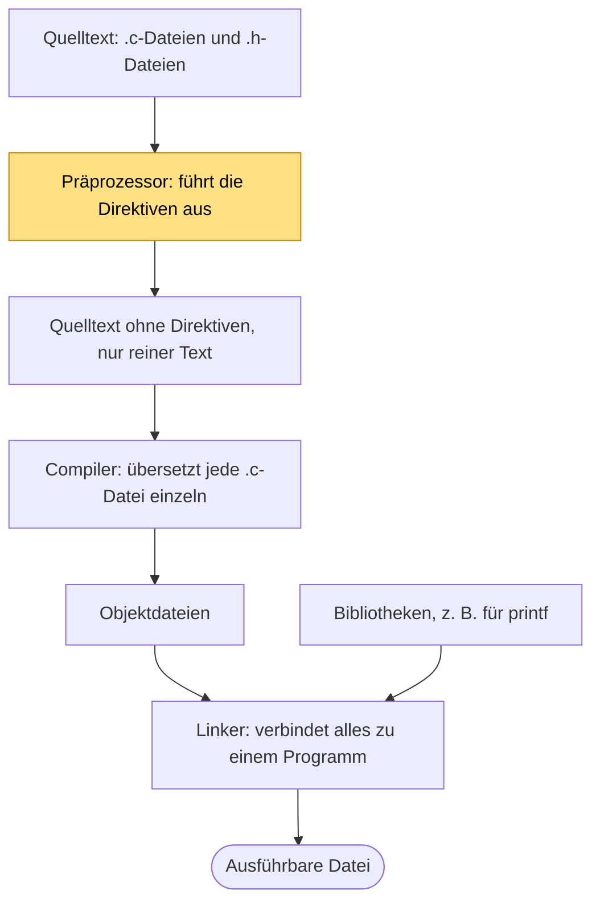

<!-- Hinweis an die Lehrperson (auf der Seite unsichtbar): Die Beispiele
     liegen je Schritt in einem eigenen Ordner (live-15-<schritt>-<slug>/ mit
     main.c und myUtil.h), damit jeder Stand für sich kompiliert. Die
     Funktion steht bewusst komplett in myUtil.h (weicht vom Standard
     "Deklaration in .h, Definition in .c" ab, im Text vermerkt).
     live-15-3a-doppelt-fehler kompiliert ABSICHTLICH nicht (Fehlerdemo).
     Demo in Visual Studio: _USE_MATH_DEFINES und const-Arraygröße verhalten
     sich mit MSVC wie im Text beschrieben, GCC weicht ab. -->

# Präprozessordirektiven und Makros (25.11.2026)

## Übung { .modus-uebung }

### Worum geht es?

Bisher kennt ihr `#include` und `#define` als Zeilen am Anfang eines Programms.
Heute schaut ihr hinter die Kulissen: Was passiert mit diesen Zeilen, bevor der
Compiler sie überhaupt sieht? Dazu bindet ihr eigene Dateien ein, schaltet
Codeteile per `#define` ein und aus und lernt Makros kennen, die nichts anderes
tun als Text zu ersetzen.

!!! abstract "Lernziele"
    - Ihr könnt die Verarbeitungskette vom Quelltext bis zur ausführbaren Datei
      beschreiben und angeben, in welchem Schritt Präprozessordirektiven
      verarbeitet werden.
    - Ihr könnt eine eigene Header-Datei mit Include-Guard anlegen und per
      `#include` mit Anführungszeichen einbinden.
    - Ihr könnt mit `#ifdef` und `#define` Code bedingt kompilieren.
    - Ihr könnt Makros und parametrierte Makros schreiben und deren
      Textersetzung nachvollziehen.
    - Ihr könnt Makro und `const` sowie parametriertes Makro und Funktion
      gegeneinander abgrenzen.

---

### Die Verarbeitungskette <span class="zeitangabe">ca. 5 Min.</span> { data-toc-label="Die Verarbeitungskette" }

Zeilen, die mit `#` beginnen, heißen **Präprozessordirektiven**. Sie sind
**kein Code, der beim Programmlauf ausgeführt wird**. Sie sind Anweisungen an
ein Werkzeug, das den Quelltext bearbeitet, bevor der Compiler ihn
übersetzt: den **Präprozessor**. Der Präprozessor arbeitet nur mit Text. Er
kennt keine Variablen und keine Datentypen und rechnet nichts aus, was zur
Laufzeit zählt.

So entsteht aus euren Quelldateien ein ausführbares Programm. Der Schritt, in
dem die Präprozessordirektiven verarbeitet werden, ist farbig hervorgehoben:



Drei Begriffe aus dem Diagramm, die ihr noch nicht kennt:

- Eine **Objektdatei** ist das Ergebnis, das der Compiler aus einer einzelnen
  `.c`-Datei erzeugt: übersetzter Code, der aber noch nicht lauffähig ist.
- Der **Linker** fügt alle Objektdateien eines Projekts zu einem einzigen
  ausführbaren Programm zusammen.
- Eine **Bibliothek** ist eine Sammlung fertiger Funktionen, zum Beispiel
  `printf`. Der Linker holt sich daraus, was euer Programm braucht.

Der Präprozessor erledigt im Wesentlichen drei Dinge:

- `#include` fügt den Inhalt einer anderen Datei an dieser Stelle ein.
- `#define` legt einen Namen fest, der im Text durch etwas anderes ersetzt wird.
- `#if`, `#ifdef`, `#ifndef` blenden Textteile ein oder aus.

Präprozessor und Compiler bearbeiten jede `.c`-Datei einzeln. Erst der Linker
fügt die Ergebnisse zusammen.

---

### Das Beispiel: Eine eigene Hilfsfunktion <span class="zeitangabe">ca. 3 Min.</span> { data-toc-label="Das Beispiel: Eine eigene Hilfsfunktion" }

Ein Array von Messwerten auszugeben habt ihr schon oft geschrieben. Statt die
Schleife in jedem Programm neu zu tippen, lagert ihr sie in eine eigene
Header-Datei `myUtil.h` aus, die ihr in jedem Projekt wiederverwenden könnt.
Anschließend baut ihr die Ausgabe so um, dass sich die Richtung per `#define`
umschalten lässt.

**Abweichung vom Standard:** Üblicherweise steht in einer Header-Datei nur die
Ankündigung einer Funktion (der Prototyp), der eigentliche Rumpf liegt in einer
eigenen `.c`-Datei. Hier steht die ganze Funktion in der Header-Datei, damit
alles in einer Datei übersichtlich bleibt. Das ist für ein einzelnes Programm
in Ordnung. Wie die Aufteilung üblicherweise aussieht, besprechen wir später.
{: .hinweis-klein }

---

### Schrittweise Umsetzung <span class="zeitangabe">ca. 25 Min.</span> { data-toc-label="Schrittweise Umsetzung" }

#### Eigene Header-Datei einbinden

`#include <stdio.h>` kennt ihr schon. Jetzt kommt eine eigene Datei dazu. Es
gibt zwei Schreibweisen mit einem Unterschied. Vereinfacht gesagt:

- `#include <stdio.h>` mit **eckigen Klammern**: Der Compiler sucht in den
  Verzeichnissen, in denen die Standardbibliothek liegt.
- `#include "myUtil.h"` mit **Anführungszeichen**: Der Compiler sucht zuerst im
  Ordner der Datei, die den `#include` enthält, und danach wie bei den eckigen
  Klammern.

Für eigene Dateien nehmt ihr deshalb immer Anführungszeichen. Weil in der
Header-Datei `printf` benutzt wird, bindet sie selbst `stdio.h` ein.

??? quote livecoding "Beispiel-Code"
    ```c title="myUtil.h" linenums="1"
    --8<-- "02-theoriephase/termin-06/code/live-15-2-header/myUtil.h"
    ```

    ```c title="main.c" linenums="1"
    --8<-- "02-theoriephase/termin-06/code/live-15-2-header/main.c"
    ```

---

#### Doppeltes Einbinden und Include-Guard

Was passiert, wenn `main.c` die Header-Datei zweimal einbindet? Das macht
natürlich niemand absichtlich. Es passiert, wenn `main.c` zwei Header-Dateien
einbindet und eine davon die andere schon selbst einbindet - so wie z.B. in `myUtil.h` schon die `stdio.h` eingebunden ist. Der Präprozessor
fügt den Text dann tatsächlich zweimal ein.

??? quote livecoding "Beispiel-Code (kompiliert absichtlich nicht)"
    ```c title="main.c" linenums="1" hl_lines="4"
    --8<-- "02-theoriephase/termin-06/code/live-15-3a-doppelt-fehler/main.c"
    ```

Der Compiler meldet einen Fehler, weil die Funktion `arrayAusgeben` zweimal
definiert wird:

```text
error: redefinition of 'arrayAusgeben'
```

Die Lösung ist der **Include-Guard**. Er steht um den gesamten Inhalt der
Header-Datei und sorgt dafür, dass dieser nur beim ersten Einbinden zählt:

??? quote livecoding "Beispiel-Code"
    ```c title="myUtil.h" linenums="1" hl_lines="1-2 14"
    --8<-- "02-theoriephase/termin-06/code/live-15-3b-guard/myUtil.h"
    ```

Beim ersten Einbinden ist `MYUTIL_H` noch unbekannt (`#ifndef` heißt "wenn
nicht definiert"), der Inhalt wird übernommen und `MYUTIL_H` wird definiert.
Beim zweiten Einbinden ist der Name schon bekannt, der Präprozessor überspringt
alles bis `#endif`. `main.c` bleibt unverändert, jetzt kompiliert es.

Als Namen nimmt man den Dateinamen in Großbuchstaben mit `_H` am Ende. Namen,
die mit einem Unterstrich beginnen, vermeidet man, weil sie in C für den
Compiler selbst reserviert sind.

Es gibt eine Kurzform, die dasselbe erreicht:

```c
#pragma once
```

Als erste Zeile der Header-Datei reicht das. Welche Variante ist der Standard?
Der Include-Guard gehört zum C-Standard und funktioniert mit jedem Compiler.
`#pragma once` ist kürzer und wird von allen gängigen Compilern verstanden, ist
aber nicht Teil des Standards. Im Kurs verwenden wir den Include-Guard.

---

#### Bedingte Kompilierung: `#define` als Schalter

Ein Beispiel kennt ihr vielleicht schon aus der Praxis: Bindet man `math.h`
ein und möchte die Konstante `M_PI` verwenden, meldet Visual Studio, dass der
Name unbekannt ist, obwohl er in `math.h` steht. Erst mit einer Zeile **vor**
dem Einbinden funktioniert es:

??? quote livecoding "Beispiel-Code"
    ```c linenums="1"
    --8<-- "02-theoriephase/termin-06/code/live-15-4a-math-pi.c"
    ```

    1. Dieser Schalter muss vor dem `#include <math.h>` stehen. Er hat keinen
       Wert, es kommt nur darauf an, dass der Name definiert ist.

**Compiler-Unterschiede:** `_USE_MATH_DEFINES` ist eine Eigenheit von Visual
Studio. Andere Compiler wie GCC stellen `M_PI` je nach Einstellung auch ohne
diese Zeile bereit.
{: .hinweis-klein }

Wie kann eine bloße `#define`-Zeile ohne Wert etwas freischalten? Weil die
Header-Datei den Teil mit `M_PI` nur dann übernimmt, wenn der Name
`_USE_MATH_DEFINES` definiert ist. Vereinfacht steht in `math.h` etwas wie:

```c
#ifdef _USE_MATH_DEFINES
#define M_PI 3.14159265358979323846
#endif
```

Das ist die **bedingte Kompilierung**: `#define` wirkt wie ein An-/Aus-Schalter,
`#ifdef` fragt ihn ab. Die allgemeine Form:

```c
#ifdef NAME
    // Code, wenn NAME definiert ist
#else
    // Code, wenn NAME nicht definiert ist
#endif
```

Das bauen wir jetzt an unserer Array-Ausgabe nach. Ist `RUECKWAERTS`
definiert, soll das Array von hinten nach vorne ausgegeben werden. Nur die
Kopfzeile der Schleife hängt vom Schalter ab. Der Compiler bekommt davon immer
nur eine der beiden Varianten zu sehen. Der Schalter wird in `main.c` gesetzt,
und zwar wie bei `M_PI` **vor** dem Einbinden der Header-Datei.

??? quote livecoding "Beispiel-Code"
    ```c title="myUtil.h" linenums="1" hl_lines="9-11 13"
    --8<-- "02-theoriephase/termin-06/code/live-15-4b-richtung/myUtil.h"
    ```

    ```c title="main.c" linenums="1" hl_lines="4-5"
    --8<-- "02-theoriephase/termin-06/code/live-15-4b-richtung/main.c"
    ```

Probiert es aus: Mit der Zeile `#define RUECKWAERTS` kommt die Ausgabe
`17 20 9 15 12`. Kommentiert ihr die Zeile aus, kommt `12 15 9 20 17`.

Typische Einsatzzwecke sind Ausgaben nur für die Fehlersuche oder Code für
unterschiedliche Systeme.

---

### Makros <span class="zeitangabe">ca. 15 Min.</span> { data-toc-label="Makros" }

#### Ein Makro ist Suchen und Ersetzen

`#define ANZAHL 5` kennt ihr schon. Dahinter steckt nichts anderes als **Suchen
und Ersetzen**: Der Präprozessor ersetzt vor dem Compiler jedes `ANZAHL` im
Text durch `5`. Ein solches `#define` mit Ersatztext heißt **Makro**. Damit
ist eigentlich schon alles gesagt, auch warum hinter dem Makro **kein Semikolon**
stehen darf: Es würde mit ersetzt.

```c
#define ANZAHL 5;
int messwerte[ANZAHL];     // wird zu: int messwerte[5;];  -> Fehler
```

??? quote livecoding "Beispiel-Code"
    ```c linenums="1"
    --8<-- "02-theoriephase/termin-06/code/live-15-5a-makro-einfach.c"
    ```

---

#### Makros mit Parametern

Ein **parametriertes Makro** funktioniert genauso. Der Präprozessor setzt
zusätzlich den Text ein, der beim Aufruf in den Klammern steht. Es ist keine
Funktion, es wird nichts aufgerufen. Das zeigt die folgende Falle, in der
dasselbe Makro einmal ohne und einmal mit Klammern definiert ist:

??? quote livecoding "Beispiel-Code"
    ```c linenums="1"
    --8<-- "02-theoriephase/termin-06/code/live-15-5b-makro-parameter.c"
    ```

Aus `QUADRAT_FALSCH(a + 1)` wird der Text `a + 1 * a + 1`, und dort gilt
"Punkt vor Strich": `3 + 1 * 3 + 1` ergibt 7 statt 16. Deshalb steht jeder
Parameter und der ganze Ausdruck in Klammern.

---

#### Beispiel SWAP: zwei Werte tauschen

Ein typisches Makro tauscht zwei `int`-Variablen. Der Block in `{ ... }` sorgt
dafür, dass die Hilfsvariable `tmp` nur dort existiert.

??? quote livecoding "Beispiel-Code"
    ```c linenums="1"
    --8<-- "02-theoriephase/termin-06/code/live-15-6a-swap-int.c"
    ```

**Ohne Semikolon im Makro:** Hinter dem `}` im Makro steht keines. Das
Semikolon setzt ihr beim Aufruf, und `SWAP(x, y);` sieht aus wie ein normaler
Befehl. In professionellem Code verpackt man den Rumpf meist in
`do { ... } while (0)`, damit sich das Makro in jeder Lage wie ein einzelner
Befehl verhält. Das lassen wir hier weg.
{: .hinweis-klein }

---

#### SWAP für beliebige Datentypen

Das Makro kann mehr als eine Funktion: Weil es nur Text einsetzt, kann man
auch den **Datentyp als Parameter** übergeben. Dasselbe Makro tauscht dann
`int`, `char` und `float`:

??? quote livecoding "Beispiel-Code"
    ```c linenums="1" hl_lines="4 10-13 15-17 19-21"
    --8<-- "02-theoriephase/termin-06/code/live-15-6b-swap-typ.c"
    ```

---

### Makro, Konstante oder Funktion? <span class="zeitangabe">ca. 7 Min.</span> { data-toc-label="Makro, Konstante oder Funktion?" }

Makros sind in modernem C die Ausnahme. Es gibt fast immer eine bessere
Lösung, und das lässt sich an zwei Fragen zeigen.

**Was unterscheidet ein Makro von einer Konstante?** Verglichen werden
`#define MEIN_WERT 10` und `const int MEIN_WERT = 10;`:

| Merkmal | `const`-Variable | Makro |
|---|---|---|
| Typsicherheit | Ja. Der Compiler prüft den Datentyp und verhindert Fehler. | Nein. Es ist nur Text, Typfehler fallen erst später oder gar nicht auf. |
| Fehlersuche | Einfach. Der Name existiert im Debugger. | Schwer. Der Debugger sieht nur die nackte Zahl, nicht den Namen. |
| Gültigkeitsbereich | Lokal oder global, beachtet Blöcke `{ ... }`. | Immer global ab der Definition. Kann ungewollt anderen Code verändern. |
| Speicheradresse | Ja. Man kann einen Pointer darauf richten. | Nein. Es hat keine Adresse im Speicher. |

**Was unterscheidet ein parametriertes Makro von einer Funktion?**

| Merkmal | Funktion | Parametriertes Makro |
|---|---|---|
| Typprüfung | Parameter haben einen Typ, der Compiler prüft ihn. | Keine. Es wird nur Text eingesetzt. |
| Auswertung | Jeder Parameter wird genau einmal ausgewertet. | Der Text wird so oft eingesetzt, wie der Parameter vorkommt. Aus `QUADRAT(i++)` wird `((i++) * (i++))`, und `i` wird dabei zweimal ohne feste Reihenfolge verändert. Das Ergebnis ist undefiniert. |
| Fehlersuche | Man kann hineinspringen und Schritt für Schritt durchgehen. | Der Debugger sieht nur das Ergebnis der Ersetzung. |
| Flexibilität | Fester Datentyp. | Funktioniert mit jedem Datentyp, wie `SWAP` gezeigt hat. |

!!! tip "Clean Code: KISS"
    Die einfachste Lösung zuerst (KISS kennt ihr aus Termin 3): Für Konstanten
    nehmt ihr `const` oder `enum`, für Berechnungen eine Funktion. Ein Makro
    ist erst gerechtfertigt, wenn es nicht anders geht, etwa beim
    Include-Guard, bei der bedingten Kompilierung oder bei typunabhängigem
    Code wie `SWAP`. Ab jetzt gilt das als Qualitätskriterium.

**Eine Ausnahme bei Konstanten:** Als Arraygröße (`int arr[N];`) funktioniert
`#define N 5` überall. Mit `const int N = 5;` meldet Visual Studio (für C)
einen Fehler, weil in C ein `const` keine echte Konstante für die Compilerzeit
ist. Manche Compiler wie GCC akzeptieren es als Sonderfall, das ist aber kein
Standardverhalten. Hier bleibt das Makro (oder ein `enum`) nötig.
{: .hinweis-klein }

---

### Zusammenfassung <span class="zeitangabe">ca. 5 Min.</span> { data-toc-label="Zusammenfassung" }

Das habt ihr gelernt:

- Präprozessordirektiven werden **vor** dem Compiler ausgeführt und arbeiten
  nur auf Text.
- Mit `#include "..."` bindet man eigene Header-Dateien ein, der
  **Include-Guard** verhindert doppelte Definitionen.
- `#define` mit `#ifdef` schaltet Code ein oder aus (**bedingte
  Kompilierung**), wenn der Schalter **vor** dem `#include` gesetzt wird.
- Ein **Makro** ist Suchen und Ersetzen, deshalb kein Semikolon und Klammern um
  Parameter und Ausdruck.
- Konstanten und Funktionen sind meistens die bessere Wahl.

---

## Betreutes Selbststudium { .modus-selbststudium }

### Worum geht es?

In der Übung habt ihr gesehen, wie Makros mit Parametern arbeiten. Jetzt setzt
ihr ein Makro ein, das in der Praxis oft vorkommt: einzelne Bits einer Zahl
setzen und zurücksetzen. Das braucht man etwa, wenn mehrere Schalter oder
Statusmeldungen in einer einzigen Zahl gespeichert sind, wie bei einem
Steuerregister.

!!! abstract "Lernziele"
    - Ihr könnt mit einer Bitmaske ein Bit einer Zahl setzen und
      zurücksetzen und das Ergebnis von Hand berechnen.
    - Ihr könnt vorhersagen, welcher Text bei einem Makroaufruf entsteht, und
      erkennen, wenn die Ersetzung zu einem unerwarteten Ergebnis führt.
    - Ihr könnt die Bitoperationen als parametrierte Makros formulieren.

### Vorab: Bits mit einer Bitmaske ändern

Eine Zahl besteht im Rechner aus Bits. **Bitoperatoren** verknüpfen diese Bits
einzeln, statt mit dem Zahlenwert zu rechnen. Ihr braucht vier:

| Operator | Bedeutung | Beispiel mit 4 Bit |
|---|---|---|
| <code>&#124;</code> | ODER: Ergebnis-Bit ist 1, wenn mindestens eines der beiden 1 ist | <code>1100 &#124; 0010</code> = `1110` |
| `&` | UND: Ergebnis-Bit ist 1, wenn beide 1 sind | `1110 & 0110` = `0110` |
| `~` | Invertieren: aus 0 wird 1 und umgekehrt | `~0010` = `1101` |
| `<<` | Nach links schieben: `1 << 3` verschiebt die 1 um drei Stellen | `0001 << 3` = `1000` |

**Wortbreite:** In C hat ein `int` meist 32 Bit. In den Beispielen und
Aufgaben zeigen wir nur die rechten 4 bzw. 8 Bit, die übrigen sind bei den
Zahlen 0. Bei `~` werden in einem echten `int` auch die linken Bits
invertiert.
{: .hinweis-klein }

**Verwechslungsgefahr:** `|` und `&` arbeiten auf einzelnen Bits. Die
logischen Operatoren `||` und `&&` kennt ihr schon, sie verknüpfen
Bedingungen. Das sind zwei verschiedene Dinge.
{: .hinweis-klein }

Die Bits werden **von rechts ab 0** durchnummeriert. Bit 0 ist die letzte
Stelle, Bit 3 die vierte von rechts. Die **Bitmaske** hat nur an der Position
eine 1, die geändert werden soll. Sie entsteht mit `1 << pos`.

- **Bit setzen:** Zahl ODER Bitmaske.
- **Bit zurücksetzen:** Zahl UND invertierte Bitmaske.

Als Tabelle sieht das für die Zahl 12 so aus. Zuerst wird Bit 1 gesetzt:

| | Bits | Dezimal |
|---|---|---|
| Zahl | `0000 1100` | 12 |
| Bitmaske (`1 << 1`) | `0000 0010` | 2 |
| Ergebnis: Zahl ODER Maske | `0000 1110` | 14 |

Danach wird bei dem Ergebnis Bit 3 zurückgesetzt:

| | Bits | Dezimal |
|---|---|---|
| Zahl | `0000 1110` | 14 |
| Bitmaske (`1 << 3`) | `0000 1000` | 8 |
| invertierte Bitmaske (`~`) | `1111 0111` | |
| Ergebnis: Zahl UND invertierte Maske | `0000 0110` | 6 |

In C schreibt man statt `zahl = zahl | maske;` kürzer `zahl |= maske;`, genau
wie bei `+=`. Entsprechend gibt es `&=`.

---

### Aufgabe 46: Bits setzen und zurücksetzen

Bitoperationen ermöglichen das Manipulieren von Zahlenwerten auf der
Bitebene. In dieser Aufgabe rechnet ihr zuerst von Hand, sagt dann die
Textersetzung eines Makros voraus und schreibt schließlich **parametrierte
Makros**.

#### Teil A — Mit der Bitmaske rechnen (ohne Rechner)

Setzt in den Zahlen jeweils das angegebene Bit. Tragt Bitmaske, binäres
Ergebnis und Dezimalzahl ein, mit acht Bit pro Zahl:

| Zahl | Binär | Bit | Bitmaske | Ergebnis binär | Ergebnis dezimal |
|---|---|---|---|---|---|
| 20 | `0001 0100` | 0 | | | |
| 6 | `0000 0110` | 2 | | | |

Setzt jetzt in den Zahlen jeweils das angegebene Bit zurück. Ergänzt zusätzlich
die invertierte Bitmaske:

| Zahl | Binär | Bit | Bitmaske | invertierte Maske | Ergebnis binär | Ergebnis dezimal |
|---|---|---|---|---|---|---|
| 15 | `0000 1111` | 1 | | | | |
| 8 | `0000 1000` | 0 | | | | |

Was fällt euch bei der jeweils zweiten Zeile auf?

<!-- MUSTERLOESUNG-START -->
??? note "Musterlösung Teil A anzeigen"
    Bit setzen (Zahl ODER Maske):

    | Zahl | Binär | Bit | Bitmaske | Ergebnis binär | Ergebnis dezimal |
    |---|---|---|---|---|---|
    | 20 | `0001 0100` | 0 | `0000 0001` | `0001 0101` | 21 |
    | 6 | `0000 0110` | 2 | `0000 0100` | `0000 0110` | 6 |

    Bit zurücksetzen (Zahl UND invertierte Maske):

    | Zahl | Binär | Bit | Bitmaske | invertierte Maske | Ergebnis binär | Ergebnis dezimal |
    |---|---|---|---|---|---|---|
    | 15 | `0000 1111` | 1 | `0000 0010` | `1111 1101` | `0000 1101` | 13 |
    | 8 | `0000 1000` | 0 | `0000 0001` | `1111 1110` | `0000 1000` | 8 |

    In der jeweils zweiten Zeile war das Bit schon im gewünschten Zustand: Bit 2
    von 6 war schon gesetzt, Bit 0 von 8 schon 0. Die Zahl bleibt dann
    unverändert. Setzen und Zurücksetzen ändern also nichts mehr, wenn das Bit
    schon im Zielzustand ist. Deshalb ist es ungefährlich, beides mehrfach
    anzuwenden.
<!-- MUSTERLOESUNG-ENDE -->

---

#### Teil B — Welcher Text entsteht? (ohne Rechner)

Das folgende Makro ist in Ordnung: Es setzt ein Bit zurück, und zwar über eine
Hilfsvariable `maske`. Trotzdem liefert das Programm nicht das erwartete
Ergebnis.

```c
#define bitReset(var, pos) { int maske = ~(1 << (pos)); (var) &= maske; }

int main(void)
{
    int maske = 14;          // 0000 1110

    bitReset(maske, 3);
    printf("%d\n", maske);   // erwartet: 6

    return 0;
}
```

1. Welcher Text steht nach der Ersetzung anstelle von `bitReset(maske, 3);` im
   Programm?
2. Welche Variable bekommt in diesem Text den Wert `~(1 << (3))`, welche wird
   mit `&=` verändert?
3. Welchen Wert gibt das Programm aus, und warum nicht 6?

<!-- MUSTERLOESUNG-START -->
??? note "Musterlösung Teil B anzeigen"
    1. Der Präprozessor setzt `maske` für `var` und `3` für `pos` ein:
       `{ int maske = ~(1 << (3)); (maske) &= maske; }`
    2. Innerhalb der geschweiften Klammern wird eine **neue** Variable `maske`
       angelegt. Sie verdeckt die `maske` aus `main`. Beide Seiten von
       `(maske) &= maske` meinen deshalb die neue Variable, die `maske` in
       `main` wird nie angefasst.
    3. Ausgegeben wird weiterhin 14. Die Änderung ist im Block verschwunden.

    Das Makro selbst ist korrekt. Der Fehler entsteht erst durch das Suchen und
    Ersetzen: Der Name der Hilfsvariable im Makro kollidiert mit dem Namen, den
    jemand beim Aufruf verwendet. Das ist derselbe Effekt wie bei `tmp` in
    `SWAP`, wenn dort eine Variable `tmp` getauscht würde. Hilfsvariablen in
    Makros bekommen deshalb gern ungewöhnliche Namen, oder man vermeidet sie
    ganz.
<!-- MUSTERLOESUNG-ENDE -->

---

#### Teil C — Die Makros schreiben

Schreibt zwei parametrierte Makros, `bitSet` und `bitReset`. Sie bekommen die
Variable, die geändert werden soll, und die Position des Bits. Weil ein Makro
nur Text einsetzt, ändert es die Variable direkt, ihr braucht dafür keinen
Pointer: Aus `bitSet(zahl, 1);` macht der Präprozessor einen Text wie
`(zahl) |= (1 << (1));`, und der ändert `zahl` ohne Funktionsaufruf.

Das Programm gibt `12`, `14` und `6` aus. Achtet auf Klammern um die
Parameter und den ganzen Ausdruck, wie bei `QUADRAT` in der Übung. Tipp: Der
Operator `~` bindet stärker als `<<`. Die Maske `1 << pos` braucht deshalb
eigene Klammern, bevor sie invertiert wird.

In der Praxis würde man so etwas meistens als Funktion umsetzen (siehe die
Gegenüberstellung von Makro und Funktion in der Übung). Hier geht es darum, die
Textersetzung bei Makros zu üben. Rahmen:

```c linenums="1"
--8<-- "02-theoriephase/termin-06/code/vorgabe-46-bitoperationen.c"
```

Probiert zusätzlich aus, was passiert, wenn ihr `bitSet(zahl, 1);` ein zweites
Mal aufruft.

<!-- MUSTERLOESUNG-START -->
??? note "Musterlösung Teil C anzeigen"
    ```c linenums="1" hl_lines="4-7"
    --8<-- "02-theoriephase/termin-06/code/aufg-46-bitoperationen.c"
    ```

    1. `1 << (pos)` erzeugt die Bitmaske mit einer 1 an der Position `pos`.
    2. `bitSet` verknüpft die Variable mit der Maske per ODER (`|=`).
    3. `bitReset` invertiert die Maske mit `~` und verknüpft per UND (`&=`).
    4. Die Klammern um `var` und `pos` schützen vor Überraschungen bei der
       Textersetzung, die Klammern um den ganzen Ausdruck machen ihn zu einem
       Wert.

    Typischer Fehler: `~1 << pos` statt `~(1 << pos)`: Der Operator `~`
    bindet stärker als `<<`, es wird also zuerst die 1 invertiert und dann
    verschoben. Ein zweiter Aufruf von `bitSet(zahl, 1);` ändert nichts mehr, das Bit ist
    schon gesetzt.
<!-- MUSTERLOESUNG-ENDE -->
