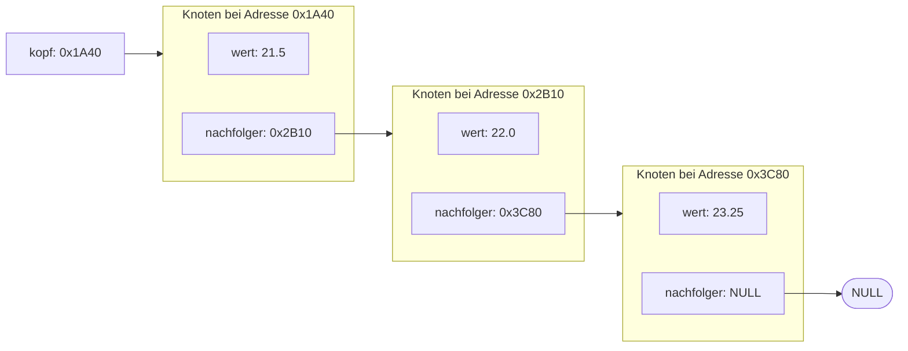
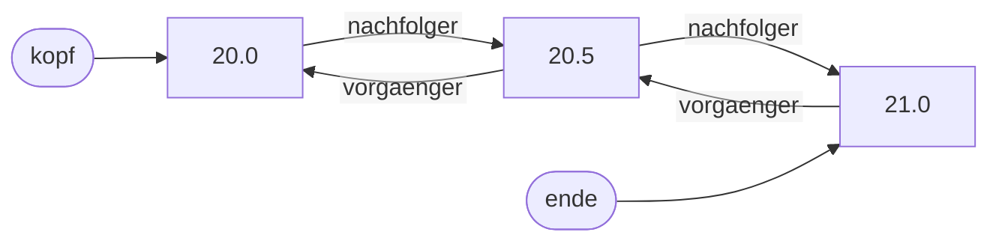

# Verkettete Listen (16.12.2026)

## Übung { .modus-uebung }

### Worum geht es?

Bisher lag eure Datenmenge entweder in einem Array fester Größe oder in
einem Array, dessen Größe zur Laufzeit feststand, weil die Anzahl in der
Datei stand. Oft weiß man aber nicht, wie viele Daten kommen werden:
Ein Sensor liefert immer weiter Messwerte. Ein Array müsstet ihr immer
wieder vergrößern und dabei alles umkopieren. Heute lernt ihr mit der
**verketteten Liste** eine Datenstruktur kennen, die Element für Element
wächst. Das Prinzip kennt ihr aus dem Vorbereitungsvideo, wir setzen es
jetzt gemeinsam um.

!!! abstract "Lernziele"
    - Ihr könnt eine einfach verkettete Liste aus Knoten aufbauen, bei der
      jeder Knoten auf seinen Nachfolger zeigt.
    - Ihr könnt Elemente an eine Liste anhängen, die Liste durchlaufen und
      alle Knoten wieder freigeben.
    - Ihr könnt begründen, warum eine Funktion, die den Anfang einer Liste
      ändern soll, die Liste oder den Kopf-Zeiger per Pointer bekommen
      muss.

### Die Idee: Knoten, die aufeinander zeigen <span class="zeitangabe">ca. 8 Min.</span> { data-toc-label="Die Idee: Knoten, die aufeinander zeigen" }

Eine verkettete Liste besteht aus einzelnen **Knoten**. Jeder Knoten wird
mit `malloc` angelegt und liegt deshalb an einer eigenen **Adresse** im
Speicher. Er enthält einen Wert und einen Zeiger auf den **Nachfolger**.
Ein Zeiger ist nichts anderes als eine Variable, die eine Adresse enthält:
Im Zeiger `nachfolger` steht die Adresse des nächsten Knotens. Der letzte
Knoten hat keinen Nachfolger, dort steht `NULL`. Von der ganzen Liste merkt
man sich nur den **Kopf**, einen Zeiger, in dem die Adresse des ersten
Knotens steht. Von dort aus kommt man über die gespeicherten Adressen an
jeden Knoten.

Die Skizze zeigt drei Knoten mit Beispieladressen (die echten Adressen
sind bei jedem Programmlauf andere). Die Pfeile dienen nur der
Übersicht: Im Speicher stehen ausschließlich die Zahlen.



Im Vergleich zum Array:

- Ein neuer Knoten wird einzeln mit `malloc` angelegt und verschiebt
  nichts: Die vorhandenen Knoten bleiben, wo sie sind.
- Die Liste wächst Knoten für Knoten und braucht nie mehr Speicher als
  nötig.
- Dafür gibt es keinen Zugriff über einen Index. Um an den dritten Knoten
  zu kommen, läuft man vom Kopf aus von Knoten zu Knoten.

Als Beispiel speichern wir **Messwerte**, die nacheinander eintreffen. Alles
steht in einer `main.c`.

---

### Schritt 1: Knoten von Hand verketten <span class="zeitangabe">ca. 10 Min.</span> { data-toc-label="Schritt 1: Knoten von Hand verketten" }

Zuerst die Struktur `Knoten`, dann drei Knoten, die wir von Hand
verketten, und eine Schleife, die die Liste durchläuft.

??? quote livecoding "Beispiel-Code"
    ```c linenums="1"
    --8<-- "02-theoriephase/termin-09/code/live-23-1-knoten-von-hand.c"
    ```

    1. Der Zeiger auf den Nachfolger hat den Typ der Struktur selbst. Weil
       der Name `Knoten` hier noch nicht fertig definiert ist, steht in
       der Definition `struct Knoten` (das kennt ihr aus Termin 6).
    2. Jeder Knoten wird einzeln mit `malloc` angelegt. Die Prüfung auf
       `NULL` ist hier bewusst weggelassen, Schritt 2 holt sie nach.
    3. Die Verkettung: Der Nachfolger von `a` ist `b`.
    4. Der letzte Knoten hat keinen Nachfolger, sein Zeiger ist `NULL`.
       So erkennt man das Ende der Liste.
    5. Der Kopf ist ein Zeiger auf den ersten Knoten. Mehr muss man sich
       von der Liste nicht merken.
    6. Zum Durchlaufen wandert `aktuell` von Knoten zu Knoten, bis es
       `NULL` ist.
    7. Jeder Knoten wurde einzeln mit `malloc` angelegt und wird einzeln
       freigegeben. Bei einer langen Liste geht das nicht von Hand, dafür
       schreiben wir in Schritt 3 eine Funktion.

---

### Schritt 2: Anhängen in einer Funktion <span class="zeitangabe">ca. 12 Min.</span> { data-toc-label="Schritt 2: Anhängen in einer Funktion" }

Von Hand verketten geht nur für drei Knoten. Wir schreiben eine Funktion,
die einen Wert hinten an die Liste anhängt. Dafür gibt es zwei Fälle: Ist
die Liste leer, wird der neue Knoten der Kopf. Sonst läuft man bis zum
letzten Knoten und hängt den neuen dahinter.

Die Funktion muss den Kopf **ändern** können, nämlich wenn die Liste leer
ist. Eine Funktion kann aber nur das ändern, was sie per Pointer bekommt.
Bekäme sie die `Liste` ohne Pointer, arbeitete sie wie bei Call by Value
mit einer **Kopie**: Der neue Knoten würde in der Kopie zum Kopf, und der
Kopf in `main` bliebe `NULL`. Alle angelegten Knoten wären verloren.
Deshalb bündeln wir den Kopf und die Anzahl in einer Struktur `Liste` und
übergeben die Liste als Pointer.

??? quote livecoding "Beispiel-Code"
    ```c linenums="1" hl_lines="10-14 16 20-26 38-59"
    --8<-- "02-theoriephase/termin-09/code/live-23-2-liste-anhaengen.c"
    ```

    1. `kopf` zeigt auf den ersten Knoten, `anzahl` zählt die Knoten. Die
       Struktur `Liste` bündelt beides.
    2. Eine leere Liste hat keinen Kopf (`NULL`) und die Anzahl 0.
    3. Die Funktion liefert 1, wenn es geklappt hat, und 0, wenn der
       Speicher fehlt. `&messwerte` ist die Adresse der Liste.
    4. Speicher für einen neuen Knoten.
    5. Der neue Knoten wird der letzte, er hat also keinen Nachfolger.
    6. Bei einer leeren Liste wird der neue Knoten der Kopf. Dafür muss
       die Funktion `liste->kopf` ändern können.
    7. Sonst läuft man bis zum letzten Knoten, dessen Nachfolger `NULL`
       ist, und hängt den neuen Knoten dahinter.

Die Ausgabe in `main` ist noch vorläufig, und wir geben die Knoten noch
nicht frei. Das programmieren wir jetzt.

**Zum Vorbereitungsvideo:** Dort gibt es keine Struktur `Liste`. Der Kopf
ist ein einzelner Zeiger `Knoten *kopf`, und die Funktion zum Anhängen
bekommt dessen Adresse als Pointer auf einen Pointer (`Knoten **`), einen
**Doppelzeiger**. Der ist schwerer zu lesen. Mit der Struktur `Liste`
vermeiden wir ihn: Der Doppelzeiger steckt in unserer Lösung im Grunde in
`liste->kopf`, denn `liste` zeigt auf eine Struktur, die den Zeiger `kopf`
enthält, und die Funktion kann ihn darüber ändern.
{: .hinweis-klein }

---

### Schritt 3: Ausgeben und Freigeben <span class="zeitangabe">ca. 12 Min.</span> { data-toc-label="Schritt 3: Ausgeben und Freigeben" }

Die Ausgabe wird eine eigene Funktion. Wichtig ist das Freigeben: Wer die Knoten mit `malloc`
angelegt hat, muss sie auch wieder freigeben, und zwar jeden einzelnen
(Wer allokiert, gibt frei). Die Falle dabei: Nach `free(aktuell)` darf man
nicht mehr auf `aktuell` zugreifen, auch nicht, um den Nachfolger zu
lesen. Man merkt sich ihn deshalb vorher.

??? quote livecoding "Beispiel-Code"
    ```c linenums="1" hl_lines="17-18 28-31 61-73 75-87"
    --8<-- "02-theoriephase/termin-09/code/live-23-3-liste-ausgeben-freigeben.c"
    ```

    1. `const Liste *`: Die Funktion liest die Liste nur und ändert sie
       nicht.
    2. Diese Funktion gibt alle Knoten frei. Wer die Liste befüllt hat,
       ruft sie am Ende auf.
    3. Zur Kontrolle: Nach dem Freigeben ist die Liste wieder leer, hier
       erscheint „Die Liste ist leer.“. Sie bleibt gefahrlos benutzbar.
    4. Die Schleife läuft mit einem Zeiger statt mit einem Index. Start:
       `aktuell` zeigt auf den Kopf. Bedingung: solange `aktuell` nicht
       `NULL` ist. Schritt: `aktuell` rückt zum Nachfolger vor.
    5. Der Nachfolger wird gemerkt, **bevor** der Knoten freigegeben wird.
    6. Der Kopf wird zurückgesetzt, damit er nicht auf freigegebenen
       Speicher zeigt.

---

### Zusammenfassung <span class="zeitangabe">ca. 3 Min.</span> { data-toc-label="Zusammenfassung" }

- **Knoten und Kopf:** Jeder Knoten enthält einen Wert und einen Zeiger auf
  den Nachfolger. Der letzte Nachfolger ist `NULL`. Von der Liste merkt man
  sich den Kopf.
- **Anhängen:** Bei leerer Liste wird der neue Knoten der Kopf, sonst
  läuft man zum letzten Knoten. Die Funktion bekommt dafür die Liste per
  Pointer, denn sie muss den Kopf ändern können.
- **Durchlaufen:** Ein Zeiger wandert vom Kopf Nachfolger für Nachfolger,
  bis er `NULL` ist.
- **Freigeben:** Jeder Knoten wird einzeln freigegeben, der Nachfolger
  wird vorher gemerkt. Wer allokiert, gibt frei.

---

## Betreutes Selbststudium { .modus-selbststudium }

### Worum geht es?

!!! abstract "Lernziele"
    - Ihr könnt an einer Skizze nachvollziehen, welche Zeiger sich beim
      Einfügen und Entfernen in einer doppelt verketteten Liste ändern.
    - Ihr könnt die einfach verkettete Liste aus der Übung zu einer doppelt
      verketteten Liste erweitern.

Ab heute ist KI-Unterstützung auch zur Code-Generierung regulär erlaubt,
siehe [KI im Kurs](../../ki-nutzung.md). Teil A bearbeitet ihr bewusst
ohne Rechner und ohne KI: Wer die Zeiger selbst zeichnen kann, erkennt
Fehler im Code der KI. Gerade bei Listen sind das typische Fehler.

### Aufgabe 52: Von der einfach zur doppelt verketteten Liste

In einer **doppelt verketteten Liste** kennt jeder Knoten nicht nur seinen
Nachfolger, sondern auch seinen **Vorgänger**. Die Liste merkt sich
zusätzlich das **Ende**. Dadurch lässt sich auch rückwärts laufen, und man
kann am Ende anhängen, ohne die ganze Liste zu durchlaufen. In der Skizze
sind beide Zeiger getrennt eingezeichnet: `nachfolger` zeigt nach rechts,
`vorgaenger` nach links.



Ausgangspunkt ist der Stand aus der Übung:

```c linenums="1"
--8<-- "02-theoriephase/termin-09/code/vorgabe-52-liste-einfach.c"
```

#### Teil A — Zeiger zeichnen (ohne Rechner und ohne KI)

1. Wie viele Zeiger hat jetzt ein Knoten, wie viele die Liste selbst, und
   wie sieht die **leere** Liste aus?
2. Zeichnet eine Liste mit zwei Knoten und hängt einen dritten an. Welche
   Zeiger müssen gesetzt oder geändert werden, und in welcher Reihenfolge
   ist das sinnvoll?
3. Zeichnet eine Liste mit drei Knoten und entfernt den **mittleren**.
   Welche zwei Zeiger der Nachbarn müssen sich ändern? Was ändert sich
   zusätzlich, wenn man den **ersten** oder den **letzten** Knoten
   entfernt?
4. Was geht schief, wenn man den Knoten mit `free` freigibt und danach
   noch seinen `nachfolger` liest?
5. In `listeAnhaengen` stünde `Liste liste` statt `Liste *liste` als
   Parameter. Was passiert beim Aufruf, und warum?
6. Fehlersuche: Ein Entwurf hängt an die doppelt verkettete Liste so an:
   Er setzt `neu->vorgaenger = liste->ende` und
   `liste->ende->nachfolger = neu`, vergisst aber, `liste->ende = neu` zu
   setzen. Was geht beim nächsten Anhängen und beim Rückwärtsausgeben
   schief? Was geht außerdem bei einer **leeren** Liste schief?

<!-- MUSTERLOESUNG-START -->
??? note "Musterlösung Teil A anzeigen"
    1. Ein Knoten hat zwei Zeiger (`vorgaenger` und `nachfolger`), die
       Liste hat zwei (`kopf` und `ende`) und zusätzlich die Anzahl. Eine
       leere Liste hat `kopf` und `ende` gleich `NULL` und die Anzahl 0.
    2. Der neue Knoten bekommt `nachfolger = NULL` und als `vorgaenger`
       den bisher letzten Knoten (`ende`). Dann zeigt der bisher letzte
       Knoten mit seinem `nachfolger` auf den neuen. Zuletzt wird `ende` auf
       den neuen Knoten gesetzt. Ist die Liste leer, wird der neue Knoten
       stattdessen `kopf` und `ende`.
    3. Beim mittleren Knoten muss der `nachfolger` des Vorgängers auf den
       Nachfolger zeigen und der `vorgaenger` des Nachfolgers auf den
       Vorgänger. Beim **ersten** Knoten gibt es keinen Vorgänger, dafür
       wird `kopf` auf den Nachfolger gesetzt. Beim **letzten** Knoten
       gibt es keinen Nachfolger, dafür wird `ende` auf den Vorgänger
       gesetzt. Beim einzigen Knoten werden beide `NULL`.
    4. Nach `free` gehört der Speicher des Knotens nicht mehr dem
       Programm, ein Zugriff darauf ist ein Fehler (undefiniertes
       Verhalten: Es kann zufällig noch „funktionieren“, bis es eines Tages
       abstürzt). Man muss die Zeiger **vor** dem `free` umhängen und
       `free` zuletzt aufrufen.
    5. Die Funktion bekäme nur eine Kopie der Liste (wie bei Call by
       Value). Der neue Knoten würde in der Kopie angehängt, die Liste in
       `main` bliebe unverändert, und der angelegte Knoten wäre verloren.
    6. `ende` zeigt weiter auf den alten letzten Knoten. Beim nächsten
       Anhängen wird deshalb an diesen alten Knoten angehängt, der neue
       Knoten fällt aus der Kette, und die Rückwärtsausgabe startet am
       falschen Knoten. Bei einer leeren Liste ist `liste->ende` `NULL`,
       der Zugriff `liste->ende->nachfolger` ist ein Fehler und stürzt ab.
       Dort muss der neue Knoten stattdessen `kopf` werden.
<!-- MUSTERLOESUNG-ENDE -->

---

#### Teil B — Doppelt verketten

Kopiert den Code oben in eine neue `main.c` und erweitert ihn: `Knoten`
bekommt einen `vorgaenger`, `Liste` ein `ende` (die Initialisierung in
`main` wird zu `{ NULL, NULL, 0 }`). Passt `listeAnhaengen` an (sie soll
das Ende nutzen und keine Schleife mehr brauchen), schreibt die Funktion
`void listeRueckwaertsAusgeben(const Liste *liste)` und ruft sie in `main`
nach der ersten Ausgabe auf. `listeFreigeben` muss `ende` ebenfalls
zurücksetzen. Mit den fünf Werten aus `main` sollte die Ausgabe so
aussehen:

```text
5 Messwerte: 20.00 20.50 21.00 21.50 22.00
Rueckwaerts: 22.00 21.50 21.00 20.50 20.00
Die Liste ist leer.
```

Ihr dürft die KI für die Code-Erzeugung einsetzen. Prüft aber jeden
Zeiger gegen eure Skizze aus Teil A. Achtet auch auf die Prinzipien aus den
bisherigen Terminen: sprechende Namen, keine Magic Numbers, `const` bei
rein lesenden Pointer-Parametern, und wer allokiert, gibt frei.

<!-- MUSTERLOESUNG-START -->
??? note "Musterlösung Teil B anzeigen"
    ```c linenums="1" hl_lines="7 14 20 25 32 50-57 76-88 101"
    --8<-- "02-theoriephase/termin-09/code/aufg-52-liste-doppelt.c"
    ```

    1. Jeder Knoten kennt jetzt auch seinen Vorgänger.
    2. Die Liste merkt sich zusätzlich das Ende.
    3. Der neue Knoten zeigt zurück auf den bisher letzten Knoten.
    4. Bei leerer Liste wird er der Kopf, sonst zeigt der bisher letzte
       Knoten auf ihn.
    5. Der neue Knoten ist jetzt das Ende. Eine Schleife bis zum letzten
       Knoten ist nicht mehr nötig.
    6. Rückwärts: vom Ende aus über die Vorgänger bis `NULL`.

    Das ist eine von mehreren möglichen Lösungen, eure darf anders
    aussehen und trotzdem gut sein.
<!-- MUSTERLOESUNG-ENDE -->

---

#### Teil C — Einen Knoten entfernen (optional)

Schreibt `int listeEntfernen(Liste *liste, int index)`: Sie entfernt den
Knoten an der Stelle `index` (0 ist der erste), gibt seinen Speicher frei
und liefert 1, bei einem ungültigen Index 0. Beachtet die Sonderfälle aus
Teil A (erster, letzter, einziger Knoten). Testet mit der Liste aus `main`:
Entfernt nacheinander den Index 2, den Index 0 und den letzten Knoten. Der
letzte Index ändert sich mit jedem Entfernen, ihr berechnet ihn als
`messwerte.anzahl - 1`. Gebt danach die Liste vorwärts und rückwärts aus.
Die Ausgabe sollte dann so aussehen:

```text
5 Messwerte: 20.00 20.50 21.00 21.50 22.00
Rueckwaerts: 22.00 21.50 21.00 20.50 20.00
2 Messwerte: 20.50 21.50
Rueckwaerts: 21.50 20.50
Die Liste ist leer.
```

<!-- MUSTERLOESUNG-START -->
??? note "Musterlösung Teil C anzeigen"
    ```c linenums="1" hl_lines="21 35-39 97-119"
    --8<-- "02-theoriephase/termin-09/code/aufg-52-liste-entfernen.c"
    ```

    1. Der letzte Index wird beim Aufruf aus der aktuellen Anzahl
       berechnet. Bei einer leeren Liste wäre das -1, und die Funktion
       liefert dann einfach 0.
    2. Ein ungültiger Index wird abgefangen, bevor irgendein Knoten
       angefasst wird.
    3. Beim ersten Knoten gibt es keinen Vorgänger, dort muss stattdessen
       der Kopf angepasst werden.
    4. Beim letzten Knoten gibt es keinen Nachfolger, dort muss
       stattdessen das Ende angepasst werden.
    5. `free` kommt zuletzt, wenn alle Zeiger umgehängt sind.
<!-- MUSTERLOESUNG-ENDE -->

---

#### Teil D — Kurze Reflexion

Haltet 2 bis 3 kurze Statements fest (z. B. als Kommentar am Anfang
eurer `main.c`): Wo hat die KI euch bei den Zeigern geholfen? Habt ihr
eine Stelle gefunden, an der ein Zeiger falsch oder gar nicht umgehängt
wurde (zum Beispiel bei einem Randfall), oder war alles korrekt? Woran
habt ihr es gemerkt? Eure Statements werden am Ende des Termins gemeinsam
besprochen.
