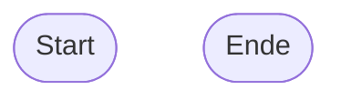
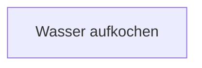
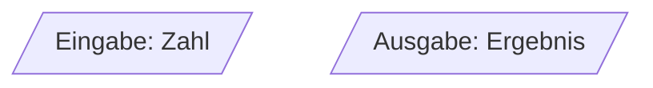
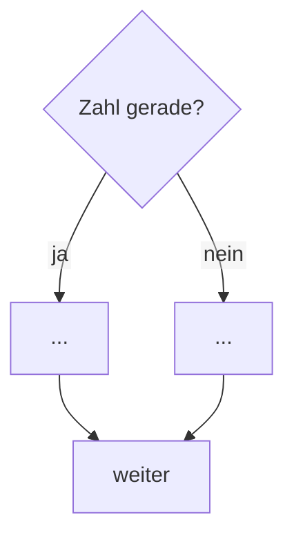
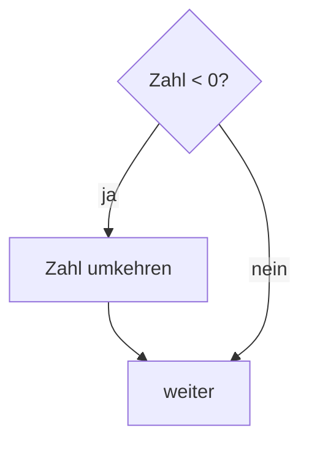
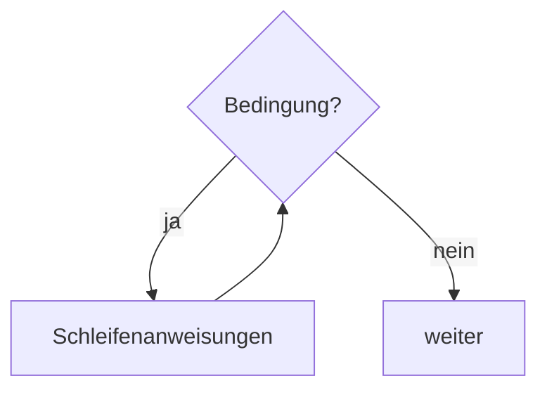
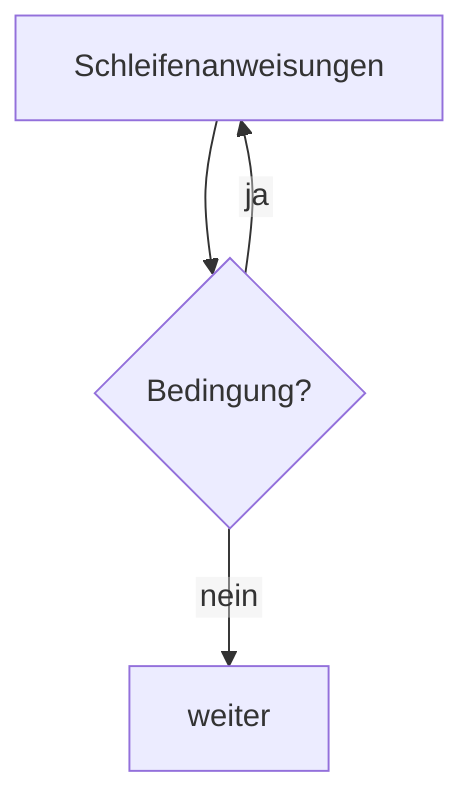
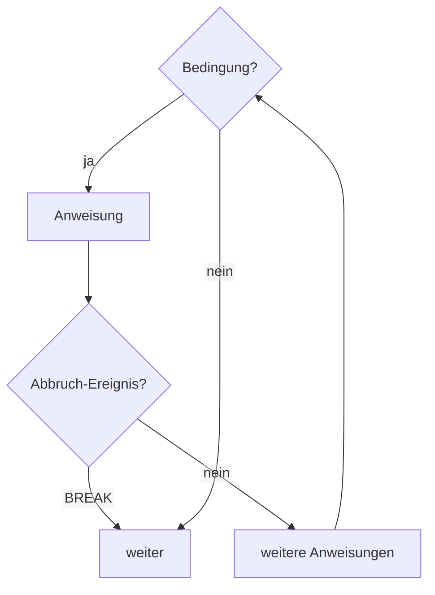

# PAP: Elemente im Überblick

Diese Seite sammelt alle Symbole, die du im Kurs für Programmablaufpläne
(PAP) kennenlernst. Du kannst hier jederzeit nachschlagen, welches Symbol
wofür steht — unabhängig davon, in welcher Woche oder welchem Termin du dich
gerade befindest. Die Seite wächst mit dem Kurs: Sobald ein neues Element
dazukommt, wird es hier ergänzt.

<!--
PFLEGEHINWEIS (nicht sichtbar auf der Seite)

Nach dem Erstellen JEDER neuen Einheit mit einem neuen PAP-Element prüfen,
ob es hier noch fehlt — und ergänzen. Reihenfolge: in der Reihenfolge, in
der die Elemente im Kurs eingeführt werden (nicht alphabetisch), damit die
Seite den Lernweg widerspiegelt. Für Mermaid-Grundregeln (Richtung,
Init-Zeile, Farben, Zeilen) siehe CLAUDE.md, Abschnitt
"Programmablaufpläne (PAP)".
-->

## Start und Ende

Jeder PAP beginnt mit genau einem Start-Symbol und endet mit mindestens
einem Ende-Symbol — dargestellt als Stadium-Form (abgerundete Enden).

## Verarbeitung

Ein Rechteck steht für einen einzelnen Verarbeitungsschritt — irgendetwas
wird getan oder berechnet.

## Eingabe und Ausgabe

Ein Parallelogramm steht sowohl für eine Eingabe als auch für eine Ausgabe.
Unterschieden werden beide nur durch den Text im Symbol, nicht durch die
Form.

## Verzweigung

Eine Raute steht für eine Verzweigung: An dieser Stelle wird eine Bedingung
geprüft, und der Ablauf nimmt je nach Ergebnis einen von zwei Wegen. Die
beiden Pfeile aus der Raute werden mit **ja** und **nein** beschriftet.

Bei einer **zweiseitigen Auswahl** (`IF`/`ELSE`) führen beide Wege zu einer
eigenen Verarbeitung, bevor sie sich wieder treffen:

Bei einer **einseitigen Auswahl** (`IF` ohne `ELSE`) passiert nur auf einem
Weg etwas — der andere Weg führt direkt zum gemeinsamen Folgeschritt:

## Wiederholung

Für Wiederholungen gibt es in diesem Kurs **kein eigenes Symbol**. Genormt
wäre das nach DIN 66001 ein eigener Schleifenblock — in der Praxis ist diese
Notation aber selten. Stattdessen wird hier dieselbe Raute wie bei der
Verzweigung verwendet: Der ja-Zweig führt als Rücksprung-Pfeil zurück zum
Anfang der Schleifenanweisungen, der nein-Zweig verlässt die Schleife.

Je nachdem, **wo** die Raute steht, ergeben sich zwei Varianten:

**Kopfgesteuerte Wiederholung** — die Bedingung wird *vor* den
Schleifenanweisungen geprüft. Ist sie von Anfang an nicht erfüllt, laufen
die Anweisungen kein einziges Mal:

**Fußgesteuerte Wiederholung** — die Bedingung wird *nach* den
Schleifenanweisungen geprüft. Dadurch laufen die Anweisungen immer
mindestens einmal:

## Vorzeitiger Abbruch (BREAK)

Manchmal soll eine Wiederholung nicht erst über ihre reguläre Bedingung
enden, sondern sofort, sobald im Inneren der Schleife ein bestimmtes
Ereignis eintritt (z. B. "gesucht Element gefunden"). Dafür gibt es
**kein eigenes Symbol** — stattdessen führt ein ganz normaler Pfeil direkt
aus dem Schleifenkörper zu demselben Knoten, an dem die Schleife auch
regulär verlassen wird. Zur besseren Erkennbarkeit wird dieser Pfeil mit
`BREAK` beschriftet:

`BREAK` ist bewusst ein Ausnahmewerkzeug, kein Standardbaustein — nur dort
einsetzen, wo sich ein vorzeitiger Abbruch nicht sauberer über die
Schleifenbedingung selbst ausdrücken lässt, und die Stelle im Pseudocode
immer mit einem kurzen Kommentar versehen, warum hier abgebrochen wird.
